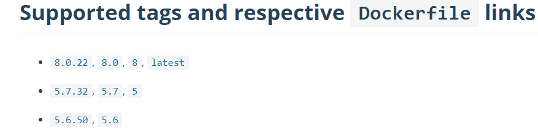
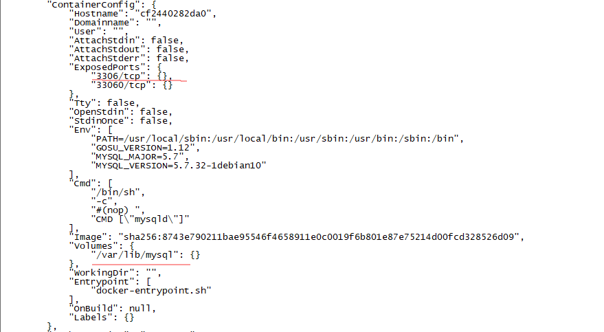

## 安装环境

- Linux CentOS7（Linux version 3.10.0-1127.el7.x86_64 (mockbuild@kbuilder.bsys.centos.org) (gcc version 4.8.5 20150623 (Red Hat 4.8.5-39) (GCC) )）,使用命令` cat /proc/version`查看
- Docker (version 19.03.13, build 4484c46d9d),使用命令`docker --version`或`docker info`可查看
- MySQL镜像(docker.io/mysql:5.7)

## 安装MySQL

1. 查找镜像：

    ```shell
    docker search mysql
    ```

也可以去官网查看镜像tag，选择自己需要的版本，否则会下载最新版本：https://hub.docker.com/_/mysql/



2. 下载镜像（如上一步，可以指定想要的版本，不指定则为最新版）：

    ```shell
    docker pull mysql:5.7 # docker pull mysql
    ```

	pull完成可以看一下镜像的信息：

   ```shell
    docker images # 查看镜像列表
    ----------------------------------------------------------------------------------------
    REPOSITORY          TAG                 IMAGE ID            CREATED             SIZE
    docker.io/mysql     5.7                 ae0658fdbad5        3 days ago          449 MB
   ```

   ```shell
   docker inspect docker.io/mysql:5.7 # 查看具体镜像信息
   ```



​		上图我截取了一些比较重要的信息，可以看出暴露的端口是`3306`，还有一些环境变量，数据卷是`/var/lib/mysql`，端口与数据卷是启动容器时需要进行绑定的，端口用于远程访问，数据卷用于持久化数据。

3. 通过镜像创建容器并运行：

    ``` shell
    docker run -p 3306:3306 \
    --name mysql \
    --privileged=true \
    -v $PWD/conf:/etc/mysql/conf.d \
    -v $PWD/logs:/logs \
    -v $PWD/data:/var/lib/mysql \
    -e MYSQL_ROOT_PASSWORD=123456 \
    -d mysql:5.7
    ```

    - **docker run**：创建容器并运行
    - **-p 3306:3306**：将容器的 3306 端口映射到主机的 3306 端口。
    - **--name mysql**：设置容器的名称mysql。注意：容器名称是唯一的。
    - **--privileged=true**：加入 --privileged=true 给容器加上特定权限。因为Centos7安全Selinux禁止了一些安全权限。[参考](https://blog.csdn.net/miaodichiyou/article/details/81562540)。
    - **-v $PWD/conf:/etc/mysql/conf.d**：将主机当前目录下的 conf/my.cnf 挂载到容器的 /etc/mysql/my.cnf。
    - **-v $PWD/logs:/logs**：将主机当前目录下的 logs 目录挂载到容器的 /logs。
    - **-v $PWD/data:/var/lib/mysql** ：将主机当前目录下的data目录挂载到容器的 /var/lib/mysql 。
    - **-e MYSQL_ROOT_PASSWORD=123456：**初始化 root 用户的密码。
    - **-d**：告诉容器在后台运行。
    - **mysql:5.7**：告诉容器运行的镜像名为mysql:5.7

4. 查看日志是否启动成功`docker logs mysql`。docker run后返回一串字符，也可以使用它来查看日志。

    ```shell
    docker logs mysql #docker logs 0f2105c6dc72261aaea4e403848b95349ab3da47da35414b94d2c082717aad45
    ```


## 设置MySQL远程访问

1. 进入启动的mysql容器：

    ```bash
    docker container exec -it mysql bash # docker exec -ti mysql bash
    ```

2. 登录：

    ```shell
    mysql -uroot -p
    ```

3. 查询user表：

    ```sql
    mysql> select host,user,plugin,authentication_string from mysql.user;
    +-------------+---------------+-----------------------+-------------------------------------------+
    | host        | user          | plugin                | authentication_string                     |
    +-------------+---------------+-----------------------+-------------------------------------------+
    | localhost   | root          | mysql_native_password | *39EF1E4F4220858A4F0D30FE91AAD7E4C4AB0812 |
    | localhost   | mysql.session | mysql_native_password | *THISISNOTAVALIDPASSWORDTHATCANBEUSEDHERE |
    | localhost   | mysql.sys     | mysql_native_password | *THISISNOTAVALIDPASSWORDTHATCANBEUSEDHERE |
    +-------------+---------------+-----------------------+-------------------------------------------+
    4 rows in set (0.00 sec)
    ```
    
    host为 % 表示不限制ip，localhost表示本机使用，也可以指定IP访问。如果这里plugin非mysql_native_password 则需要修改密码。
    
4. 添加密码IP远程访问权限：

    ```sql
    GRANT ALL PRIVILEGES ON *.* TO 'root'@'172.33.5.46' IDENTIFIED BY '123456' WITH GRANT OPTION;
    ```

    表示设置指定用户名为root，密码为123456，可访问所有数据库*，只有IP为172.33.5.46这台机器有权限访问。

5. 刷新权限

    ```sql
    flush privileges;
    ```

6. 再次查询user表：

    ```sql
    select host,user,plugin,authentication_string from mysql.user;
    +-------------+---------------+-----------------------+-------------------------------------------+
    | host        | user          | plugin                | authentication_string                     |
    +-------------+---------------+-----------------------+-------------------------------------------+
    | localhost   | root          | mysql_native_password | *39EF1E4F4220858A4F0D30FE91AAD7E4C4AB0812 |
    | localhost   | mysql.session | mysql_native_password | *THISISNOTAVALIDPASSWORDTHATCANBEUSEDHERE |
    | localhost   | mysql.sys     | mysql_native_password | *THISISNOTAVALIDPASSWORDTHATCANBEUSEDHERE |
    | 172.33.5.46 | root          | mysql_native_password | *39EF1E4F4220858A4F0D30FE91AAD7E4C4AB0812 |
    +-------------+---------------+-----------------------+-------------------------------------------+
    4 rows in set (0.00 sec)
    ```

​	此时可以使用IP为172.33.5.46这台机器访问MySQL了。

## 修改MySQL配置文件

> 在创建容器时，-v $PWD/conf:/etc/mysql/conf.d语句为我们挂载了配置文件，所以我们只需要在宿主机当前目录下的conf文件夹下修改配置即可

这里以修改MySQL的字符编码为例。

1. 进入mysql容器`docker exec -ti mysql bash`，登录mysql`mysql -uroot -p`，查询当前编码`show variables like '%character%';`

2. 确定Docker内 MySQL 文件相关路径

   ```shell
   # 查找Docker内，MySQL配置文件my.cnf的位置，加载顺序根据列出的顺序一致
   mysql --help | grep my.cnf
   ```

   

   打开/etc/mysql/my.cnf可以发现include正是我们之前挂载的目录/etc/mysql/conf.d，里面以.cnf结尾的文件在启动时都会被加载。

3. 直接在宿主机上修改配置

   我这里的$pwd是 `/home/centos` ，所以直接进入目录

   ```
   cd /home/centos/conf
   ```

   可以发现里面啥也没有，直接`vim my.cnf`新建一个即可。

4. 输入配置信息，保存退出

   ```
   [client]
   default-character-set=utf8mb4
   [mysql]
   default-character-set=utf8mb4
   [mysqld]
   character-set-server=utf8mb4
   ```

5. 重启mysql，生效

   ```shell
   docker restart mysql
   ```

   再次查看编码`show variables like '%character%';`发现已经修改成功。

## *附录：授予权限与修改密码*

- 修改密码：将user为root，host为172.33.5.46的密码修改为1234567

  ```sql
  ALTER USER 'root'@'172.33.5.46' IDENTIFIED WITH mysql_native_password BY '1234567';
  ```

- 删除user表的某一记录：

  ```sql
  delete from user where user = 'root' and host='172.33.5.46';
  ```
- 授权：设置一个只能IP为`172.33.5.46`访问，用户名为root,密码为123456可以访问所有数据库的权限的用户
  ```sql
  GRANT ALL PRIVILEGES ON *.* TO 'root'@'172.33.5.46' IDENTIFIED BY '123456' WITH GRANT OPTION;
  ```


## *参考*

[1]. [mysqld: Can't read dir of '/etc/mysql/conf.d/' (Errcode: 13 - Permission denied)_赵健乔的技术Blog-CSDN博客](https://blog.csdn.net/miaodichiyou/article/details/81562540)

[2]. [使用docker安装mysql并连接 - luckylemon - 博客园 (cnblogs.com)](https://www.cnblogs.com/yy-cola/p/11226924.html)

[3]. [Docker部署mysql，并配置远程连接 - 简书 (jianshu.com)](https://www.jianshu.com/p/e7ac0717be00?from=timeline&isappinstalled=0)

[4]. [Docker安装MySQL并挂载数据及配置文件 - Weiles - 博客园 (cnblogs.com)](https://www.cnblogs.com/weile0769/p/11863779.html)

[5]. [Docker 升级到最新版本 - 简书 (jianshu.com)](https://www.jianshu.com/p/6e5da590aeda)

