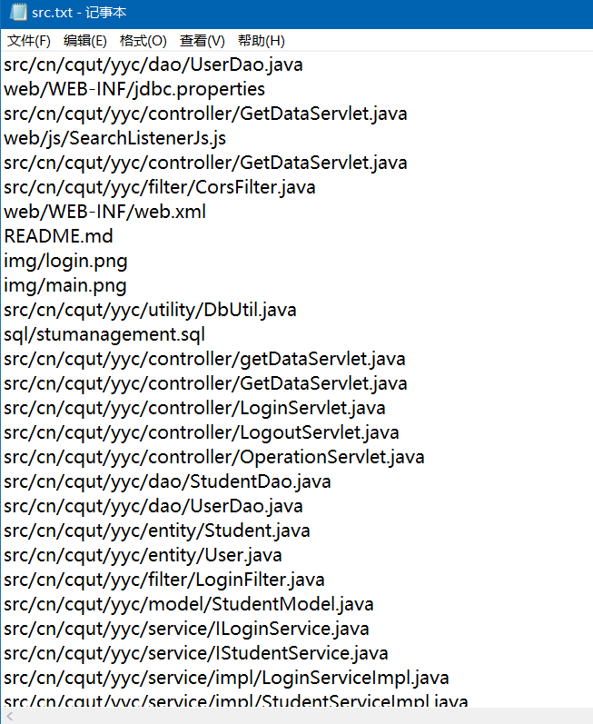
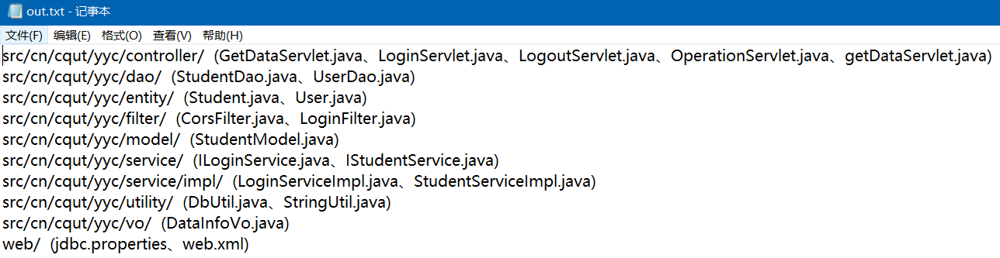

##  需求描述

&emsp;&emsp; 获取项目中自己修改过的文件名,要求包含文件路径,相同目录下的文件可使用 `路径 (文件1、文件2)`格式表示,形成汇总文件。如下:

```
src/main/java/com/yyc/yyclady/actions/filter/  (IPValidateFilter.java)
src/main/java/com/yyc/yyclady/actions/transfermodel/  (LadyServiceParas.java)
src/main/java/com/yyc/yyclady/abc/dao/  (UserDAO.java、DAOParas.java、StatementDAO.java)
src/main/java/com/yyc/yyclady/abc/dao/model/  (UserPO.java、StatementPO.java)
```

## 处理

&emsp;&emsp;基本思路:先使用git命令将自己修改过的文件路径包括文件名获取到,然后使用Java处理文件.

**使用git命令获取自己改动过的文件**

使用如下命令(使用` | clip`可以直接将结果拷贝到剪贴板):

```shell
git show commit1..commit2 --author=你 --pretty= --name-only  | clip
# git show c93cb213..6b3234f3 --author=yyc --pretty= --name-only | clip
```

**处理结果 将其转换为我们想要的格式**

将git获取到的内容(所有commit涉及到的文件绝对路径名,一行一个)放到src.txt文件中,然后用Java流读取,可利用Set的特性去除重复的内容(因为是根据commit记录来获取的文件名,肯定有多次commit修改了同样的文件,所以是有重复的).然后使用正则表达式匹配文件路径和文件名,将其转换为我们需要的格式. 

源文件(src.txt):



处理结果(out.txt):



处理过程完整代码如下:

```java
import java.io.*;
import java.util.*;
import java.util.regex.Matcher;
import java.util.regex.Pattern;

public class Main {

    private static Pattern URL_PATTERN = Pattern.compile("([a-zA-z]+/)*");

    private static Pattern FILE_NAME_PATTERN = Pattern.compile("[a-zA-z]*[.](xml|java|xls|properties)");

    public static void main(String[] args) throws IOException {
        FileInputStream filestream=new FileInputStream("C:\\Users\\yyc\\Desktop\\src.txt");
        InputStreamReader readStream=new InputStreamReader(filestream,"UTF-8");
        BufferedReader reader=new BufferedReader(readStream);

        File fout = new File("C:\\Users\\yyc\\Desktop\\out.txt");
        FileOutputStream fos = new FileOutputStream(fout);
        BufferedWriter bw = new BufferedWriter(new OutputStreamWriter(fos));

        // 使用Set去重
        String temp=null;
        Set<String> fileNames = new TreeSet<>();
        while((temp=reader.readLine())!=null){
            fileNames.add(temp);
        }

        // 遍历Set 处理文件路径和文件名 处理后放入map  将文件路径作为map的key,文件名作为map的value
        Iterator<String> iterator = fileNames.iterator();
        Map<String, String> map = new TreeMap<>();
        while (iterator.hasNext()){
            String next = iterator.next();
                // 匹配文件路径
                Matcher matcher = URL_PATTERN.matcher(next);
                // 匹配文件名
                Matcher matcher2 = FILE_NAME_PATTERN.matcher(next);
                if (matcher.find() && matcher2.find()) {
                    String group = matcher.group(0);
                    String group1 = matcher2.group(0);
                    // 如果有这个key,就追加
                    if (map.containsKey(group)){
                        map.put(group,map.get(group)+"、"+group1);
                    }else{
                        // 没有就新加入
                        map.put(group,group1);
                    }
                }
        }

        // 遍历map 将内容输出到文件
        Set<Map.Entry<String, String>> entries = map.entrySet();
        entries.stream().forEach(entry ->{
            try {
                bw.write(entry.getKey()+"  ("+entry.getValue()+")");
                bw.newLine();
            } catch (IOException e) {
                e.printStackTrace();
            }
        });

        bw.close();
        fos.close();
    }
}
```

## *参考*

1. [git 有什么办法可以比对任意两次提交中一个作者修改了哪些文件吗？ - V2EX](https://www.v2ex.com/t/367266)