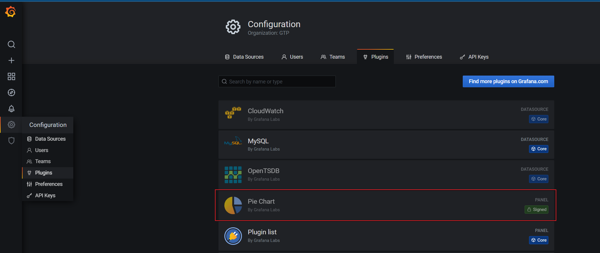

# 离线安装Grafana插件

## 方案调研
> 如果是可以访问外网的情况下直接在Grafana页面的插件市场直接安装就可以，如果没有网络的情况下，
> 根据官方文档<https://grafana.com/docs/grafana/latest/plugins/installation/#install-plugin-on-local-grafana>,有如下说明：
> You can either install the plugin with a Grafana CLI command or by downloading and uncompress a .zip file into the Grafana plugins directory.
> 我们可以使用Grafana CLI或者直接将解压后的安装包复制到插件目录即可。
> 
> 这里使用第二种方式。

## 准备安装包
> 以`Pie Chart`这个插件为例，<https://grafana.com/grafana/plugins/grafana-piechart-panel/?tab=installation>

使用命令下载或者直接在上面的grafana插件市场中点击下载。
```bash
$ wget https://storage.googleapis.com/plugins-community/grafana-piechart-panel/release/1.6.2/grafana-piechart-panel-1.6.2.zip
$ unzip grafana-piechart-panel-1.6.2.zip -d YOUR_PLUGIN_DIR/grafana-piechart-panel
```
## 安装
将**解压后**的安装包复制到grafana插件目录中，然后重启grafana即可完成。

由于测试环境使用的是Helm在K8s安装的Grafana，所以直接将安装包使用`kubectl cp`复制到挂载的插件卷中即可

**确认挂载的Grafana插件卷目录**
```bash
$ kubectl get pod grafana-557846c649-46xcc -n gtp-metric -o yaml | grep mount
    - mountPath: /etc/grafana/grafana.ini
    - mountPath: /var/lib/grafana
    - mountPath: /var/run/secrets/kubernetes.io/serviceaccount
    - mountPath: /var/lib/grafana
    - mountPath: /var/run/secrets/kubernetes.io/serviceaccount
$ kubectl exec -it -n gtp-metric grafana-557846c649-46xcc -- cat /etc/grafana/grafana.ini
...
[paths]
data = /var/lib/grafana/data
logs = /var/log/grafana
plugins = /var/lib/grafana/plugins
provisioning = /etc/grafana/provisioning
...
```
可以确认插件挂载目录就是`/var/lib/grafana/plugins`

**复制插件到Grafana插件卷目录**

```bash
$ kubectl cp /data/grafana-piechart-panel -n gtp-metric grafana-557846c649-46xcc:/var/lib/grafana/plugins/

$ kubectl exec -it -n gtp-metric grafana-557846c649-46xcc -- ls /var/lib/grafana/plugins
grafana-piechart-panel

```


**重启pod**
```bash
$ kubectl get pod grafana-557846c649-46xcc -n gtp-metric -o yaml | kubectl replace --force -f -
```

至此，离线安装Grafana插件完成，访问Grafana页面的插件页面即可看到刚刚安装的插件。



## 小结

离线安装Grafana插件，只需要将插件下载下来解压放到Grafana插件目录中，然后重启Grafana即可。