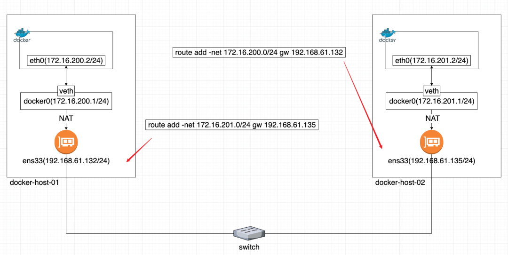
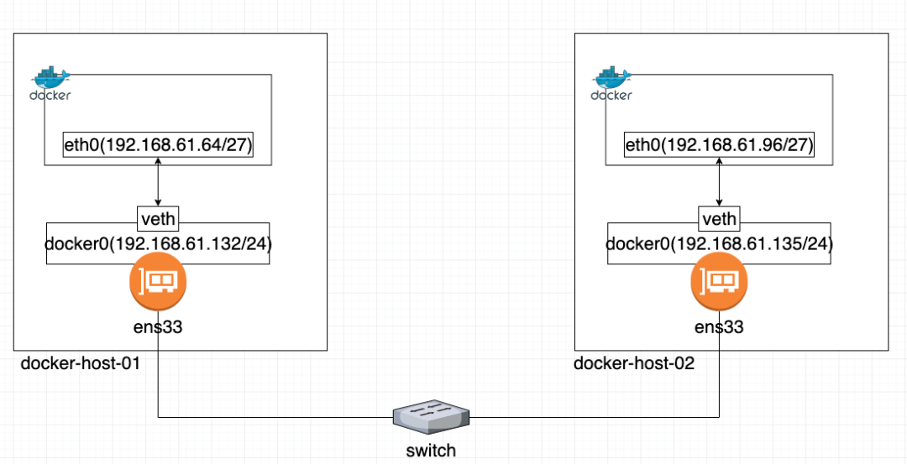

## 背景
  我们的Choerodon部署在测试网段的K8S中，现在需要给另一部门在办公网部署一套Choerodon的敏捷管理模块。
首先为了减少在在Docker中部署与在k8s中部署Choerodon（SpringCloud）微服务项目的差异性，我们选择使用docker-compose来部署，这样微服务之间仍然可以使用服务名进行互相访问。
由于只给了两台8C16G的机器，我们先是将需要存储空间的基础组件（MySQL、Redis和MinIO）部署在其中一台带有1T硬盘机器， 其它Choerodon的微服务使用docker-compose部署在另外一台机器上，这样在docker-compose中只需要为<span style="color:red">每一个service指定一个相同的type:bridge桥接网络</span>就可以互通了。
  但是后来发现，所有的微服务部署在一台机器上内存不够用，需要将两台机器的Docker网络打通进行部署。

> 本文部署的Choerodon为[开源版1.0.0](https://open.hand-china.com/document-center/doc/product/10003/10426?doc_id=125686&doc_code=1723)

## 离线环境下的安装准备
1. 离线安装docker：https://blog.csdn.net/qq_27706119/article/details/122311325
2. 离线安装registry：使用`docker save -o` 命令在本地将镜像打包，然后通过ftp上传镜像文件后使用`docker load -i`命令将镜像包导出为镜像，然后启动即可。
3. 然后将需要的镜像上传到registry

## 多机Docker网络互通方案
  前面说到，最开始将所有微服务部署在一台机器上，要实现微服务模块之间通过servicename互相访问只需要设置一个相同的桥接网络就可以，如下：

创建一个网络:

```bash
docker network create -d bridge c7n_net
```

docker-compose.yaml文件：

```yaml
version: '2.3'

services:
  agile-service:
    # container_name: agile-service # 生成的容器名
    restart: always
    image: agile-service:1.0.4
    # 省略...
    networks:
      - c7n_net
  test-manager-service:
    restart: always
    image: test-manager-service:1.0.3
    # 省略...
    networks:
      - c7n_net
networks:
  c7n_net:
    external: true
```

  后面需要将两台机器互联起来，并且需要能够在两台机器的容器之间通过服务名访问。主要有三种方式来实现：

前两种方式可以参考https://ost.51cto.com/posts/14012进行配置，主要记录第三种方式也是我采用的方式。

### 一、通过直接路由方式实现跨主机Docker容器通信



### 二、通过将物理接口添加到docker0网桥



### 三、基于overlay的docker容器间跨宿主机通信【采用】


#### Consul搭建

要实现overlay网络，我们会有一个服务发现。比如说consul，会定义一个ip地址池，比如10.0.2.0/24之类的。上面会有容器，容器的ip地址会从上面去获取。

consul通过docker部署在节点1，首先需要修改cdh1中的docker配置并重启。

```bash
[root@h1 /]# vim /etc/docker/daemon.json
//添加以下配置，此配置的作用为在docker守护程序停止或重启的时候，容器依然可以保持运行
"live-restore":true
[root@h1 /]# systemctl restart docker
```

在节点1启动一个consul：

```bash
docker run -d -p 8500:8500 -h consul -e 'CONSUL_LOCAL_CONFIG={"limits":{"kv_max_value_size": 1024}}' --name consul consul:1.12.9

```

修改节点1中的docker配置并重启：

```bash
[root@h1 /]# vim /etc/docker/daemon.json
# 添加以下两行配置
"cluster-store": "consul://节点1的IP:8500"
"cluster-advertise": "节点1的IP:2375"
[root@h1 /]# systemctl restart docker
```

修改cdh2中的docker配置并重启：

```bash
[root@h2 /]# vim /etc/docker/daemon.json
# 添加以下两行配置
"cluster-store": "consul://节点1的IP:8500"
"cluster-advertise": "节点2的IP:2375"
[root@h2 /]# systemctl restart docker
```

> cluster-store指定的是consul服务地址，因为consul服务运行在cdh1的8500端口，所以两台机器的cluster-store值均为consul://节点1的IP:8500
> cluster-advertise指定本机与consul的通信端口，所以指定为本机的2375端口

此时可以通过http://节点1的IP:8500/访问consul地址，在**Key/Value**菜单中的docker-nodes目录中可以看到两个docker节点，代表consul配置成功。

#### 创建overlay网络

此时我们可以创建overlay网络，在其中一个docker节点创建overlay网络，因为此时consul服务发现已经正常运行，且两个节点的docker服务已经接入，所以此时overlay网络是全局创建的，在任何一台宿主机创建一次即可。

```bash
docker network create -d overlay c7n_overlay
```

此时两台物理机上的Docker网络就可以互通了。只需要在docker-compose的service指定我们创建的网络c7n_overlay即可，如下：

```yaml
version: '2.3'

services:
  agile-service:
    # container_name: agile-service # 生成的容器名
    restart: always
    image: agile-service:1.0.4
    deploy:
      resources:
        limits:
          memory: 1G
    expose:
     - "8378"
    environment:
      # 省略
    healthcheck:
      test: ["CMD","/bin/sh","-c","nc -z localhost 8378 && curl -s --fail localhost:8379/actuator/health"]
      interval: 30s
      timeout: 10s
      retries: 3
      start_period: 1m
    networks:
      - c7n_overlay
  elasticsearch-kb:
    restart: always
    image: elasticsearch-kb:7.9.2-elasticsearch-kb
    deploy:
      resources:
        limits:
          memory: 1G
    expose:
      - "9200"
    environment:
      ES_JAVA_OPTS: -Xms1024m -Xmx1024m
      bootstrap.memory_lock: true
      discovery.type: single-node
    healthcheck:
      test: ["CMD","/bin/sh","-c","nc -z localhost 9200"]
      interval: 30s
      timeout: 10s
      retries: 3
      start_period: 1m
    networks:
      - c7n_overlay
  knowledgebase-service:
    restart: always
    image: knowledgebase-service:1.0.2
    deploy:
      resources:
        limits:
          memory: 1G
    expose:
      - "8280"
    environment:
      # 省略
    networks:
      - c7n_overlay
networks:
  c7n_overlay:
    external: true
```

## c7n基础组件安装

相关docker-compose文件已放到我的github, https://github.com/yinyicao/usefulScript

## c7n数据初始化

### 1.根据[官方文档](https://open.hand-china.com/document-center/doc/product/10003/10426?doc_id=125686&doc_code=1723)，先对每个模块的数据库进行创建，如下：

```sql
    # 创建用户，用于后面微服务模块
    CREATE USER IF NOT EXISTS 'choerodon'@'%' IDENTIFIED BY 'password';
    # 创建数据库和授权
    CREATE DATABASE IF NOT EXISTS hzero_platform DEFAULT CHARACTER SET utf8mb4 COLLATE utf8mb4_unicode_ci;
    CREATE DATABASE IF NOT EXISTS hzero_message DEFAULT CHARACTER SET utf8mb4 COLLATE utf8mb4_unicode_ci;
    CREATE DATABASE IF NOT EXISTS hzero_file DEFAULT CHARACTER SET utf8mb4 COLLATE utf8mb4_unicode_ci;
    CREATE DATABASE IF NOT EXISTS hzero_monitor DEFAULT CHARACTER SET utf8mb4 COLLATE utf8mb4_unicode_ci;
    CREATE DATABASE IF NOT EXISTS hzero_admin DEFAULT CHARACTER SET utf8mb4 COLLATE utf8mb4_unicode_ci;
    CREATE DATABASE IF NOT EXISTS asgard_service DEFAULT CHARACTER SET utf8mb4 COLLATE utf8mb4_unicode_ci;
    CREATE DATABASE IF NOT EXISTS devops_service DEFAULT CHARACTER SET utf8mb4 COLLATE utf8mb4_unicode_ci;
    CREATE DATABASE IF NOT EXISTS workflow_service DEFAULT CHARACTER SET utf8mb4 COLLATE utf8mb4_unicode_ci;
    CREATE DATABASE IF NOT EXISTS agile_service DEFAULT CHARACTER SET utf8mb4 COLLATE utf8mb4_unicode_ci;
    CREATE DATABASE IF NOT EXISTS knowledgebase_service DEFAULT CHARACTER SET utf8mb4 COLLATE utf8mb4_unicode_ci;
    CREATE DATABASE IF NOT EXISTS test_manager_service DEFAULT CHARACTER SET utf8mb4 COLLATE utf8mb4_unicode_ci;
    CREATE DATABASE IF NOT EXISTS hrds_code_repo DEFAULT CHARACTER SET utf8mb4 COLLATE utf8mb4_unicode_ci;
    CREATE DATABASE IF NOT EXISTS hrds_prod_repo DEFAULT CHARACTER SET utf8mb4 COLLATE utf8mb4_unicode_ci;
    GRANT ALL PRIVILEGES ON hzero_platform.* TO choerodon@'%';
    GRANT ALL PRIVILEGES ON hzero_message.* TO choerodon@'%';
    GRANT ALL PRIVILEGES ON hzero_file.* TO choerodon@'%';
    GRANT ALL PRIVILEGES ON hzero_monitor.* TO choerodon@'%';
    GRANT ALL PRIVILEGES ON hzero_admin.* TO choerodon@'%';
    GRANT ALL PRIVILEGES ON asgard_service.* TO choerodon@'%';
    GRANT ALL PRIVILEGES ON devops_service.* TO choerodon@'%';
    GRANT ALL PRIVILEGES ON workflow_service.* TO choerodon@'%';
    GRANT ALL PRIVILEGES ON hrds_code_repo.* TO choerodon@'%';
    GRANT ALL PRIVILEGES ON hrds_prod_repo.* TO choerodon@'%';
    GRANT ALL PRIVILEGES ON test_manager_service.* TO choerodon@'%';
    GRANT ALL PRIVILEGES ON knowledgebase_service.* TO choerodon@'%';
    GRANT ALL PRIVILEGES ON agile_service.* TO choerodon@'%';
    FLUSH PRIVILEGES;
	# 客户端数据初始化，域名要和部署时的一致
	INSERT INTO hzero_platform.oauth_client (name,organization_id,resource_ids,secret,scope,authorized_grant_types,web_server_redirect_uri,access_token_validity,refresh_token_validity,additional_information,auto_approve,object_version_number,created_by,creation_date,last_updated_by,last_update_date,enabled_flag,time_zone)VALUES('choerodon',1,'default','secret','default','password,implicit,client_credentials,authorization_code,refresh_token','http://app.example.choerodon.io,http://hzero.example.choerodon.io',86400,86400,'{}','default',1,0,NOW(),0,NOW(),1,'GMT+8');

```

### 2.微服务数据初始化

可以直接使用[yinyicao/choerodon-dbtool-jdk](https://hub.docker.com/r/yinyicao/choerodon-dbtool-jdk/)这个镜像将会事半功倍！

## c7n微服务安装

同基础组件安装，相关docker-compose文件已放到我的github, https://github.com/yinyicao/usefulScript

## 遇到的坑

1. c7n的1.0这个版本的workflow在环境变量中设置SPRING_REDIS_PASSWORD无效；

2. minio可能会因为时区不正确而无法上传文件,且通过nginx代理后使用域名也无法上传只能通过内部地址服务名访问；

  docker-compose.yml文件配置东八时区上海时间示例：

  ```yaml
  version: "3.5"
  services:
    mysql:
      image: minio
      environment:    #设置东八时区上海时间
        - SET_CONTAINER_TIMEZONE=true
        - CONTAINER_TIMEZONE=Asia/Shanghai
      volumes:    #挂载宿主机东八时区
        - /etc/localtime:/etc/localtime:ro
  ```

3. 最好使用域名来设置访问c7n，暂时还没有调通直接通过IP访问的。

4. 

*参考：*

[docker compose容器间服务访问](https://blog.csdn.net/qq_41768400/article/details/117367167)

[Docker多机网络](https://www.cnblogs.com/wtzbk/p/15542781.html)

[docker容器间跨宿主机通信-基于overlay](https://blog.csdn.net/mrliqifeng/article/details/113833523)

<https://github.com/bitnami/containers>

