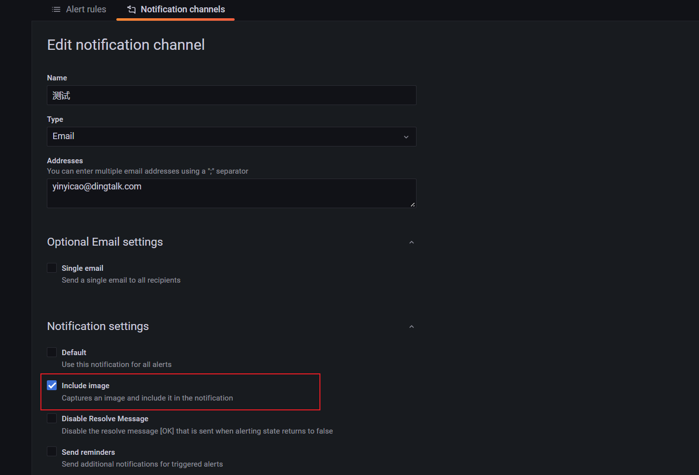

`Grafana Image Renderer`是一个 Grafana 后端插件，它使用无头浏览器 (Chromium) 将面板和仪表板渲染为 PNG。比如下面的邮件通知，`Include image`功能则需要这个插件。



本文中的Grafana在Docker容器中运行，用的Grafana7和Grafana8.5的镜像都实验了，如果是二进制本地化安装可能很多经验不适用。

本文将在`Grafana的邮件报警通知`,`Grafana容器中安装grafana-image-renderer插件`，`独立运行grafana-image-renderer插件镜像作为远程服务`,`遇到的坑`这几个方便做个记录。

## Grafana的邮件报警通知

我使用的是QQ邮箱来做实验，需要注意配置邮箱的密码不是QQ密码，而是SMTP服务的授权码。[什么是授权码，它又是如何设置？_QQ邮箱帮助中心](https://service.mail.qq.com/cgi-bin/help?subtype=1&&id=28&&no=1001256)

在Grafana中配置SMTP可以修改[配置文件](https://grafana.com/docs/grafana/v7.0/administration/configuration/#smtp)或者使用[环境变量](https://grafana.com/docs/grafana/v7.0/administration/configuration/#configure-with-environment-variables)，SMTP配置常用环境变量：

```ini
GF_SMTP_ENABLED true
GF_SMTP_HOST smtp.qq.com:465
GF_SMTP_USER yinyicao@qq.com
GF_SMTP_PASSWORD SMTP授权码
GF_SMTP_FROM_ADDRESS yinyicao@qq.com
```

## 关于容器中安装image-renderer插件[<span style="color:red">不行</span>]

> <span style="color:red">注意：</span>通过尝试，发现在容器中安装了grafana-image-renderer插件也无法使用截图，详情请查看本文后面的遇到的坑。

**不能**和其它面板插件一样放入plugins目录即可，我试过发现会无法启动Grafana容器。

官方也有说明，需要在构建镜像时加入。

> If you still want to install the plugin with the Grafana Docker image, refer to the instructions on building a custom Grafana image in [Grafana Docker documentation](https://grafana.com/docs/installation/docker/#custom-image-with-grafana-image-renderer-plugin-pre-installed).
>
> The [Grafana Image Renderer plugin](https://grafana.com/docs/grafana/v9.0/setup-grafana/image-rendering/#grafana-image-renderer-plugin) does not currently work if it is installed in a Grafana Docker image. You can build a custom Docker image by using the `GF_INSTALL_IMAGE_RENDERER_PLUGIN` build argument. 

在Github中也找到了相关issue回复：https://github.com/grafana/grafana-image-renderer/issues/301#issuecomment-973939440

其中构建的Dockerfile在grafana有的：https://github.com/grafana/grafana/tree/main/packaging/docker/custom 可以直接用，比如我要在Grafana7.0.3中安装grafana-image-renderer插件：

官方Dockerfile：https://github.com/grafana/grafana/blob/v7.0.3/packaging/docker/custom/Dockerfile

构建命令：

```sh
docker build --build-arg "GRAFANA_VERSION=7.0.3" --build-arg "GF_INSTALL_IMAGE_RENDERER_PLUGIN=true" -t grafana-custom -f Dockerfile .
```

## 独立运行renderer插件镜像作为远程服务[<span style="color:green">行</span>]

> 比在容器中直接安装grafana-image-renderer插件好使。但是有几个坑，详情请查看本文后面的遇到的坑。

这在[官方文档](https://grafana.com/grafana/plugins/grafana-image-renderer/)中也有具体说明。运行远程服务后，只需要修改grafana服务的两个配置即可，[Configuration | Grafana documentation](https://grafana.com/docs/grafana/v7.0/administration/configuration/#rendering)。或者添加环境变量：

```ini
GF_RENDERING_SERVER_URL http://render:8081/render
GF_RENDERING_CALLBACK_URL  http://grafana:3000
```

## 遇到的坑和经验

1.容器中安装了grafana-image-renderer插件<span style="color:red">也无法使用截图</span>

> 打开[`rendering:debug`](https://grafana.com/docs/grafana/v7.0/administration/configuration/#rendering_verbose_logging)可查看grafana render的debug日志，环境变量为：`GF_LOG_FILTERS rendering:debug`

报错信息如下：尝试了多种方式也无法解决，比如尝试修改CALLBACK_URL、修改GRAFANA_IMAGE_RENDERER_RENDERING_MODE、修改镜像中的时区和时间保持与宿主机同步等，甚至更换版本

```
INFO[09-04|10:06:01] Rendering                  logger=rendering renderer=plugin path="d-solo/-QbYsVMVz/new-dashboard-copy?orgId=1&from=1662264351713&to=1662285951713&panelId=2&width=1000&height=500&tz=Asia%2FShanghai"
DBUG[09-04|10:06:01] Calling renderer plugin    logger=rendering renderer=plugin req="url:\"http://localhost:3000/d-solo/-QbYsVMVz/new-dashboard-copy?orgId=1&from=1662264351713&to=1662285951713&panelId=2&width=1000&height=500&tz=Asia%2FShanghai&render=1\" width:1000 height:500 deviceScaleFactor:1 filePath:\"/var/lib/grafana/png/KuhYOWtGcN29Bl0Nx1Su.png\" renderKey:\"hCTUBU04a03ROzRUdgAhzJBzqIEPHGPx\" domain:\"localhost\" timeout:60 timezone:\"Asia/Shanghai\" headers:<key:\"Accept-Language\" value:<values:\"zh-CN,zh;q=0.9\" > > "
EROR[09-04|10:06:01] Rendering failed.          logger=context userId=1 orgId=1 uname=admin error="rpc error: code = Unauthenticated desc = Unauthorized request"
EROR[09-04|10:06:01] Request Completed          logger=context userId=1 orgId=1 uname=admin method=GET path=/render/d-solo/-QbYsVMVz/new-dashboard-copy status=500 remote_addr=172.17.0.1 time_ms=19 size=1723 referer="http://192.168.158.196:3000/d/-QbYsVMVz/new-dashboard-copy?orgId=1"
```

2.独立运行renderer插件镜像作为远程服务的地址<span style="color:red">不能是localhost或127.0.0.1</span>

包括grafana中的DataSources地址、GF_RENDERING_SERVER_URL、GF_RENDERING_CALLBACK_URL都不能是localhost或127.0.0.1，在本地测试需要使用`ipconfig`查看ipv4地址使用，巨坑！否则莫名奇妙504、timeout等。

3.关于如何验证renderer是否正常工作的坑

在容器中构建镜像时加入image-renderer插件，通知通道那里测试邮箱配置时可以勾选Include image（文章开始的截图），也能正常收到包含图片的测试邮件，但是实际监控报警时没有截图。

一定要通过如下方式验证才可以：

one.一定要保存面板，<span style="color:red">保存面板</span>，保存面板！

two.在任意一张图表标题，点击后展示下拉菜单，选择"Share"

three.点击下方的“<span style="color:red">Direct link rendered image</span>”后打开跳转页面，正常显示截图才算行！

## *参考*

<https://grafana.com/grafana/plugins/grafana-image-renderer/>

<https://github.com/grafana/grafana/tree/main/packaging/docker/custom>

[Grafana 报警配置 – 兰陵美酒郁金香的个人博客 (xhyonline.com)](https://www.xhyonline.com/?p=1534)

[Grafana配置邮件告警_lee_yanyi的博客-CSDN博客_grafana 配置邮件](https://blog.csdn.net/lee_yanyi/article/details/120363993)

[《打造高可用监控系统》之——Grafana Alert通过Ceph的S3兼容接口在推送webhook报警时同时渲染图片并带上imageUrl参数（报警推送时能有图片一起带出来）_技术流奶爸奶爸的博客-CSDN博客](https://blog.csdn.net/weixin_42182797/article/details/104653812)

[grafana生成图片导出 - 简书 (jianshu.com)](https://www.jianshu.com/p/66f022e8645d)

[在dockerfile中设置时区_fengfanghuang的博客-CSDN博客_dockerfile 设置时区](https://blog.csdn.net/qq_26572567/article/details/125166288)
