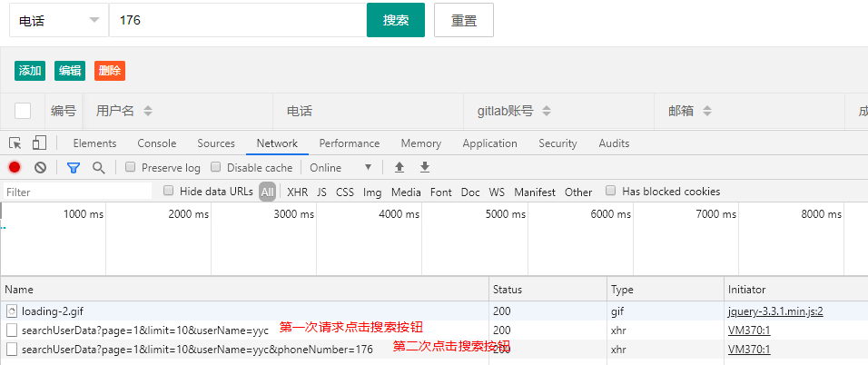

### 问题场景

- LayUI版本：layui-v2.4.5

&emsp;&emsp;在使用layui table实现搜索按钮（完整代码见<a href="#end">附1</a>）时，重载表格请求的额外参数不清空，上一次的字段还会出现的问题。这个问题的表现为，请求第一次选择姓名字段，发送请求：`page=1&limit=10&userName=%E5%B0%E4%BB%A5%E6%8D`，重新选择索引字段为电话后，<!--more-->发送请求：`page=1&limit=10&userName=%E5%B0%E4%BB%A5%E6%8D&phoneNumber=176`，即多次请求重载表格，出现之前重载表格时额外参数(`where{}`)不清空，导致请求字段不刷新，无法搜索到结果。见下图：



### 源码分析

#### 代码：render方法

&emsp;&emsp;从Layui.table模块中的render方法说起。也就是表格的渲染。我们要在界面上显示一个表格就要使用这个方法进行表格的渲染和初始化，需要传递一个options对象进去，即配置项。如下：

```javascript
table.render({
    elem: '#dataTable'
    , height: 525
    , limit: 10
    , limits: [1, 3, 5, 10, 20, 30, 40, 50]
    , url: '/getUserData' //数据接口
    , page: true //开启分页       , toolbar: ""
    , defaultToolbar: []
    , loading: true//切换分页加载条
    , title: "用户信息管理系统"
    , cols: [[ //表头]]
})
```

&emsp;&emsp;就配置一些宽高、数据接口等等配置项，这样就完成了一个表格的初始化渲染。

#### 源码：render核心入口

现在我们深入这个表格渲染的源码，看看做了哪些操作。这是表格渲染的核心入口源码：  

```javascript
  //核心入口
  table.render = function(options){
    var inst = new Class(options);
    return thisTable.call(inst);
   };
```

发现创建了一个实例，在实例化对象时就创建了一个索引（`that.index = ++table.index;`），并对我们传进来的options保存到了当前对象的config中（`that.config = $.extend({}, that.config, table.config, options);`），随后并对表格进行了渲染（`that.render();`）。

```javascript
//构造器
 Class = function(options){
  var that = this;
  that.index = ++table.index;
  that.config = $.extend({}, that.config, table.config, options);
  that.render();
 };
```

在核心入口中还调用了thisTable.call(inst);这个方法源码如下：

```javascript
 //操作当前实例
thisTable = function(){

  var that = this

  ,options = that.config

  ,id = options.id || options.index;

  if(id){

   thisTable.that[id] = that; //记录当前实例对象

   thisTable.config[id] = options; //记录当前实例配置项

  }
  // 省略部分
 }
```

从源码中我们发现，layui将当前实例的配置项保存了起来，与之对应的还将当前实例对象也保存了起来（后面就会发现是为了方便获取）。

至此，表格的初始化渲染就结束了。

#### 代码：reload方法

回到我们讨论的问题上，出现这个问题是在表格重载的时候出现的。我们重载表格时都会传递两个参数，一个是表格的id,还有一个是options对象，就像下面这样：

```javascript
table.reload('dataTable', { //重新加载表格
   url: '/searchUserData'
   , where:param //设定异步数据接口的额外参数
   , done: function (res, curr, count) {
    // 重载完成后的操作
   }
 });
```

根据我们上面的分析，在初始化表格时，layui已经将表格id和options对象保存起来了。在重载表格时，都是传递的同样的ID值，因为这样才能保证是操作的同一个表格对象。

#### 源码：reload方法

下面是表格重载的源码：

```javascript
 //表格重载
 table.reload = function(id, options){
  var config = getThisTableConfig(id); //获取当前实例配置项
  if(!config) return;
  var that = thisTable.that[id];
  that.reload(options);
  return thisTable.call(that);
 };
```

从源码中可以看出，每次重载的时候都先去获取当前实例的配置项，因为我们重载表格一般只会修改表格配置项的部分内容。随后获取之前初始化表格保存的实例，再调用这个实例的reload方法。

#### 源码：reload原型方法

表格重载的源码：

```javascript
 //表格重载
 Class.prototype.reload = function(options){
  var that = this;
  options = options || {};
  delete that.haveInit;
  if(options.data && options.data.constructor === Array) delete that.config.data;
  that.config = $.extend(true, {}, that.config, options);
  that.render();
 };
```

从这里，我们就发现了问题的关键所在，这句`that.config = $.extend(true, {}, that.config, options);`就是将当前的配置项与原来有的配置项（都是对象）进行了合并。随即我便测试了这个`Jquery`的`$extend()`方法。

#### 发现问题-测试

```javascript
var layuiConfig={};//模拟layui的config
var param = {};// 我们自己每次搜索的索引和值
/*****第一次搜索开始******/

var searchIndex = 'userName'; 
var searchContent = 'yyc';
param[searchIndex]= searchContent; // 设置搜索的目标对象
console.log("第一次搜索发送出去的条件：");
console.log(param)
layuiConfig=$.extend(true, {}, layuiConfig, param); // 模拟layui进行处理我们的搜索值
console.log("第一次搜索layui处理后的搜索条件：");
console.log(layuiConfig)
/*****第一次搜索结束******/

/*****第二次搜索开始******/
//第二次搜索（layui未对之前存好的搜索条件进行清空，直接拿到了之前搜索的键值）
param = {};// 我们自己清空了搜索的值
searchIndex = 'phoneNumber';
searchContent = '176****8789';
param[searchIndex]= searchContent;// 设置搜索的目标对象
console.log("第二次搜索发送出去的条件：");
console.log(param)
layuiConfig = $.extend(true, {}, layuiConfig, param);// 模拟layui进行处理我们的搜索值
console.log("第二次搜索layui处理后的搜索条件：");
console.log(layuiConfig)
/*****第二次搜索结束******/
```

输出：

```javascript
\> "第一次搜索发送出去的条件："
\> Object { userName: "yyc" }
\> "第一次搜索layui处理后的搜索条件："
\> Object { userName: "yyc" }
\> "第二次搜索发送出去的条件："
\> Object { phoneNumber: "176****8789" }
\> "第二次搜索layui处理后的搜索条件："
\> Object { userName: "yyc", phoneNumber: "176****8789" }
```

这就明白了，之所以在网页上当我们切换了索引项，之前的数据项还是存在，就是因为layui table中的config保存机制，`JQuery`的`$.extend()`方法导致的。

### 解决方法
&emsp;&emsp;只能暂时先把不用的值置空，依旧会送出空的字段。但不影响查询。修改方法如下：

将：

```javascript
param[searchIndex]= searchContent;// 设置搜索的目标对象
```

改为：

```javascript
//列出搜索的所有索引项
let arr= ['userName','phoneNumber','gitlabAcc','emailAddr','score','credit']; 
arr.forEach(function(i){
    // 为索引项赋值
   (i===searchIndex)?config[i]=searchContent : config[i]=null; 
});
```

至此，该问题已解决。


<p id="end">附1：</p>
完整的搜索按钮代码：

```javascript
function searchForm(){
    // 获取搜索的索引项和索引值
    const searchIndex = $("#searchIndex  option:selected").val();
    const searchContent = $("#searchContent").val().trim();
    // 使用《object[属性名变量] = 属性值》的方式 对象的属性名 可以为变量
    let param = {}
    // FIXME 表格reload 时，where 的字段不会清空，上一次的对象字段还依旧保留着。原因是layui的config保存机制出的问题.没办法, 只能暂时先把不用的值置空. 但依旧会送出空的字段.
    let arr = ['userName','phoneNumber','gitlabAcc','emailAddr','score','credit'];
    arr.forEach(function(i){
        (i===searchIndex)?param[i]=searchContent : param[i]=null;
    });
    // param[searchIndex] = searchContent;
    if (searchIndex === "" || searchContent === "") {
        layer.msg("您未输入索引或搜索内容!", {
            time: 3000
        });
    } else {
        var index = layer.load(2, {time: 10 * 1000}); //设定最长等待10秒
        var isClickSearchButton = 1;
        table.reload('dataTable', { //重新加载表格
            url: '/searchUserData'
            , where:param //设定异步数据接口的额外参数
            , done: function (res, curr, count) {
                if (isClickSearchButton == 1) {
                    //关闭加载
                    layer.close(index);
                    layer.msg("共搜索到【" + count + "】条数据！", {
                        time: 1500
                    }, function () {
                        isClickSearchButton = 0;
                    })
                }
            }
        });
        //关闭加载
        layer.close(index);
    }
}
```

