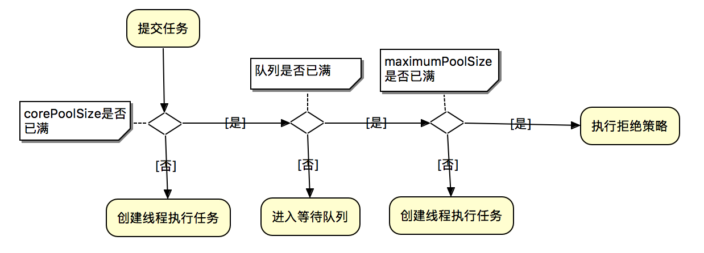

# ThreadPoolExecutor

## 构造方法

ThreadPoolExecutor提供了四个构造方法，下面为参数最多的那个构造方法

```java
 public ThreadPoolExecutor(int corePoolSize, // 1
                              int maximumPoolSize,  // 2
                              long keepAliveTime,  // 3
                              TimeUnit unit,  // 4
                              BlockingQueue<Runnable> workQueue, // 5
                              ThreadFactory threadFactory,  // 6
                              RejectedExecutionHandler handler ) { //7
        // ....
    }
```

## 任务处理流程



执行逻辑说明：

- 判断核心线程数是否已满，核心线程数大小和corePoolSize参数有关，未满则创建线程执行任务
- 若核心线程池已满，判断队列是否满，队列是否满和workQueue参数有关，若未满则加入队列中
- 若队列已满，判断线程池是否已满，线程池是否已满和maximumPoolSize参数有关，若未满创建线程执行任务
- 若线程池已满，则采用拒绝策略处理无法执执行的任务，拒绝策略和handler参数有关

**简单来说：**核心线程满了，接下来进队列，队列也满了，创建新线程，直到达到最大线程数，之后再超出，会进入拒绝rejectedExecution。

通常，核心和最大池大小仅在构建时设置，但也可以使用`setCorePoolSize`和`setMaximumPoolSize`进行动态更改。

## 线程池的设置

> <span style="color:red">应用场景中没有特殊的要求，就不需要使用这些设置</span>

```java
// 创建线程池
ThreadPoolExecutor executor = new ThreadPoolExecutor(2, 4, 10, TimeUnit.SECONDS,
        new ArrayBlockingQueue<>(2), new NameTreadFactory(), new MyIgnorePolicy());
```

**初始化线程池时可以预先创建线程**

```java
executor.prestartAllCoreThreads(); // 预启动所有核心线程
executor.prestartCoreThread(); // 预启动一个核心线程
```

**超时回收核心线程**

```java
executor.allowCoreThreadTimeOut(true); // 允许核心线程超时关闭
```

java.util.concurrent.ThreadPoolExecutor#getTask源码：

```java
boolean timedOut = false; // Did the last poll() time out?
for (;;) {
    // Are workers subject to culling?
    boolean timed = allowCoreThreadTimeOut || wc > corePoolSize;

    try {
        Runnable r = timed ?
            // poll():从BlockingQueue取出一个任务，如果不能立即取出，则可以等待timeout参数的时间，如果超过这个时间还不能取出任务，则返回null；
            workQueue.poll(keepAliveTime, TimeUnit.NANOSECONDS) :
        //take():从blocking阻塞队列取出一个任务，如果BlockingQueue为空，阻断进入等待状态直到BlockingQueue有新的任务被加入为止。
        workQueue.take();
        if (r != null)
            return r;
        timedOut = true;
    } catch (InterruptedException retry) {
        timedOut = false;
    }
}
```

当allowCoreThreadTimeOut=true或者此时工作线程大于corePoolSize时，线程调用BlockingQueue的poll方法获取任务，若超过keepAliveTime时间，则返回null，timedOut=true，则getTask会返回null，线程中的runWorker方法会退出while循环，线程接下来会被回收。

## 核心参数

| 序号 | 名称            | 类型                      | 含义             | 解释                                                         |
| ---- | --------------- | ------------------------- | ---------------- | ------------------------------------------------------------ |
| 1    | corePoolSize    | int                       | 核心线程池大小   | 核心线程会一直存活，及时没有任务需要执行 <br />当线程数小于核心线程数时，即使有线程空闲，线程池也会优先创建新线程处理  <br />设置allowCoreThreadTimeout=true（默认false）时，核心线程会超时关闭 |
| 2    | maximumPoolSize | int                       | 最大线程池大小   | 当线程数>=corePoolSize，且线程等待队列已满时。线程池会创建新线程来处理任务<br />当线程数=maximumPoolSize，且线程等待队列已满时，线程池会拒绝处理任务而抛出异常 |
| 3    | keepAliveTime   | long                      | 线程最大空闲时间 | 当线程空闲时间达到keepAliveTime时，线程会退出，直到线程数量=corePoolSize<br />如果allowCoreThreadTimeout=true，则会直到线程数量=0 |
| 4    | unit            | TimeUnit                  | 时间单位         | 参数keepAliveTime的时间单位：天、小时、分钟、秒、毫秒、微秒  |
| 5    | workQueue       | BlockingQueue\<Runnable\> | 线程等待队列     | [查看详情](#workQueue)，任务队列容量（阻塞队列），当核心线程数达到最大时，新任务会放在队列中排队等待执行 |
| 6    | threadFactory   | ThreadFactory             | 线程创建工厂     | [查看详情](#threadFactory)                                   |
| 7    | handler         | RejectedExecutionHandler  | 拒绝策略         | [查看详情](#handler)                                         |

## 参数说明

### workQueue参数：线程等待队列<a id="workQueue"></a>

BlockingQueu用于存放提交的任务，队列的实际容量与线程池大小相关联。

- 如果当前线程池任务线程数量小于核心线程池数量，执行器总是优先创建一个任务线程，而不是从线程队列中取一个空闲线程。
- 如果当前线程池任务线程数量大于核心线程池数量，执行器总是优先从线程队列中取一个空闲线程，而不是创建一个任务线程。
- 如果当前线程池任务线程数量大于核心线程池数量，且队列中无空闲任务线程，将会创建一个任务线程，直到超出maximumPoolSize，如果超时maximumPoolSize，则任务将会被拒绝。

主要有三种队列策略：

1. **直接握手队列**（Direct handoffs ）
    如：SynchronousQueue。它将任务交给线程而不需要保留。这里，如果没有线程立即可用来运行它，那么排队任务的尝试将失败，因此将构建新的线程。
    此策略在处理可能具有内部依赖关系的请求集时避免锁定。Direct handoffs 通常需要无限制的maximumPoolSizes来避免拒绝新提交的任务。 **但得注意，当任务持续以平均提交速度大余平均处理速度时，会导致线程数量会无限增长问题。**
2. **无界队列**（Unbounded queues ）
   如：没有预定义容量的LinkedBlockingQueue。当所有corePoolSize线程繁忙时，使用无界队列将导致新任务在队列中等待，从而导致maximumPoolSize的值没有任何作用。当每个任务互不影响，完全独立于其他任务时，这可能是合适的; 例如，在网页服务器中， 这种队列方式可以用于平滑瞬时大量请求。**但得注意，当任务持续以平均提交速度大余平均处理速度时，会导致队列无限增长问题。**
3. **有界队列**（Bounded queues ）
   如：一个ArrayBlockingQueue。 一个有界的队列和有限的maximumPoolSizes配置有助于防止资源耗尽，但是难以控制。队列大小和maximumPoolSizes需要 **相互权衡**：
   - 使用大队列和较小的maximumPoolSizes可以最大限度地减少CPU使用率，操作系统资源和上下文切换开销，但会导致人为的低吞吐量。如果任务经常被阻塞（比如I/O限制），那么系统可以调度比我们允许的更多的线程。
   - 使用小队列通常需要较大的maximumPoolSizes，这会使CPU更繁忙，但可能会遇到不可接受的调度开销，这也会降低吞吐量。

### threadFactory参数：线程创建工厂<a id="threadFactory"></a>

新线程使用ThreadFactory创建。 如果未另行指定，则使用Executors.defaultThreadFactory默认工厂，使其全部位于同一个ThreadGroup中，并且具有相同的NORM_PRIORITY优先级和非守护进程状态。

通过提供不同的ThreadFactory，您可以更改线程的名称，线程组，优先级，守护进程状态等。如果ThreadCactory在通过从newThread返回null询问时未能创建线程，则执行程序将继续，但可能无法执行任何任务。

线程应该有modifyThread权限。 如果工作线程或使用该池的其他线程不具备此权限，则服务可能会降级：配置更改可能无法及时生效，并且关闭池可能会保持可终止但尚未完成的状态。

[1]: https://www.jianshu.com/p/c41e942bcd64

### handler参数：拒绝策略<a id="handler"></a>

两种情况会拒绝处理任务：

1. 当线程数已经达到maximumPoolSize，且队列已满，会拒绝新任务
2. 当线程池被调用shutdown()后，会等待线程池里的任务执行完毕，再shutdown。如果在调用shutdown()和线程池真正shutdown之间提交任务，会拒绝新任务

预定义了四种处理策略：

1. **AbortPolicy**（默认策略）：丢弃任务，抛出RejectedExecutionException运行时异常；

2. **CallerRunsPolicy**：调用线程处理该任务，这提供了一个简单的反馈控制机制，可以减慢提交新任务的速度；

3. **DiscardPolicy**：直接丢弃新提交的任务，不抛出异常；

4. **DiscardOldestPolicy**：如果执行器没有关闭，队列头的任务将会被丢弃，然后执行器重新尝试执行任务（如果失败，则重复这一过程）；

我们可以自己定义RejectedExecutionHandler，以适应特殊的容量和队列策略场景中。

## 预定义线程池【不推荐】

即Executors提供的创建线程池的方式，<span style="color:red">不推荐使用</span>。阿里巴巴开发手册并发编程这块有一条：线程池不允许使用Executors去创建，而是通过ThreadPoolExecutor的方式。<span style="color:red">容易引起OOM异常。</span>

根据返回的对象类型创建线程池可以分为三类：

- 创建返回ThreadPoolExecutor对象
- 创建返回ScheduleThreadPoolExecutor对象
- 创建返回ForkJoinPool对象

这里只讨论创建返回ThreadPoolExecutor对象。

Executors创建返回ThreadPoolExecutor对象的方法共有三种：

- Executors#newCachedThreadPool => 创建可缓存的线程池
- Executors#newSingleThreadExecutor => 创建单线程的线程池
- Executors#newFixedThreadPool => 创建固定长度的线程池

### Executors的newCachedThreadPool方法

```java
public static ExecutorService newCachedThreadPool() {
    return new ThreadPoolExecutor(0, Integer.MAX_VALUE,
                                  60L, TimeUnit.SECONDS,
                                  new SynchronousQueue<Runnable>());
}
```

CachedThreadPool是一个根据需要创建新线程的线程池

- corePoolSize => 0，核心线程池的数量为0
- maximumPoolSize => Integer.MAX_VALUE，可以认为最大线程数是无限的
- keepAliveTime => 60L
- unit => 秒
- workQueue => SynchronousQueue

当一个任务提交时，corePoolSize为0不创建核心线程，SynchronousQueue是一个不存储元素的队列，可以理解为队列永远是满的，因此最终会创建非核心线程来执行任务。

对于非核心线程空闲60s时将被回收。因为Integer.MAX_VALUE非常大，可以认为是可以无限创建线程的，在资源有限的情况下<span style="color:red">容易引起OOM异常</span>

### Executors的newSingleThreadExecutor方法

```java
public static ExecutorService newSingleThreadExecutor() {
    return new FinalizableDelegatedExecutorService
        (new ThreadPoolExecutor(1, 1,
                                0L, TimeUnit.MILLISECONDS,
                                new LinkedBlockingQueue<Runnable>()));
}
```

SingleThreadExecutor是单线程线程池，只有一个核心线程

- corePoolSize => 1，核心线程池的数量为1
- maximumPoolSize => 1，只可以创建一个非核心线程
- keepAliveTime => 0L
- unit =>毫 秒
- workQueue => LinkedBlockingQueue

当一个任务提交时，首先会创建一个核心线程来执行任务，如果超过核心线程的数量，将会放入队列中，因为LinkedBlockingQueue是长度为Integer.MAX_VALUE的队列，可以认为是无界队列，因此往队列中可以插入无限多的任务，在资源有限的时候<span style="color:red">容易引起OOM异常</span>，同时因为无界队列，maximumPoolSize和keepAliveTime参数将无效，压根就不会创建非核心线程

### Executors的newFixedThreadPool方法

```java
public static ExecutorService newFixedThreadPool(int nThreads) {
    return new ThreadPoolExecutor(nThreads, nThreads,
                                  0L, TimeUnit.MILLISECONDS,
                                  new LinkedBlockingQueue<Runnable>());
}
```

FixedThreadPool是固定核心线程的线程池，固定核心线程数由用户传入

- corePoolSize => nThreads，核心线程池的数量为nThreads

- maximumPoolSize => nThreads，可以创建nThreads个非核心线程

- keepAliveTime => 0L

- unit => 毫秒

- workQueue => LinkedBlockingQueue

  它和SingleThreadExecutor类似，由于使用的是LinkedBlockingQueue，在资源有限的时候<span style="color:red">容易引起OOM异常</span>

这就是为什么禁止使用Executors去创建线程池，而是推荐自己去创建ThreadPoolExecutor的原因

# 自定义线程池

以下是自定义线程池，使用了有界队列，自定义ThreadFactory和拒绝策略的demo：

```java
import java.io.IOException;
import java.util.concurrent.*;
import java.util.concurrent.atomic.AtomicInteger;

public class ThreadTest {

    public static void main(String[] args) throws InterruptedException, IOException {

        // ThreadPoolExecutor executor = new ThreadPoolExecutor(corePoolSize, maximumPoolSize, keepAliveTime, unit,workQueue, threadFactory, handler);
        ThreadPoolExecutor executor = new ThreadPoolExecutor(2, 4, 10, TimeUnit.SECONDS,
                new ArrayBlockingQueue<>(2), new NameTreadFactory(), new MyIgnorePolicy());
        executor.prestartAllCoreThreads(); // 预启动所有核心线程
        executor.allowCoreThreadTimeOut(true); // 允许核心线程超时关闭

        for (int i = 1; i <= 10; i++) {
            if((i-1)<executor.getCorePoolSize()){
                System.out.println("---------进入core线程----------");
            }
            else if(executor.getQueue().size()<2){
                System.out.println("---------进入阻塞队列线程----------");
            }
            else if((i-1)<(executor.getMaximumPoolSize()+2)){
                System.out.println("---------直接创建新的线程----------");
            }
            else{
                System.out.println("---------执行拒绝策略----------");
            }
            MyTask task = new MyTask(String.valueOf(i));
            executor.execute(task);
        }
        // ThreadPoolExecutor作为局部变量使用完成后记得shutdown
        executor.shutdown();
    }

    static class NameTreadFactory implements ThreadFactory {

        private final AtomicInteger mThreadNum = new AtomicInteger(1);

        @Override
        public Thread newThread(Runnable r) {
            Thread t = new Thread(r, "my-thread-" + mThreadNum.getAndIncrement());
            System.out.println(t.getName() + " has been created");
            return t;
        }
    }

    public static class MyIgnorePolicy implements RejectedExecutionHandler {

        public void rejectedExecution(Runnable r, ThreadPoolExecutor e) {
            doLog(r, e);
        }

        private void doLog(Runnable r, ThreadPoolExecutor e) {
            // 可做日志记录等
            System.err.println( r.toString() + " rejected");
//          System.out.println("completedTaskCount: " + e.getCompletedTaskCount());
        }
    }

    static class MyTask implements Runnable {
        private String name;

        public MyTask(String name) {
            this.name = name;
        }

        @Override
        public void run() {
            try {
                System.out.println(this.toString() + " is running!");
                Thread.sleep(3000); //让任务执行慢点
            } catch (InterruptedException e) {
                e.printStackTrace();
            }
        }

        public String getName() {
            return name;
        }

        @Override
        public String toString() {
            return "MyTask [name=" + name + "]";
        }
    }
}
```

输出：

```
my-thread-1 has been created
my-thread-2 has been created
---------进入core线程----------
---------进入core线程----------
MyTask [name=1] is running!
MyTask [name=2] is running!
---------进入阻塞队列线程----------
---------进入阻塞队列线程----------
---------直接创建新的线程----------
my-thread-3 has been created
---------直接创建新的线程----------
my-thread-4 has been created
---------执行拒绝策略----------
MyTask [name=5] is running!
---------执行拒绝策略----------
---------执行拒绝策略----------
---------执行拒绝策略----------
MyTask [name=6] is running!
MyTask [name=7] rejected
MyTask [name=8] rejected
MyTask [name=9] rejected
MyTask [name=10] rejected
MyTask [name=3] is running!
MyTask [name=4] is running!

Process finished with exit code 0
```

结果分析：

1. 如果已创建线程数量<corePoolSize，则直接创建线程（或者使用已经预初始化的corePoolSize线程）

2. 如果已创建线程数量>=corePoolSize，且阻塞队列未滿，则进入阻塞队列

3. 如果阻塞队列满了，则看已创建线程数量是否小于maximumPoolSize，如果小于则直接创建新线程

4. 否则，执行拒绝策略，如此反复2(阻塞队列未滿，则进入阻塞队列)和4

如果把任务总数量加到超过100个，任务执行时间设置短一点，就会发现，后面有线程任务会再次进入阻塞队列，然后开始运行，这是因为之前在阻塞队列的线程已经被执行了，阻塞队列空闲了，所以允许新的线程进入。

# 生产实例

### 场景

系统需要调用第三方接口，第三方接口最多支持每次查询查50条，现需要开启线程池查询出所有数据（所有数据的条数生产上通过其它方式获得，这里固定为3000条）。

### 代码

```java
public class DataOperate {

    /**
     * 定义线程池,定义为静态避免每次创建DataOperate对象生成一个线程池又不关闭
     */
    private static AbstractExecutorService tasksThreadPool = new ThreadPoolExecutor(10, 30,
            15L, TimeUnit.SECONDS, new ArrayBlockingQueue<Runnable>(40),
            new ThreadPoolExecutor.CallerRunsPolicy());

    /**
     * 由外部注入的远程调用服务，可以获取数据的（当然获取数据也可以通过其它方式）
     */
    private DataService dataService;

    /**
     * 总的数据条数(不固定，可以是其它方式设置来的值)
     */
    private int totalDataNumber = 3000;

    /**
     * 每页的条数(不固定，可以是其它方式设置来的值)
     */
    private int perPageCount = 50;

    public List<Object> getAllData(String username){
        List<Object>  dataInfoList = new ArrayList<Object>();
        List<Callable<List<Object>>> tasks = new ArrayList<Callable<List<Object>>>();

        // 计算要查多少次
        int times = totalDataNumber % perPageCount == 0 ?
                totalDataNumber / perPageCount : totalDataNumber / perPageCount +1;
        // 加入任务列表
        for (int pageIndex = 0; pageIndex < times; pageIndex++) {
            tasks.add(new ThreadQuery(pageIndex,perPageCount,username));
        }
        try {
            // 批量提交任务
            List<Future<List<Object>>> futures = tasksThreadPool.invokeAll(tasks);
            if (futures != null && futures.size() > 0) {
                for (Future<List<Object>> future : futures) {
                    // 获取返回结果、处理结果等，这里直接放入结果集
                    // doSomething...
                    dataInfoList.addAll(future.get());
                }
            }
        } catch (InterruptedException e) {
            logger.error("获取出错：多线程future执行出错"+e.getMessage(),e);
            e.printStackTrace();
        } catch (ExecutionException e) {
            logger.error("获取出错：多线程future.get()出错"+e.getMessage(),e);
            e.printStackTrace();
        }
        return dataInfoList;
    }

    private List<Object> queryFromXXX(int pageIndex,int perPageCount,String userName){
        // 请求获取数据...
        // doSomething...
        return dataService.getData(pageIndex,perPageCount,userName);
    }

    /**
     * 内部类，可返回值的线程类
     */
    class ThreadQuery implements Callable<List<Object>>{

        private int pageIndex;
        private int perPageCount;
        private String userName;

        public ThreadQuery(int pageIndex,int perPageCount,String userName) {
            this.pageIndex = pageIndex;
            this.perPageCount = perPageCount;
            this.userName = userName;
        }

        @Override
        public List<Object> call()  {
            return queryFromXXX(this.pageIndex,this.perPageCount,this.userName);
        }
    }
}
```


# 参考

1. [ThreadPoolExecutor参数说明_sinat_15946141的博客-CSDN博客_threadpoolexecutor参数](https://blog.csdn.net/sinat_15946141/article/details/107951917)
2. [线程池之ThreadPoolExecutor使用 - 简书 (jianshu.com)](https://www.jianshu.com/p/f030aa5d7a28)
3. [线程池之ThreadPoolExecutor概述 - 简书 (jianshu.com)](https://www.jianshu.com/p/c41e942bcd64)
4. [ThreadPoolExecutor线程池详解 - 发疯的man - 博客园 (cnblogs.com)](https://www.cnblogs.com/coder-lzh/p/9418831.html)
5. [为什么尽量不要使用Executors创建线程池 - murphy_gb - 博客园 (cnblogs.com)](https://www.cnblogs.com/kyoner/p/12318057.html)
6. [java使用多线程及分页查询数据量很大的数据_知北-CSDN博客_java多线程分页查询数据](https://blog.csdn.net/sinat_29211659/article/details/102589229)
7. [JAVA多线程与高并发-线程池如果不用了没有关闭,会导致内存溢出和资源浪费吗? - it610.com](https://www.it610.com/article/1288100337110003712.htm)
8. [关于线程池你不得不知道的一些设置_后端进阶-CSDN博客](https://blog.csdn.net/zchdjb/article/details/90274497)

