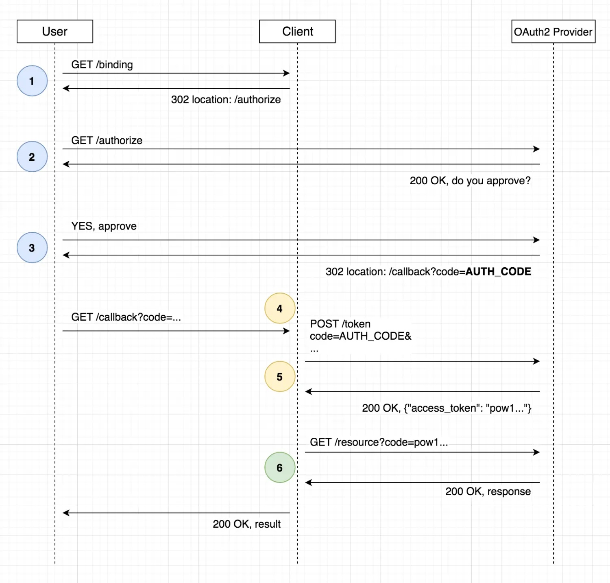

本文主要记录使用Go语言的golang.org/x/oauth2库接入OAuth2实现统一身份认证登录的过程。由于我们内网部署了Choerodon开源版1.0,所以OAuth2的认证服务端直接使用Choerodon的OAuth服务。即在我们的自研服务接入Choerodon的OAuth2服务实现统一身份认证登录。

<!-- more -->

Choerodon的OAuth服务是对Spring Security的二开，和接入Spring Security的OAuth2流程类似。并且OAuth2是一种用于授权的开放标准，理论上所有的OAuth2服务端的实现都是大同小异的，规范[RFC6749](http://www.rfcreader.com/#rfc6749)

## 实现步骤

OAuth有4种授权模式，我们选择最为安全的授权码模式，如下图：



这是一个简化的流程图，User代表我们用户和浏览器端，Client代表我们的Go程序即要接入OAuth2的客户端，OAuth2 Provider代表授权服务端这里就是Choerodon OAuth服务（以下简称OAuth2服务）。

### 1. 配置OAuth2

首先，我们需要在OAuth2服务注册我们的客户端，得到配置OAuth2的一些参数，如`ClientID`、`ClientSecret`、`RedirectURL`等。这些参数将用于在与OAuth2服务进行交互时进行身份验证。

客户端初始化认证处理器

```go
var (
	issuerUri = 'http://127.0.0.1:8000'
	logoutUrl = 'https://api.c7n.x/oauth/logout?access_token=%s'
	conf      *oauth2.Config
)

// 创建认证处理器
func init() {
	E := gin.New()
	E.Use(gin.Recovery())
	
    // ....
    
	auth := E.Group("/auth")

	// 重定向到认证
	auth.GET("/login", Redirect)
	// 认证后回调
	auth.GET("/callback", CallBack)
	// 本地登出
	auth.GET("/logout", LogOut)

	conf = &oauth2.Config{
		ClientID:     'test', // 在OAuth2服务注册的客户端ID和Secret
		ClientSecret: 'testsecretAbv23lnH',
		RedirectURL:  'http://127.0.0.1:8000/auth/callback', // 在OAuth2服务注册时需要填写，请求授权码时需要带上这个地址，OAuth2服务生成授权码后需要回调这个地址
		Scopes:       []string{"default"},
		Endpoint: oauth2.Endpoint{
			AuthURL:   'https://api.c7n.x/oauth/oauth/authorize', // 客户端请求OAuth2服务授权地址
			TokenURL:  'https://api.c7n.x/oauth/oauth/token', // 客户端请求OAuth2服务授权码换取token地址
			AuthStyle: 0,
		},
	}
}
```

### 2. 重定向到认证页面

```go
func Redirect(c *gin.Context) {
	state, err := randString(16)
	if err != nil {
		log.Fatal(err)
	}
	util.SetSession(c, "state", state)
	c.Redirect(302, conf.AuthCodeURL(state))
}
```

通过创建路由，我们可以将用户重定向到OAuth2服务的认证授权页面，以获取授权码。在代码中的`Redirect`函数中，我们可以看到使用`conf.AuthCodeURL(state)`来生成认证页面的URL同时带上state参数，并将用户重定向到该URL（`https://api.c7n.x/oauth/oauth/authorize`）。

### 3. 认证授权回调处理

```go
func CallBack(c *gin.Context) {
	state := util.GetSession(c, "state")
	util.RemoveSession(c, "state")
	//log.Println(state)
	log.Println(c.Query("state"))
	if c.Query("state") != state {
		c.JSON(http.StatusBadRequest, gin.H{
			"code": "BadRequest",
			"msg":  "state did not match",
		})
		c.Abort()
		return
	}
	// 创建 HTTP 客户端，并配置 Transport 忽略 x509 错误
	tr := &http.Transport{
		TLSClientConfig: &tls.Config{InsecureSkipVerify: true},
	}
	sslcli := &http.Client{Transport: tr}
	ctx := context.TODO()
	ctx = context.WithValue(ctx, oauth2.HTTPClient, sslcli)

	oauth2Token, err := conf.Exchange(ctx, c.Query("code"))
	if err != nil {
		c.JSON(http.StatusInternalServerError, gin.H{
			"code": "InternalServerError",
			"msg":  "Failed to exchange token: " + err.Error(),
		})
		c.Abort()
		return
	}

	client := conf.Client(ctx, oauth2Token)

	req, _ := http.NewRequest("GET", "https://api.c7n.x/v1/users/queryPermissions", nil)

	if resp, err := client.Do(req); err == nil {
		defer resp.Body.Close()
		permissionInfo, _ := io.ReadAll(resp.Body)
		// 组装用户和权限信息并保存到session中
		util.SetSession(c, "permissionInfo", permissionInfo)
		util.SetSession(c, "accessToken", oauth2Token.AccessToken)
		u := util.GetSession(c, "url")

		// 跳转到主页
		c.Redirect(302, u.(string))
	} else {
		c.JSON(http.StatusInternalServerError, gin.H{
			"code": "InternalServerError",
			"msg":  "Failed to get userinfo: " + err.Error(),
		})
		c.Abort()
		return
	}
}
```

用户在OAuth2服务授权成功后，将会被重定向回你的应用，并在URL参数中携带授权码和state参数。在`CallBack`函数中，我们首先校验传递的授权码是否与之前生成的state匹配，以确保安全性。然后，使用OAuth2的`conf.Exchange`方法来交换授权码以获取访问令牌。

### 4. 获取和处理用户权限信息

一旦我们获得了访问令牌，我们可以使用它来进行API请求，访问受保护的资源（比如获取用户的权限信息）。在代码中，我们可以看到构建HTTP请求并在请求头中添加访问令牌，然后发送请求以获取用户的权限信息。

通过解析返回的权限信息，我们可以获取用户的权限列表，并进行一些操作。在这个示例中，我们获取到用户权限信息并进行了保存。

### 5. 登出功能

```go
func LogOut(c *gin.Context) {
	accessToken := util.GetSession(c, "accessToken")
	util.ClearSession(c)
	// 不为空就返回登出地址
	if accessToken != nil {
		c.JSON(http.StatusOK, gin.H{
			"logoutUrl": fmt.Sprintf(logoutUrl, accessToken.(string)),
		})
	}
	// 为空直接跳转到主页
	c.Redirect(302, issuerUri)
}
```

在`LogOut`函数中，我们实现了用户登出的功能。这个函数会清除会话信息，并根据用户的访问令牌构建OAuth2服务的登出URL返回给前端由前端请求OAuth2服务进行登出以销毁accessToken。

### 6.其它思考

1. 上述示例代码将用户的信息和token直接保存在Session中，可能在某些场景下（比如移动APP等非Web场景）就不能直接保存在Session中了，可以考虑在客户端置换Jwt来实现。
2. 上述流程并未实现刷新Token的功能，在session失效后需要重新授权和登录。其实在授权服务返回AccessToken时同时也返回了RefreshToken，我这里没有做处理。


本文主要参考以下文章完成，部分内容值得研读，记录一下：

1. [RFC Reader - An online reader for IETF RFCs](http://www.rfcreader.com/#rfc6749)
1. [理解OAuth 2.0 - 阮一峰的网络日志](https://www.ruanyifeng.com/blog/2014/05/oauth_2_0.html)
1. [理解OAuth2.0认证与客户端授权码模式详解-腾讯云开发者社区](https://cloud.tencent.com/developer/article/1811598)
1. [如何验证和刷新 OAuth2 Token - 知乎](https://zhuanlan.zhihu.com/p/639908934)
1. [OAuth2.0用refresh_token更新access_token令牌_reuserefreshtokens_CSDN博客](https://blog.csdn.net/qq_41489540/article/details/122813497)
1. [泛微移动办公云OA(eteams)：竹云统一身份认证对接接口文档](https://eteams.cn/help/1964722188793979108)
1. [Spring Security Oauth2之scope作用域机制使用详解_oauth2 scope-CSDN博客](https://blog.csdn.net/jiangjun_dao519/article/details/125242434)
1. [汉得焱牛开放平台 (hand-china.com)-OAuth认证服务](https://open.hand-china.com/document-center/doc/application/10033/10154?doc_id=24951136&doc_code=2922#OAuth认证服务)
1. [汉得焱牛开放平台 (hand-china.com)-身份认证标准登录](https://open.hand-china.com/document-center/doc/application/10033/10154?doc_id=31679648&doc_code=2924#标准登录)
1. https://github.com/open-hand/choerodon-oauth/blob/1.0.3/src/main/java/org/hzero/oauth/config/AuthorizationServerConfig.java