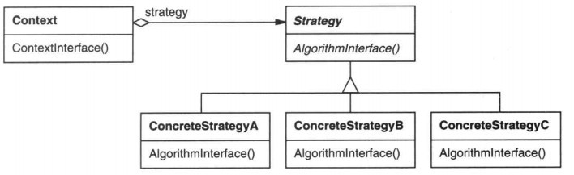
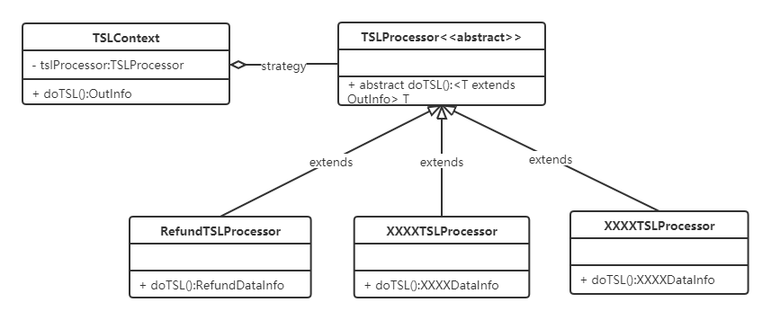
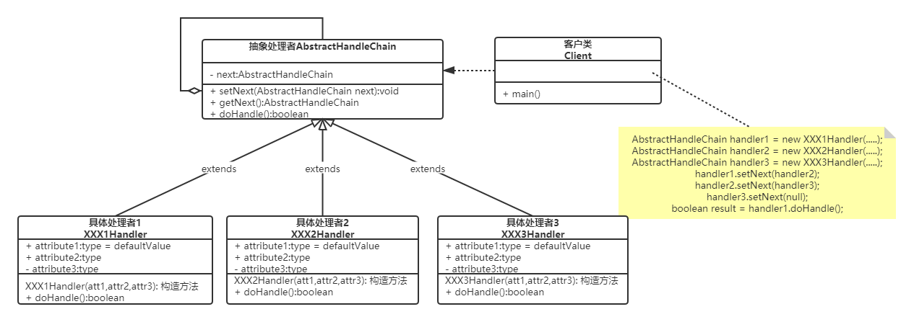

> 本篇旨在记录最近工作中遇到了分别通过策略和责任链设计模式进行代码编写或优化的业务场景与实战经历。

## 策略模式

### 基础知识

**概念：** 定义一系列的算法,把每一个算法封装起来, 并且使它们可相互替换。本模式使得算法可独立于使用它的客户而变化。也称为政策模式(Policy)。（Definea family of algorithms,encapsulate each one, andmake them interchangeable. Strategy lets the algorithmvary independently from clients that use it. ）

策略模式把对象本身和运算规则区分开来，其功能非常强大，因为这个设计模式本身的核心思想就是面向对象编程的多形性的思想。

**意图：** 定义一系列的算法,把它们一个个封装起来, 并且使它们可相互替换。

**主要解决：** 在有多种算法相似的情况下，使用 if...else 所带来的复杂和难以维护。

**何时使用：** 一个系统有许多许多类，而区分它们的只是他们直接的行为。

**如何解决：** 将这些算法封装成一个一个的类，任意地替换。

**关键代码：** 实现同一个接口。

**应用实例：** 1、诸葛亮的锦囊妙计，每一个锦囊就是一个策略。 2、旅行的出游方式，选择骑自行车、坐汽车，每一种旅行方式都是一个策略。 3、JAVA AWT 中的 LayoutManager。

**优点：** 1、算法可以自由切换。 2、避免使用多重条件判断。 3、扩展性良好。

**缺点：** 1、策略类会增多。 2、所有策略类都需要对外暴露。

**注意事项：** 如果一个系统的策略多于四个，就需要考虑使用混合模式，解决策略类膨胀的问题。

**适用场景：** 

当存在以下情况时使用Strategy模式

- 许多相关的类仅仅是行为有异。 “策略”提供了一种用多个行为中的一个行为来配置一个类的方法。即一个系统需要动态地在几种算法中选择一种。
- 需要使用一个算法的不同变体。例如，你可能会定义一些反映不同的空间 /时间权衡的算法。当这些变体实现为一个算法的类层次时 ,可以使用策略模式。
- 算法使用客户不应该知道的数据。可使用策略模式以避免暴露复杂的、与算法相关的数据结构。
- 一个类定义了多种行为 , 并且这些行为在这个类的操作中以多个条件语句的形式出现。将相关的条件分支移入它们各自的Strategy类中以代替这些条件语句。

**结构图：** 




- 环境类(Context):用一个ConcreteStrategy对象来配置。维护一个对Strategy对象的引用。可定义一个接口来让Strategy访问它的数据。
- 抽象策略类(Strategy):定义所有支持的算法的公共接口。 Context使用这个接口来调用某ConcreteStrategy定义的算法。
- 具体策略类(ConcreteStrategy):以Strategy接口实现某具体算法。

### 实战应用

项目中遇到一个TSL:R指令接口（简单来说就是我们请求第三方接口，接口参数就是一个指令命令+指令参数）开发，在原有基础上使用策略模式增加代码可扩展性。见下图，RefundTSLProcessor类表示具体的TSL指令实现类，下次如果需要增加新的TSL指令（如TSL:C、TSL:V等），只需要增加一个TSLProcessor的子类实现具体逻辑即可，其它几个类一行代码不需要改即可完成一个功能。



## 责任链模式

### 基础知识

**概念：** 责任链模式（Chain of Responsibility Pattern）为请求创建了一个接收者对象的链，通常每个接收者都包含对另一个接收者的引用。如果一个对象不能处理该请求，那么它会把相同的请求传给下一个接收者，依此类推。

**意图：** 避免请求发送者与接收者耦合在一起，让多个对象都有可能接收请求，将这些对象连接成一条链，并且沿着这条链传递请求，直到有对象处理它为止。

**主要解决：** 职责链上的处理者负责处理请求，客户只需要将请求发送到职责链上即可，无须关心请求的处理细节和请求的传递，所以职责链将请求的发送者和请求的处理者解耦了。

**何时使用：** 在处理消息的时候以过滤很多道。

**如何解决：** 拦截的类都实现统一接口。

**关键代码：** Handler 里面聚合它自己，在 HandlerRequest 里判断是否合适，如果没达到条件则向下传递，向谁传递之前 set 进去。

**应用实例：** 1、红楼梦中的"击鼓传花"。 2、JS 中的事件冒泡。 3、JAVA WEB 中 Apache Tomcat 对 Encoding 的处理，Struts2 的拦截器，jsp servlet 的 Filter。

**优点：** 1、降低耦合度。它将请求的发送者和接收者解耦。 2、简化了对象。使得对象不需要知道链的结构。 3、增强给对象指派职责的灵活性。通过改变链内的成员或者调动它们的次序，允许动态地新增或者删除责任。 4、增加新的请求处理类很方便。

**缺点：** 1、不能保证请求一定被接收。 2、系统性能将受到一定影响，而且在进行代码调试时不太方便，可能会造成循环调用。 3、可能不容易观察运行时的特征，有碍于除错。

**使用场景：** 1、有多个对象可以处理同一个请求，具体哪个对象处理该请求由运行时刻自动确定。 2、在不明确指定接收者的情况下，向多个对象中的一个提交一个请求。 3、可动态指定一组对象处理请求。

**结构图：**


- 抽象处理者（Handler）角色：定义一个处理请求的接口，包含抽象处理方法和一个后继连接。

- 具体处理者（Concrete Handler）角色：实现抽象处理者的处理方法，判断能否处理本次请求，如果可以处理请求则处理，否则将该请求转给它的后继者。

- 客户类（Client）角色：创建处理链，并向链头的具体处理者对象提交请求，它不关心处理细节和请求的传递过程。

**责任链：**


**样例代码：** 

```java
package chainOfResponsibility;

public class ChainOfResponsibilityPattern {
    public static void main(String[] args) {
        //组装责任链
        Handler handler1 = new ConcreteHandler1();
        Handler handler2 = new ConcreteHandler2();
        handler1.setNext(handler2);
        //提交请求
        handler1.handleRequest("two");
    }
}

//抽象处理者角色
abstract class Handler {
    private Handler next;

    public void setNext(Handler next) {
        this.next = next;
    }

    public Handler getNext() {
        return next;
    }

    //处理请求的方法
    public abstract void handleRequest(String request);
}

//具体处理者角色1
class ConcreteHandler1 extends Handler {
    public void handleRequest(String request) {
        if (request.equals("one")) {
            System.out.println("具体处理者1负责处理该请求！");
        } else {
            if (getNext() != null) {
                getNext().handleRequest(request);
            } else {
                System.out.println("没有人处理该请求！");
            }
        }
    }
}

//具体处理者角色2
class ConcreteHandler2 extends Handler {
    public void handleRequest(String request) {
        if (request.equals("two")) {
            System.out.println("具体处理者2负责处理该请求！");
        } else {
            if (getNext() != null) {
                getNext().handleRequest(request);
            } else {
                System.out.println("没有人处理该请求！");
            }
        }
    }
}
```

### 实战应用

这个实战应用主要是我看到项目代码某个方法中一系列流程下来出现了多个flag值，基本思路就是一堆逻辑处理最终设定flag1的值，接着当flag1==true 又一堆逻辑处理最终设定flag2的值，最后又根据flag2的值处理逻辑。看懂这个流程下来后我就开始兴奋，准备把这个代码使用责任链模式重构。见下图：



由于整个处理逻辑最后只需要得到一个Boolean类型的值，所以doHandle()方法就只需要返回一个Boolean值即可，同时因为每一个链的处理逻辑很复杂，需要很多参数且这些处理者之间的参数互不相关（即下一个处理者的参数不依赖上一个的参数或结果），我这里就通过每一个具体的处理者的构造函数传入参数。上一个处理完成后调用getNext().doHandle()进入下一个链。

## *参考*

1. [设计模式 ( 十八 ) 策略模式Strategy（对象行为型）_黄规速博客:学如逆水行舟，不进则退-CSDN博客_策略模式](https://blog.csdn.net/hguisu/article/details/7558249/)
2. [责任链模式 | 菜鸟教程 (runoob.com)](https://www.runoob.com/design-pattern/chain-of-responsibility-pattern.html)
3. [责任链模式（职责链模式）详解 (biancheng.net)](http://c.biancheng.net/view/1383.html)
4. [工作中巧用了这几个设计模式重构代码，女同事直呼666_翻肚鱼儿的博客-CSDN博客](https://blog.csdn.net/qq_21743659/article/details/109259079)

