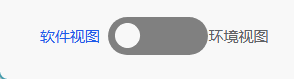

基本需求场景：使用Vue2实现一个自定义的Switch Button组件，并且在使用时要求父子组件能相互通信。使用到的技术主要是`vue2`和`element-ui`。

<!-- more -->

### 实现效果



### 基本思路

**按钮样式：** 主要参考<https://codepen.io/mburnette/pen/LxNxNg>。  

**父子组件传值绑定：** 主要有两种方式：

第一种父组件给子组件的prop传值，子组件通过`this.$emit('change', this.isChecked)`向父组件传递change事件，父组件监听change事件变化即可，可参考：[Vue.js监听子组件事件（v-on）、绑定子组件数据（v-model）_vue监听子组件数据变化](https://blog.csdn.net/xingzuo_1840/article/details/125019947) ；

第二种则是利用Vue2.2.0中新增的model来实现，可参考：[API — Vue.js (vuejs.org)](https://v2.cn.vuejs.org/v2/api/#model) 和 [在 vue 中使用 v-model 监听子组件中的任何值](https://www.jianshu.com/p/71c6b2500e24/)，这其实是Vue提供的一种可自定义的prop和event的方式。

> 允许一个自定义组件在使用 `v-model` 时定制 prop 和 event。默认情况下，一个组件上的 `v-model` 会把 `value` 用作 prop 且把 `input` 用作 event，但是一些输入类型比如单选框和复选框按钮可能想使用 `value` prop 来达到不同的目的。使用 `model` 选项可以回避这些情况产生的冲突。
>
> ```vue
> Vue.component('my-checkbox', {
>   model: {
>     prop: 'checked',
>     event: 'change'
>   },
>   props: {
>     // this allows using the `value` prop for a different purpose
>     value: String,
>     // use `checked` as the prop which take the place of `value`
>     checked: {
>       type: Number,
>       default: 0
>     }
>   },
>   // ...
> })
> <my-checkbox v-model="foo" value="some value"></my-checkbox>
> ```
>
> 上述代码相当于：
>
> ```vue
> <my-checkbox
>   :checked="foo"
>   @change="val => { foo = val }"
>   value="some value">
> </my-checkbox>
> ```

### 代码实现

> 示例代码中包含了两种父子组件传值绑定的方式，具体使用时自行选择。

Switcher子组件：

```vue
<template>
  <div style="display: flex;align-items: center">
    <span :style="{fontSize: '0.25rem',color: inactiveColor1}">{{inactiveText}}</span>
    <input type="checkbox" id="switch" v-model="isChecked" @change="handleChange" />
    <label for="switch">Toggle</label>
    <span :style="{fontSize: '0.25rem',color: activeColor1}">{{activeText}}</span>
  </div>
</template>

<script>

export default {
  props: {
    activeText: String,
    inactiveText: String,
    activeColor: String,
    inactiveColor: String,
    parentMsg: {
      type: Boolean,
      default: false
    }
  },
  // https://v2.cn.vuejs.org/v2/api/#model
  model: {
    // 父组件使用v-model双向绑定parentMsg值
    prop: 'parentMsg',
    // 定义v-model的事件名为watch111
    event: 'watch111'
  },
  name: 'Switcher',
  data() {
    return {
      isChecked: false,
      activeColor1: this.inactiveColor?this.inactiveColor:"#606266",
      inactiveColor1: this.activeColor?this.activeColor:"#13ce66",
    }
  },
  methods: {
    handleChange() {
      this.$emit('change', this.isChecked)
      this.$emit('watch111', this.isChecked)
      if (this.isChecked) {
        this.activeColor1 = this.activeColor
        this.inactiveColor1 = this.inactiveColor
      }else{
        this.activeColor1 = this.inactiveColor
        this.inactiveColor1 = this.activeColor
      }
    },
  },
}
</script>

<style lang="scss" scoped>

input[type=checkbox]{
  height: 0;
  width: 0;
  visibility: hidden;
}

label {
  cursor: pointer;
  text-indent: -9999px;
  width: 80px;
  height: 30px;
  background: grey;
  display: block;
  border-radius: 100px;
  position: relative;
}

label:after {
  content: '';
  position: absolute;
  top: 5px;
  left: 5px;
  width: 20px;
  height: 20px;
  background: #fff;
  border-radius: 90px;
  transition: 2s;
}

input:checked + label {
  //background: #bada55;
}

input:checked + label:after {
  left: calc(100% - 5px);
  transform: translateX(-100%);
}

label:active:after {
  width: 70px;
}
</style>
```

父组件中使用Switcher子组件：

使用v-model来绑定子组件`this.$emit('watch111', this.isChecked)`过来的值，使用@change来监听子组件`this.$emit('change', this.isChecked)`过来的值

```vue
<Switcher active-text="环境视图"
   inactive-text="软件视图"
   active-color="#215ae5"
   inactive-color="#606266"
   v-model="foo" 
   @change="handleSwitch($event)"
/>
```
