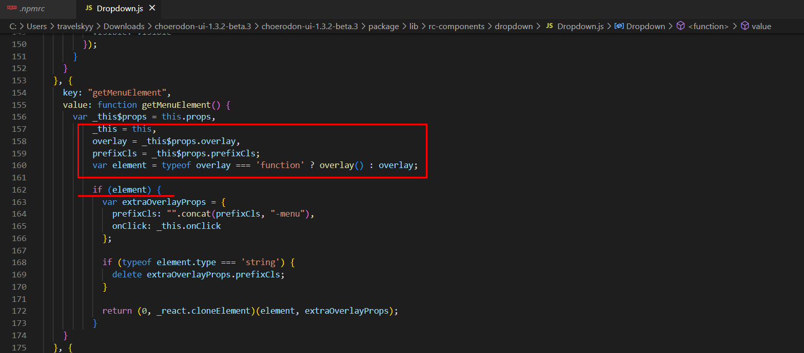

在二次开发猪齿鱼时，[choerodon-front](https://github.com/open-hand/choerodon-front/blob/9699502bf1e4a0f0e6d577fdcac086839892b4c2/package.json#L21)依赖[@choerodon/master](https://github.com/open-hand/choerodon-front-master/),[@choerodon/master](https://github.com/open-hand/choerodon-front-master/blob/aca25a9c88c344125139a14897e3d640c5ee8750/package.json#L63)又依赖[choerodon-ui](https://github.com/open-hand/choerodon-ui/)，我们用到的版本是1.3.2-beta.3版本，而这个版本的choerodon-ui存在一个bug需要修复。本文记录修改过程和踩坑

<!-- more -->

> 参考：https://openforum.hand-china.com/t/topic/5207
>
> 已查明是chorderon-ui:1.3.2-alpha3版本中的Dropdown组件与rc-compnent中的Dropdown组件不匹配。 rc中未判断overlay传入的是函数还是element，直接当成element使用。 而外部包装的Dropdown组件传入的是一个函数。
> choederon-ui：1.4.2版本修复了这个bug

尝试直接升级到choederon-ui：1.4.2版本发现与原choerodon-front不兼容，这样的话我们只能修改choederon-ui:1.3.2-beta.3这个版本的源码修复这个bug，但是这个版本的源码我们没法编译(拉取不到依赖包)，所以只能够修改他的发布包然后上传到我们自己的私库进行引用。


这里记录一下步骤和踩坑：

1. [官方库](https://nexus.choerodon.com.cn/service/rest/repository/browse/choerodon-npm/choerodon-ui/)中下载choerodon-ui的tgz包进行修改,通过对比1.4.2版本的源码，发现只需要修改如下内容

   

2. 直接在包含package.json文件的路径下执行[npm publish](https://docs.npmjs.com/cli/v9/commands/npm-publish)，这个操作需要先[登录私库](https://docs.npmjs.com/cli/v9/commands/npm-login)，需要注意的是`npm publish`命令发布到的地址是在.npmrc中或者package.json文件中指定的。

3. 此时如果在choerodon-front使用我们刚刚发布的choerodon-ui（通过choerodon-master间接引入的），就会出现这个sha512校验不通过。找了半天也没找到如何来忽略这个checksum校验。

   ```bash
   npm WARN tarball tarball data for choerodon-ui@https://nexus.my.com/repository/npm-public/choerodon-ui/-/choerodon-ui-1.3.2-beta.3.tgz (sha512-ILrrmusY1HFd32GABH9AGHpxGs61RykWfnz8a6QjwcBPlTbC2hZ6XAiUInZrD1RiOwZTRD5rAb710fPbh98f2A==) seems to be corrupted. Trying again.
   npm ERR! code EINTEGRITY
   npm ERR! sha512-ILrrmusY1HFd32GABH9AGHpxGs61RykWfnz8a6QjwcBPlTbC2hZ6XAiUInZrD1RiOwZTRD5rAb710fPbh98f2A== integrity checksum failed when using sha512: wanted sha512-ILrrmusY1HFd32GABH9AGHpxGs61RykWfnz8a6QjwcBPlTbC2hZ6XAiUInZrD1RiOwZTRD5rAb710fPbh98f2A== but got sha512-XTbLhn23uAsM6ToSRWTZPYTxBCLTdbmdWrJnhUxvTcqvDx9bYaHshABi/wOwg9dcrZKIt2prOaddzTAPQZSXAg==. (28358010 bytes)
   ```

4. 最终我采取的方式是：把我们修改的choerodon-ui增加一个版本号，同时修改choerodon-master依赖的choerodon-ui版本号。

   choerodon-ui下的package.json中修改`"version": "1.3.2-beta.4"`再进行发布，[官方库](https://nexus.choerodon.com.cn/service/rest/repository/browse/choerodon-npm/%40choerodon/master/)中下载choerodon-master的对应版本，修改package.json中依赖的版本` "dependencies": {  "choerodon-ui": "1.3.2-beta.4",...}`再将choerodon-master发布到私库。

5. 最后让我们的choerodon-front打包时去我们私库拉取这个两个包即可。需要注意的是如果私库有之前没有修改过的包可以删除了以免拉到旧包或造成误解。
