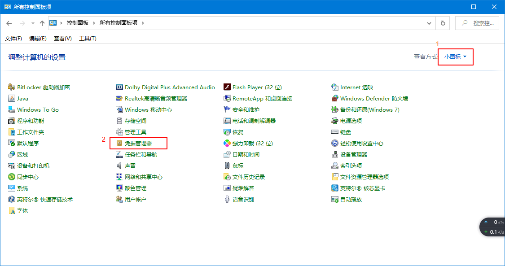

## 操作环境

- Windows 10
- Git 

## 问题重现

首次使用Git拉代码/推送代代码时会要求输入远程仓库用户名和密码，这时候一不小心输错了，然而再次拉代码/推送代码时只密码错误，不再弹出输入用户名和密码框。只弹出用户名密码框一次。<!--more-->错误信息：密码错误remote: Coding 提示: Authentication failed! 认证失败，请确认您输入了正确的账号密码。

## 问题解决

只需要去系统控制面板凭据管理器里面修改密码即可。

1、打开控制面板，选择查看方式为"小图标"，选择“凭据管理器”；

2、选择“Windows凭据”，在下方的“普通凭据”中选择对应的账户修改密码即可。

自此，该问题已解决，重新拉取/推送即可成功。