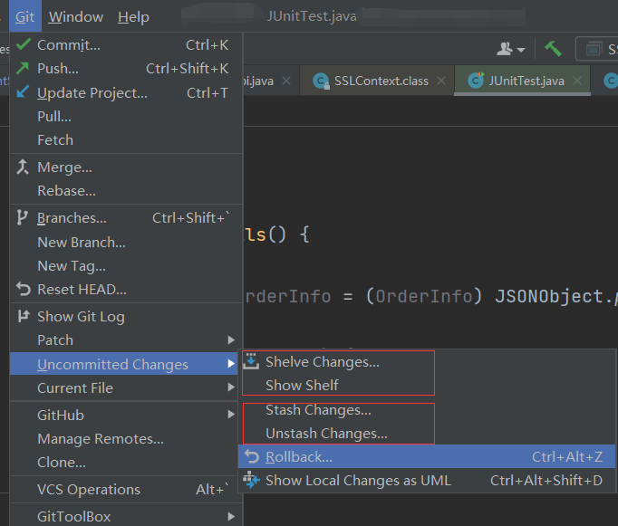

> 在IDEA中看到这两个暂存代码的功能，在此记录一下它们的区别。

**场景：** 比如此时你正在IDEA中开心地撸代码（在分支A上），因为同事叫你帮忙看看他分支的代码或者因为其它原因需要切换到分支B上，分支A上的代码如果没有commit直接切换分支就有可能产生冲突。这时需要将修改的代码"暂存"起来。

暂存未提交的代码可以有很多种方式，比较方便的就是`Shelve Changes`  和 `Git Stash`。

总的来说，这两种方式实现的功能都一样，区别就是`Shelve Changes`功能是IDEA提供的，`Git Stash`是Git工具提供的。

Jetbrains官方对Shelve-Changes的介绍：[Shelve and unshelve changes | IntelliJ IDEA (jetbrains.com)](https://www.jetbrains.com/help/idea/shelving-and-unshelving-changes.html)

Git官方对Git-Stash的介绍：[Git - git-stash Documentation (git-scm.com)](https://git-scm.com/docs/git-stash)

