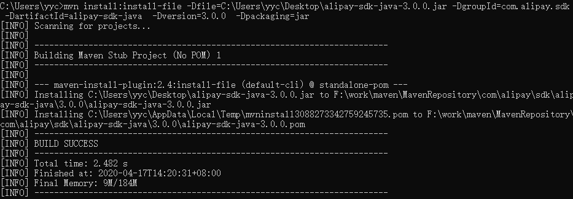
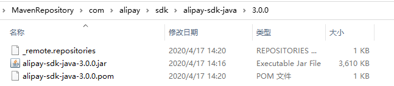

### 重现场景

1. 在某些地方只提供了一个本地jar包，在Maven中央仓库中下载没有该jar包；
2. 目标jar包只在公司内网私服上有，外网是没有的（表现为`pom.xml`文件中对应依赖标红），但是你找同事拷贝了一个jar包。<!--more-->

### 操作前提

1. 本地安装好maven环境，并配置好maven环境变量；
2. 有一个需要放到本地仓库的jar文件。

### 命令操作

> 将jar包安装到本地maven仓库，这样在本地项目的pom.xml中就可以正常引用了。

这里以阿里云支付宝sdk为例（现在的maven仓库已经有这个jar包了，可直接引用，地址：[ https://mvnrepository.com/artifact/com.alipay.sdk/alipay-sdk-java/ ]( https://mvnrepository.com/artifact/com.alipay.sdk/alipay-sdk-java/ )），将`alipay-sdk-java-3.0.0.jar`这个放到本地，如：windows桌面。然后执行命令安装到本地：

```shell
mvn install:install-file -Dfile=C:\Users\yyc\Desktop\alipay-sdk-java-3.0.0.jar -DgroupId=com.alipay.sdk  -DartifactId=alipay-sdk-java  -Dversion=3.0.0  -Dpackaging=jar
```

如果拿到的jar同时有pom文件，则可以不用指定`groupId`，`artifactId`，`version` 因为pom中都有啊！只需要指定jar的位置和pom文件的位置就可以<span id ="top"></span>

```shell
mvn install:install-file -Dfile=E:\redisRMI-1.0.0.jar -DpomFile=redisRMI-1.0.0.pom  
```

执行成功，如下图所示：



这时候在maven本地仓库中就有相应的jar包，如下图所示：



已经添加成功，在pom.xml中使用即可。

```xml
<dependency>
    <groupId>com.alipay.sdk</groupId>
    <artifactId>alipay-sdk-java</artifactId>
    <version>3.0.0</version>
</dependency>
```

### 拓展

其实我们常用的maven命令除了install还有package、deploy，这三个命令的区别如下：

- **package命令完成了项目编译、单元测试、打包功能**，但没有把打好的可执行jar包（war包或其它形式的包）布署到本地maven仓库和远程maven私服仓库

- **install命令完成了项目编译、单元测试、打包功能，同时把打好的可执行jar包（war包或其它形式的包）布署到本地maven仓库**，但没有布署到远程maven私服仓库

- **deploy命令完成了项目编译、单元测试、打包功能，同时把打好的可执行jar包（war包或其它形式的包）布署到本地maven仓库和远程maven私服仓库（<span style="color:blue">需要在本地maven的settings.xml中配置Server</span>）**

  settings文件：

  ```xml
    <servers>
        <server>
          <id>nexushost.y.y</id><!---->
          <username>ycyin</username>
          <password>123qwweq</password>
        </server>
    </servers>
  ```

  命令：([同样的，如果有pom文件则无需指定`groupId`，`artifactId`，`version` ](#top))

  ```shell
  mvn deploy:deploy-file -DgroupId=com.yyc -DartifactId=yyc-demo -Dversion=2.5.0-SNAPSHOT -Dpackaging=jar -Dfile=E:\yyc-demo-2.5.0-SNAPSHOT.jar -Durl=http://nexushost.y.y/repository/maven-snapshots/ -DrepositoryId=nexushost.y.y -s D:\devEnv\apache-maven-3.6.3\conf\settings.xml -DupdateReleaseInfo=true
  ```

<span style="color:red">另外：一般执行命令加上clean，以生成新的jar包免受之前旧文件影响。</span>如打包使用的命令就为：`mvn clean package `

或者也可以加上参数`-Djar.forceCreation`生成全新的jar包，如：`mvn package -Djar.forceCreation`。

