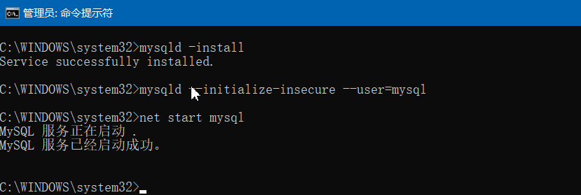
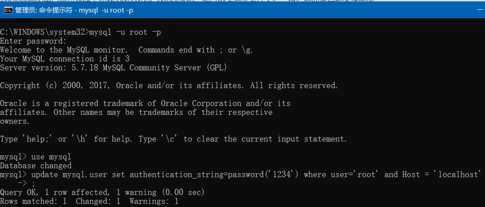

## 前言

本篇旨在快速在win10中搭起MySQL环境，使用5.7的zip版本；zip版本是一个压缩包，使用命令安装，可以更快、免注册表安装；官方有提供exe文件包安装的，它会写一堆注册表，还可能因为宿主机环境问题导致不能启动等诸多问题(反正我遇到过)。

<span style="color:red">本篇针对解压版本5.7.18(博主使用的这个版本、在某些低版本/高版本中部分命令可能失效)</span>

## 安装环境

- mysql-5.7.18-winx64.zip  
- windows 10 专业版 20H2

## 安装和初始化MySQL

**下载：** 点击[MySQL :: Download MySQL Community Server](https://dev.mysql.com/downloads/mysql/5.7.html)下载，或者百度搜MySQL 5.7 找官方下载地址

**安装：** 解压压缩包，配置<span style="color:red">系统变量(不是用户变量)</span>path环境变量，然后管理员运行命令提示符cmd   输入`mysqld -install` 安装mysql

```bash
mysqld -install
```

**初始化：** 解压版解压后没有data目录，所以需要初始化生成data目录。使用如下命令：

```bash
mysqld --initialize-insecure --user=mysql
```

## 启动MySQL

管理员命令提示符下使用命令（net start mysql）来启动mysql数据库，前提是你已经完成上面的安装和初始化操作。

```bash
net start mysql
```



停止mysql服务命令：

```bash
net stop mysql
```
移除安装命令：

```bash
mysqld -remove
```

启动时，可能会出现下面的错误：

<span style="color:red">出现无法启动的提示：检查是否已经启动，或者进程中是否有一个mysqld.exe的进程正在运行。</span>

<span style="color:red">出现10061错误：需要管理员运行cmd 移除安装后重新install </span>

<span style="color:red">出现发生系统错误2，系统找不到指定文件：环境变量需要配置到系统变量下而不是用户变量，然后移除安装后重新install。</span>

## 创建用户名和密码
> （新版本5.7 Mysql）

```sql
CREATE USER '用户名'@'localhost' IDENTIFIED BY '密码'; 
```

## 修改root密码

<span id="updatePass" style="color:red">每次修改密码都需要重启服务才能生效</span>

修改root用户的密码，需要启动mysql后，输入mysql -u root -p回车，显示输入密码，输入密码或直接回车（第一次使用mysql,root没有密码直接回车）就可以登录数据库。然后输入命令use mysql来使用mysql这个数据库，然后尝试使用下面三个方法来修改密码：

- 使用命令

  ```sql
  update mysql.user set authentication_string=password('123qwe') where user='root' and Host = 'localhost';
  ```
  
  新版Mysql已经没有password字段，而是将加密后的用户密码存储于authentication_string字段，所以网上很多方法不行，执行后要重启服务才生效
  
- 使用 `mysqladmin –u用户名–p旧密码 password 新密码`

- （新版本Mysql）还不行就试试

  ```sql
  set password for root@localhost = password(‘123’); 
  ```
  
   注：最好手敲，以免符号不对




## 忘记root密码


>  跳过数据库连接修改root密码

1. 管理员运行第一个cmd，输入`net stop mysql`以关闭mysql服务，再接着输入`mysqld --skip-grant-tables` 以跳过密码
2. 保持上一步的cmd不关闭，管理员运行另一个cmd,直接输入`mysql -u root -p`回车，显示输入密码，直接回车就可以免密码登录
3. 这时你可以在第二个cmd修改root密码了（见[修改root密码](#updatePass)）。

<span style="color:red">注：</span>该过程mysql没有net start mysql操作。

## 乱码问题

在java中连接数据库时，有时为了防止存入的数据乱码，我们常常使用这样的语句：

`jdbc:mysql://localhost:3306/weibo?useUnicode=true&characterEncoding=UTF8`

最后的characterEncoding就是指定数据库的编码。如何查看和修改数据库的编码，如下：

查看当前数据库编码

```sql
show variables like 'character_set_database';
```

修改数据库编码(xxx是数据库名)

```sql
alter database xxx CHARACTER SET gb2312;
```

## 更换盘符

如果数据库需要更换盘符（如：原来在C盘，现在要换到D盘），需要先停止数据库服务，复制粘帖数据库后要执行`mysqld -remove`卸载，然后执行`mysqld -install`重新安装即可


## *参考：*

本篇经过多次本地安装MySQL经验后记录，原来写在我的博客园，地址：[安装mysql数据库中的技巧、错误排查 - 敲代码的小松鼠 - 博客园 (cnblogs.com)](https://www.cnblogs.com/hyyq/p/6219083.html)