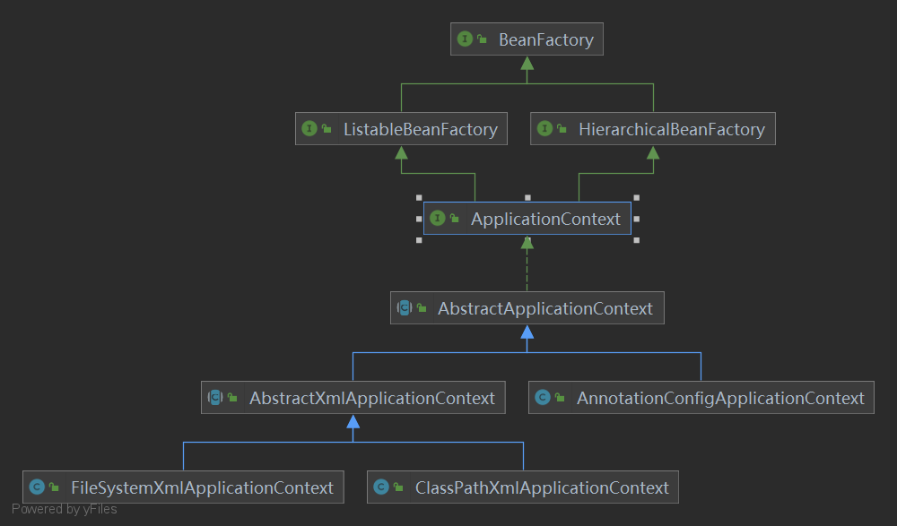

## 前言

之前最开始学Spring的时候有写过Spring相关的文章，写得很烂，现在去看基本上没啥帮助了，所以决定重新学习一下重新写点文章记录一下。本篇会从一个Service层依赖DAO层的实例一步步解耦，从而引入对Spring IOC 和DI、BeanFactory 和 ApplicationContext、Spring Bean 的XML配置等学习。

## 程序的耦合

这个概念在大学的软件工程课程中有过详细学习，不过忘得差不多了。模块间的耦合度是指模块之间的依赖关系，包括控制关系、调用关系、数据传递关系。模块间联系越多，其耦合性越强，同时表明其独立性越差( 降低耦合性，可以提高其独立性)。耦合性存在于各个领域，而非软件设计中独有的，但是我们只讨论软件工程中的耦合。在软件工程中，耦合指的就是就是对象之间的依赖性。对象之间的耦合越高，维护成本越高。因此对象的设计应使类和构件之间的耦合最小。软件设计中通常用耦合度和内聚度作为衡量模块独立程度的标准。划分模块的一个准则就是<span style="color:red">高内聚低耦合</span>。耦合类型可以由程度由高到低分为：内容耦合>公共耦合>外部耦合>控制耦合>标记耦合>数据耦合>非直接耦合。

简单来说耦合就是程序间的依赖关系，包括类之间的依赖和方法间的依赖。解耦即是降低程序间的耦合关系，在实际开发中我们应该做到：编译期不依赖，运行时才依赖。解耦的思路：第一步：使用反射来创建对象，而避免使用new关键字。第二步：通过读取配置文件来获取要创建的对象全限定类名。

<span style="color:blue">下面先通过一些实例来看看一般我们的程序中怎么解耦。</span>

### 实例1:原始JDBC解耦

下面我们通过原始的JDBC操作实例来演示如何一步步解耦的。

```java
//1.注册驱动
DriverManager.registerDriver(new com.mysql.jdbc.Driver());
//2.获取连接
Connection conn = DriverManager.getConnection("jdbc:mysql://localhost:3306/test","root","1234");
//3.获取操作数据库的预处理对象
PreparedStatement pstm = conn.prepareStatement("select * from account");
//4.执行SQL，得到结果集
ResultSet rs = pstm.executeQuery();
//5.遍历结果集
while(rs.next()){
    System.out.println(rs.getString("name"));
}
//6.释放资源
rs.close();
pstm.close();
conn.close();
```

上面代码的第一步注册驱动时，我们使用 DriverManager 的 register 方法，这种方式我们的类依赖了数据库的具体驱动类（`new com.mysql.jdbc.Driver()`），如果这时候更换了数据库品牌（比如 Oracle），需要修改源码来重新数据库驱动，这样耦合度就太高。

为了不使用`new`关键字注册驱动，我们可以使用反射来注册。代码如下：

```java
Class.forName("com.mysql.jdbc.Driver");//此处只是一个字符串
```

此时的好处是，我们的类中不再依赖具体的驱动类，此时就算删除 mysql 的驱动 jar 包，依然可以编译（运行就不要想了，没有驱动不可能运行成功的）。
同时，也产生了一个新的问题，mysql 驱动的全限定类名字符串是在 java 类中写死的，一旦要改还是要修改源码。
解决这个问题也很简单，使用配置文件配置，这里就先。

### 实例2:工厂模式解耦

<span id="demo2"></span>在这个实例中，模拟创建Service层和DAO层，在Service中需要注入DAO层。在没有解耦的情况下，我们创建对象都是new出来的,这样的Service和DAO强耦合，需要注入新的DAO实现必须修改源码，使用Service实现也是new出来的强耦合代码。如下代码：

**DAO与Service层：**

```java
/**
 * 账户的持久层接口
 */
public interface IAccountDao {

    /**
     * 模拟保存账户
     */
    void saveAccount();
}


/**
 * 账户的持久层实现类
 */
public class AccountDaoImpl implements IAccountDao {

    public  void saveAccount(){

        System.out.println("保存了账户");
    }
}

////*************************************************************/////

/**
 * 账户业务层的接口
 */
public interface IAccountService {

    /**
     * 模拟保存账户
     */
    void saveAccount();
}

/**
 * 账户的业务层实现类
 */
public class AccountServiceImpl implements IAccountService {

    private IAccountDao accountDao = new AccountDaoImpl();

    public void  saveAccount(){
        accountDao.saveAccount();
    }
}
```

**获取Bean：** 直接new ,耦合度高。

```java
// service层中使用DAO时
private IAccountDao accountDao = new AccountDaoImpl();

// 外部使用Service时
IAccountService as = new AccountServiceImpl();
```

#### 工厂模式解耦

创建`bean.properties`配置文件：

```properties
accountService=com.yyc.service.impl.AccountServiceImpl
accountDao=com.yyc.dao.impl.AccountDaoImpl
```

创建工厂类和方法：

```java
import java.io.InputStream;
import java.util.*;
/**
 * 一个创建Bean对象的工厂
 *
 * Bean：在计算机英语中，有可重用组件的含义。
 * JavaBean：用java语言编写的可重用组件。
 *      javabean >  实体类
 *
 *   它就是创建我们的service和dao对象的。
 *
 *   第一个：需要一个配置文件来配置我们的service和dao
 *           配置的内容：唯一标识=全限定类名（key=value)
 *   第二个：通过读取配置文件中配置的内容，反射创建对象
 *
 *   我的配置文件可以是xml也可以是properties
 */
public class BeanFactory {
    // 定义一个Properties对象
    private static Properties props;

    // 定义一个Map,用于存放我们要创建的对象。我们把它称之为容器
    private static Map<String,Object> beans;

    //使用静态代码块为Properties对象赋值
    static {
        try {
            //实例化对象
            props = new Properties();
            //获取properties文件的流对象
            InputStream in = BeanFactory.class.getClassLoader().getResourceAsStream("bean.properties");
            props.load(in);
            //实例化容器
            beans = new HashMap<String,Object>();
            //取出配置文件中所有的Key
            Enumeration keys = props.keys();
            //遍历枚举
            while (keys.hasMoreElements()){
                //取出每个Key
                String key = keys.nextElement().toString();
                //根据key获取value
                String beanPath = props.getProperty(key);
                //反射创建对象
                Object value = Class.forName(beanPath).newInstance();
                //把key和value存入容器中
                beans.put(key,value);
            }
        }catch(Exception e){
            throw new ExceptionInInitializerError("初始化properties失败！");
        }
    }

    /**
     * 根据bean的名称获取对象,单例
     * @param beanName
     * @return
     */
    public static Object getBean(String beanName){
        return beans.get(beanName);
    }

    /**
     * 根据Bean的名称获取bean对象,多例
     * @param beanName
     * @return

    public static Object getBean(String beanName){
        Object bean = null;
        try {
            String beanPath = props.getProperty(beanName);
            //每次都会调用默认构造函数创建对象
            bean = Class.forName(beanPath).newInstance();
        }catch (Exception e){
            e.printStackTrace();
        }
        return bean;
    }*/
}
```

**工厂方法获取Bean：** 耦合度降低。

```java
// service层中使用DAO时
private IAccountDao accountDao = (IAccountDao) BeanFactory.getBean("accountDao");

// 外部使用Service时
IAccountService as = (IAccountService) BeanFactory.getBean("accountService");
```


<span style="color:red">通过工厂模式+反射可以较好的将对象解耦，并且通过Map可以实现对象的创建和获取。</span> 在应用加载时，创建一个 Map，用于存放三层对象。我们把这个 map 称之为<span style="color:red">容器</span>。工厂就是负责给我们从容器中获取指定对象的类。这时候我们获取对象的方式发生了改变。
原来：
我们在获取对象时，都是采用 new 的方式。**是主动的**。

现在：
我们获取对象时，同时跟工厂要，有工厂为我们查找或者创建对象。**是被动的**。

这种被动接收的方式获取对象的思想就是控制反转，它是 spring 框架的核心之一。

## 控制反转(IOC)

**控制反转**（Inversion of Control，缩写为**IoC**），是[面向对象编程](#)中的一种设计原则，可以用来减低计算机[代码](#)之间的[耦合度](#)。其中最常见的方式叫做**[依赖注入](#)**（Dependency Injection，简称**DI**），还有一种方式叫“依赖查找”（Dependency Lookup）。

IOC的作用：削减计算机程序的耦合(解除我们代码中的依赖关系)。

## 使用Spring的IOC解决对象创建

仍然以上面实例2中的代码为例，使用Spring的IOC解决对象的创建耦合。

**pom.xml导入Spring-Context包:**

```xml
<dependency>
    <groupId>org.springframework</groupId>
    <artifactId>spring-context</artifactId>
    <version>5.0.2.RELEASE</version>
</dependency>
```

**创建spring配置文件bean.xml：**

```xml
<?xml version="1.0" encoding="UTF-8"?>
<beans xmlns="http://www.springframework.org/schema/beans"
       xmlns:xsi="http://www.w3.org/2001/XMLSchema-instance"
       xsi:schemaLocation="http://www.springframework.org/schema/beans
        http://www.springframework.org/schema/beans/spring-beans.xsd">

    <!--把对象的创建交给spring来管理-->
    <bean id="accountService" class="com.yyc.service.impl.AccountServiceImpl"></bean>

    <bean id="accountDao" class="com.yyc.dao.impl.AccountDaoImpl"></bean>
</beans>
```

**使用Spring获取Bean:**

```java
//1.获取核心容器对象
ApplicationContext ac = new ClassPathXmlApplicationContext("bean.xml");
//ApplicationContext ac = new FileSystemXmlApplicationContext("C:\\Users\\yyc\\Desktop\\bean.xml");
//2.根据id获取Bean对象
IAccountService as  = (IAccountService)ac.getBean("accountService");
IAccountDao adao = ac.getBean("accountDao",IAccountDao.class);
```

## BeanFactory 和 ApplicationContext 的区别

上面的[实例2](#demo2)通过BeanFactory解耦，这也是Spring的BeanFactory的基本原理，我们可以通过IDEA  的Show Diagrams可以方便的查看类结构图，见下图：



可以发现，BeanFactory 才是 Spring 容器中的顶层接口。ApplicationContext 是它的子接口。
BeanFactory 和 ApplicationContext 的区别：

- 创建对象的时间点不一样。

  ApplicationContext：只要一读取配置文件，默认情况下就会创建对象。
  BeanFactory：什么时候使用什么时候创建对象。

## ApplicationContext 接口的实现类

- ClassPathXmlApplicationContext：它是从类的根路径下加载配置文件 推荐使用这种
- FileSystemXmlApplicationContext：它是从磁盘路径上加载配置文件，配置文件可以在磁盘的任意位置。
- AnnotationConfigApplicationContext: 当我们使用注解配置容器对象时，需要使用此类来创建 spring 容器。它用来读取注解。

## Spring IOC中Bean标签与对象管理

### Bean标签

作用：
用于配置对象让 spring 来创建的。
默认情况下它调用的是类中的无参构造函数。如果没有无参构造函数则不能创建成功。
属性：

- id：给对象在容器中提供一个唯一标识。用于获取对象。

- class：指定类的全限定类名。用于反射创建对象。<span style="color:red">默认情况下调用无参构造函数</span>。

- scope：指定对象的作用范围。

    - - singleton :<span style="color:red">默认值，单例的</span>.
    - - prototype :多例的.
    - - request:WEB 项目中,Spring 创建一个 Bean 的对象,将对象存入到 request 域中.
    - - session:WEB 项目中,Spring 创建一个 Bean 的对象,将对象存入到 session 域中.
    - - global session:WEB 项目中,应用在 Portlet 环境.如果没有 Portlet 环境那么globalSession 相当于 session.

- init-method：指定类中的初始化方法名称。

- destroy-method：指定类中销毁方法名称

### Bean 的作用范围和生命周期

- 单例对象：`scope="singleton"`
  一个应用只有一个对象的实例。它的作用范围就是整个引用，单例对象的生命周期和容器相同。
  生命周期：
   对象出生：当应用加载，创建容器时，对象就被创建了。
   对象活着：只要容器在，对象一直活着。
   对象死亡：当应用卸载，销毁容器时，对象就被销毁了。
- 多例对象：`scope="prototype"`
  每次访问对象时，都会重新创建对象实例。
  生命周期：
   对象出生：当使用对象时，创建新的对象实例。
   对象活着：只要对象在使用中，就一直活着。
   对象死亡：当对象长时间不用，且没有别的对象引用时，由Java的垃圾回收器回收。

### 实例化 Bean 的三种方式

**第一种方式：** 使用默认构造函数创建。

在spring的配置文件中使用bean标签，配以id和class属性之后，且没有其他属性和标签时。采用的就是默认构造函数创建bean对象，此时如果类中没有默认构造函数，则对象无法创建。

Java代码：

```java
public class AccountServiceImpl{
    public AccountServiceImpl(){
        System.out.println("对象创建了");
    }
} 
```

Spring配置xml:

```xml
<bean id="accountService" class="com.yyc.service.impl.AccountServiceImpl"></bean>
```

**第二种方式：** 使用实例工厂的方法创建对象

先把工厂的创建交给 spring 来管理，然后在使用工厂的 bean 中调用里面的方法

- factory-bean 属性：用于指定实例工厂 bean 的 id。
- factory-method 属性：用于指定实例工厂中创建对象的方法。

Java代码：

```java
/////AccountServiceImpl类
public class AccountServiceImpl{
    public AccountServiceImpl(){
        System.out.println("对象创建了");
    }
} 

///////实例工厂类
/**
 * 模拟一个工厂类（该类可能是存在于jar包中的，我们无法通过修改源码的方式来提供默认构造函数）
 */
public class InstanceFactory {

    public IAccountService getAccountService(){
        return new AccountServiceImpl();
    }
}
```

Spring配置xml:

```xml
<bean id="instanceFactory" class="com.yyc.factory.InstanceFactory"></bean>    
<bean id="accountService" factory-bean="instanceFactory" factory-method="getAccountService"></bean>
```

**第三种方式：** 使用静态工厂的方法创建对象

使用 StaticFactory 类中的静态方法 createAccountService 创建对象，并存入 spring 容器

- id 属性：指定 bean 的 id，用于从容器中获取
- class 属性：指定静态工厂的全限定类名
- factory-method 属性：指定生产对象的静态方法

Java代码：

```java
/////AccountServiceImpl类
public class AccountServiceImpl{
    public AccountServiceImpl(){
        System.out.println("对象创建了");
    }
} 

///////静态工厂类
/**
 * 模拟一个工厂类（该类可能是存在于jar包中的，我们无法通过修改源码的方式来提供默认构造函数）
 */
public class StaticFactory {
    public static IAccountService getAccountService(){
        return new AccountServiceImpl();
    }
}
```

Spring配置xml:

```xml
<bean id="accountService" class="com.yyc.factory.StaticFactory" factory-method="getAccountService"></bean>
```

## 依赖注入(DI)

依赖注入：Dependency Injection。它是 spring 框架核心 ioc 的<span style="color:red">具体实现</span>。
我们的程序在编写时，通过控制反转，把对象的创建交给了 spring，但是代码中不可能出现没有依赖的情况。
ioc 解耦只是降低他们的依赖关系，但不会消除。例如：我们的业务层仍会调用持久层的方法。
那这种业务层和持久层的依赖关系，在使用 spring 之后，就让 spring 来维护了。
简单的说，就是IOC帮助我们把对象放入Spring容器里，DI帮助我们在使用Bean时从容器中取出来，也就是坐等框架把持久层对象传入业务层，而不用我们自己去获取。

### 构造方法注入

```java
public class AccountServiceImpl implements IAccountService {

    //如果是经常变化的数据，并不适用于注入的方式
    private String name;
    private Integer age;
    private Date birthday;

    public AccountServiceImpl(String name,Integer age,Date birthday){
        this.name = name;
        this.age = age;
        this.birthday = birthday;
    }

    public void  saveAccount(){
        System.out.println("service中的saveAccount方法执行了。。。"+name+","+age+","+birthday);
    }
}

```

使用构造函数的方式，给 service 中的属性传值
**前提：** 类中需要提供一个对应参数列表的构造函数。
**使用的标签:** constructor-arg
**标签出现的位置：** bean标签的内部
**标签中的属性：**

- type：用于指定要注入的数据的数据类型，该数据类型也是构造函数中某个或某些参数的类型
- index：用于指定要注入的数据给构造函数中指定索引位置的参数赋值。索引的位置是从0开始
- name：用于指定给构造函数中指定名称的参数赋值（常用）
===上面三个都是找给谁赋值，下面两个指的是赋什么值的===
- value：用于提供基本类型和String类型的数据
- ref：用于指定其他的bean类型数据。它指的就是在spring的Ioc核心容器中出现过的bean对象

**优势：** 在获取bean对象时，注入数据是必须的操作，否则对象无法创建成功。
**弊端：** 改变了bean对象的实例化方式，使我们在创建对象时，如果用不到这些数据，也必须提供。

```xml
<bean id="accountService" class="com.yyc.service.impl.AccountServiceImpl">
    <constructor-arg name="name" value="张三"></constructor-arg>
    <constructor-arg name="age" value="18"></constructor-arg>
    <constructor-arg name="birthday" ref="now"></constructor-arg>
</bean>
<!-- 配置一个日期对象 -->
<bean id="now" class="java.util.Date"></bean>
```

### Set方法注入(常用)

通过配置文件给 bean 中的属性传值：使用 set 方法的方式

**前提：** 类中需要提供一个对应参数列表的Setter方法。
**涉及的标签：** property
**出现的位置：** bean标签的内部
**标签的属性：**

- name：用于指定注入时所调用的set方法名称
- value：用于提供基本类型和String类型的数据
- ref：用于指定其他的bean类型数据。它指的就是在spring的Ioc核心容器中出现过的bean对象

**优势：** 创建对象时没有明确的限制，可以直接使用默认构造函数
**弊端：** 如果有某个成员必须有值，则获取对象是有可能set方法没有执行。

```xml
<bean id="accountService2" class="com.yyc.service.impl.AccountServiceImpl2">
    <property name="name" value="TEST" ></property>
    <property name="age" value="21"></property>
    <property name="birthday" ref="now"></property>
</bean>

<!-- 配置一个日期对象 -->
<bean id="now" class="java.util.Date"></bean>
```

### 使用 p 名称空间注入数据(Set)

> 本质还是调用 set 方法

此种方式是通过在 xml 中导入 p 名称空间，使用 p:propertyName 来注入数据，它的本质仍然是调用类中的
set 方法实现注入功能。

```xml
<beans xmlns="http://www.springframework.org/schema/beans"
	   xmlns:p="http://www.springframework.org/schema/p"
       xmlns:xsi="http://www.w3.org/2001/XMLSchema-instance"
       xsi:schemaLocation=" http://www.springframework.org/schema/beans
       http://www.springframework.org/schema/beans/spring-beans.xsd">
    
    <bean id="accountService" class="com.yyc.service.impl.AccountServiceImpl4"
    		p:name="test" p:age="21" p:birthday-ref="now"/>
    
</beans>
```

### 注入集合属性(Set)

> 本质还是调用 set 方法

顾名思义，就是给类中的集合成员传值，它用的也是 set方法注入的方式，只不过变量的数据类型都是集合。一般这种用的少，因为集合的数据一般都不是固定的。
我们这里介绍注入数组，List,Set,Map,Properties。

Java代码：

```java
public class AccountServiceImpl implements IAccountService {
    private String[] myStrs;
    private List<String> myList;
    private Set<String> mySet;
    private Map<String,String> myMap;
    private Properties myProps;
    public void setMyStrs(String[] myStrs) {
        this.myStrs = myStrs;
    }
    public void setMyList(List<String> myList) {
        this.myList = myList;
    }
    public void setMySet(Set<String> mySet) {
        this.mySet = mySet;
    }
    public void setMyMap(Map<String, String> myMap) {
        this.myMap = myMap;
    }
    public void setMyProps(Properties myProps) {
        this.myProps = myProps;
    }
    @Override
    public void saveAccount() {
        System.out.println(Arrays.toString(myStrs));
        System.out.println(myList);
        System.out.println(mySet);
        System.out.println(myMap);
        System.out.println(myProps);
    }
}
```

XML配置：

```xml
    <bean id="accountService" class="com.yyc.service.impl.AccountServiceImpl">
        <!-- 在注入集合数据时，只要结构相同，标签可以互换 -->
        <!-- 给数组注入数据 -->
        <property name="myStrs">
            <set>
                <value>AAA</value>
                <value>BBB</value>
                <value>CCC</value>
            </set>
        </property>
        <!-- 注入 list 集合数据 -->
        <property name="myList">
            <array>
                <value>AAA</value>
                <value>BBB</value>
                <value>CCC</value>
            </array>
        </property>
        <!-- 注入 set 集合数据 -->
        <property name="mySet">
            <list>
                <value>AAA</value>
                <value>BBB</value>
                <value>CCC</value>
            </list>
        </property>
        <!-- 注入 Map 数据 -->
        <property name="myMap">
            <props>
                <prop key="testA">aaa</prop>
                <prop key="testB">bbb</prop>
            </props>
        </property>
        <!-- 注入 properties 数据 -->
        <property name="myProps">
            <map>
                <entry key="testA" value="aaa"></entry>
                <entry key="testB">
                    <value>bbb</value>
                </entry>
            </map>
        </property>
    </bean>
```

## 使用Spring的IOC彻底解决程序耦合

还是以上面的[实例2](#demo2)为例，我们通过工厂模式解决了对象创建的耦合，也通过IOC解决了对象创建的耦合，但是对象与对象之间的依赖依然没有降低。上面介绍了依赖注入，现在就可以在Service中注入DAO解决这个问题了。

Service层：

```java
/**
 * 账户的业务层实现类
 */
public class AccountServiceImpl implements IAccountService {

    private IAccountDao accountDao;

    /**
    * 需要提供setter方法
    */
    public void setAccountDao(IAccountDao accountDao) {
        this.accountDao = accountDao;
    }

    public void  saveAccount(){
        accountDao.saveAccount();
    }
}
```

XML配置：

```xml
<!-- 配置Service -->
<bean id="accountService" class="com.yyc.service.impl.AccountServiceImpl">
    <!-- 注入dao -->
    <property name="accountDao" ref="accountDao"></property>
</bean>

<!--配置Dao对象-->
<bean id="accountDao" class="com.yyc.dao.impl.AccountDaoImpl"></bean>
```


## *参考*

1. 重学Spring参考黑马57期Spring部分内容
2. 总结我之前在[博客园](https://www.cnblogs.com/hyyq/)初学Spring的系列文章，本篇总结得更好、更完整、更易懂、理解更深入。
   - [Spring学习之xml配置Bean总结 - 敲代码的小松鼠 - 博客园 (cnblogs.com)](https://www.cnblogs.com/hyyq/p/6701211.html)
   - [Spring初学之bean之间的关系和bean的作用域 - 敲代码的小松鼠 - 博客园 (cnblogs.com)](https://www.cnblogs.com/hyyq/p/6701632.html)
   - [Spring初学之通过工厂方法配置Bean - 敲代码的小松鼠 - 博客园 (cnblogs.com)](https://www.cnblogs.com/hyyq/p/6701774.html)
   - [Spring初学之FactoryBean配置Bean - 敲代码的小松鼠 - 博客园 (cnblogs.com)](https://www.cnblogs.com/hyyq/p/6701801.html)