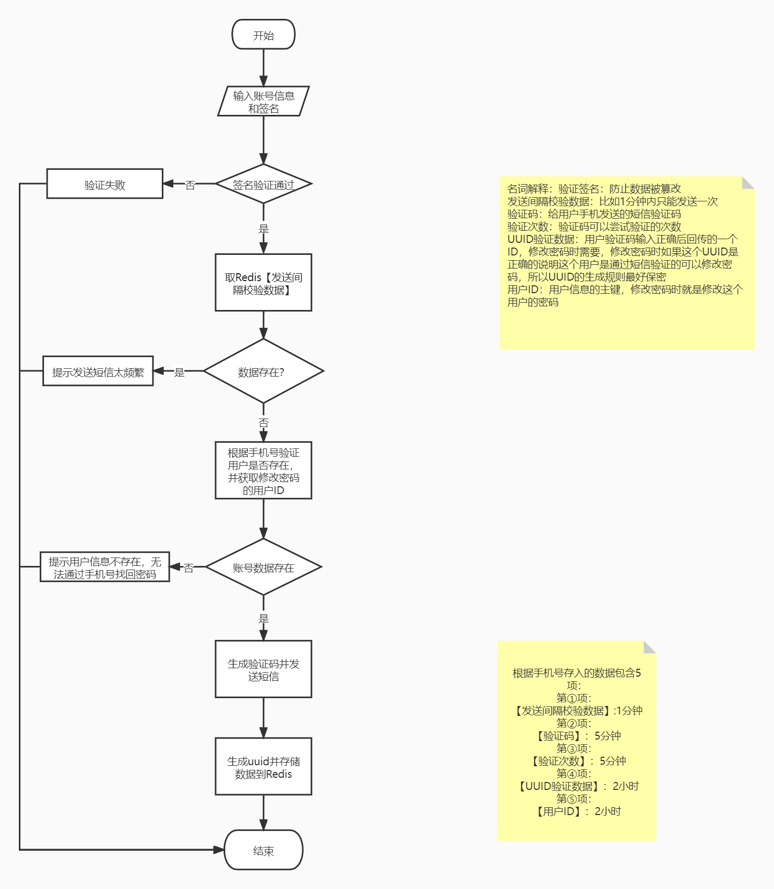
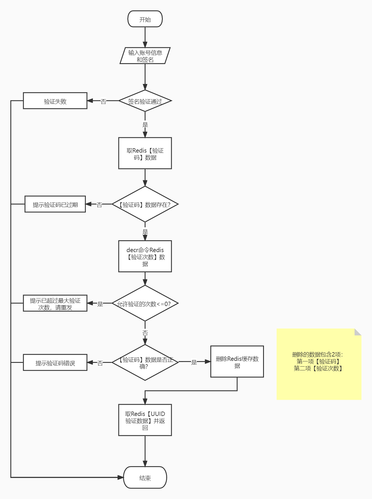
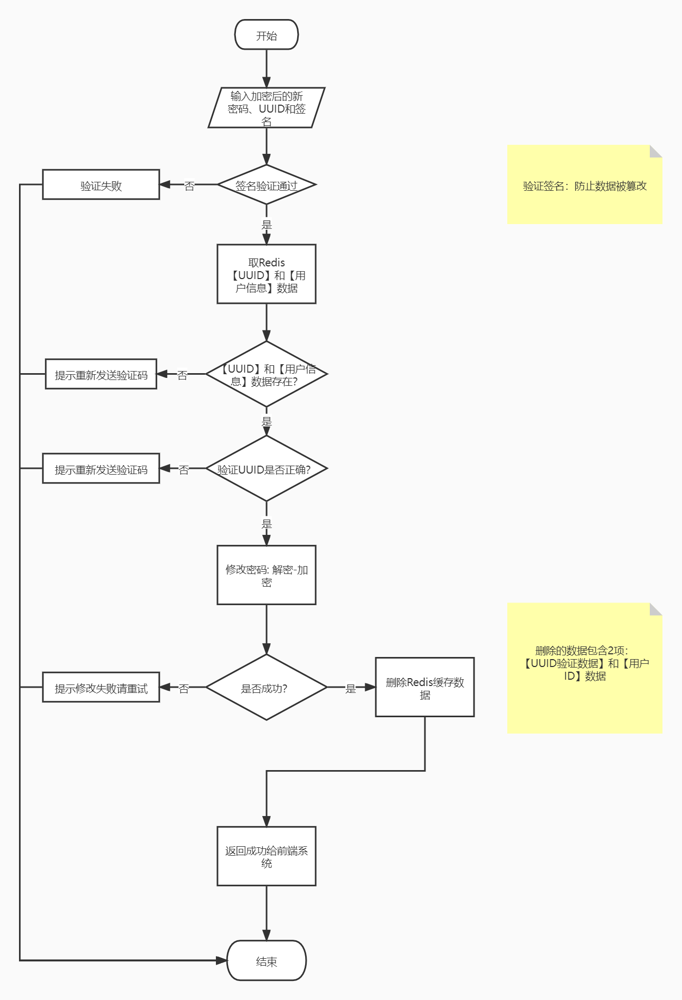

## 开发环境与背景

- IntelliJ IDEA
- Redis
- JDK1.8

这是一个线上的忘记密码功能，依靠Redis缓存和第三方发送短信接口实现通过发送短信进行验证码验证，验证成功后修改账户密码的功能。该文档旨在记录通过短信验证码验证修改密码的解决方案，不存在具体的代码实现过程。

## 主流程

从需求角度出发，整个忘记密码--直接修改密码流程为：

1. 发送验证码：输入用户名和手机号，发送短信验证码到用户手机；
2. 验证码校验：输入手机短信中的验证码提交验证；
3. 新密码修改：输入新密码修改密码。

在开始之前需要先考虑以下几个问题：

1. 如何防止被恶意拦截传入任意手机号码，恶意刷短信验证码接口？

   首先需要验证用户信息和手机号是在当前系统用户中真实存在才给目标手机号发送短信验证码，其次也可以通过某些标识（如请求头）来判断是我们自己的应用发来的请求而不是第三方恶意拦截后发来的请求。

   比如下面是一个最简单的接口防刷验证：

   定义密钥key:前后台私下约定的一个长度大于8位的随机字符串；
   接口入参:手机号码mobile、时间戳time和加密后的签名code.其中签名`code=MD5(mobile+key+time)`；
   服务端解密验证:判断`if(code==MD5(mobile+key+time));`就可以向手机号码mobile发送验证码了,否则返回特定值。

2. 如何防止同一用户一直发验证码，占用资源？

   首先，我们的上游发送短信接口是设定有发送次数限制的，比如每个手机号每天只能发送10次。

   其次，我们可以往Redis中放入一个标识，以判断这个用户某个时间间隔内只能发送一次验证码，比如`redis.set(xxxx_phoneNumber,1) `一分钟有效，发送前判断这个数据是否存在，保证一分钟只能发一次。

3. 短信验证码通常比较短，如何防止爆破？

   可以利用Redis的decr指令，校验短信验证码只能校验设定的次数。比如`redis.set(times,5)`只能验证5次，每验证一次利用decr指令减1，并且设置有效期和验证码有效期相同。

4. 如何标识验证码校验通过，进行下一步的修改密码操作？

   可以在短信验证码校验通过后返回根据一定规则生成的标识，在下一步修改密码时校验这个标识是否正确。比如验证通过后给前端一个UUID,同时放入Redis,下一步验证UUID是否有效，无效则需要重新验证手机验证码。

## 发送验证码

在发送验证码阶段主要做的工作是校验用户和发送验证码及相关数据的存储，还有判断用户频繁发送验证码等。存储到缓存的数据中，验证码数据是必须要存储起来的，发送间隔判断用的缓存数据和验证的次数数据也需要存起来。最后，用户需要修改密码时需要用到的用户ID也在这一步校验用户时可以拿到，为了后面不重复校验用户也可以把用户ID也存起来。同时，短信验证码校验成功返回的标识数据可以在这时生成和用户ID存在一起，可以减少一条缓存数据的存储。

## 验证码校验

由于第一步发送验证码做的工作比较多，这一步就相对比较简单了。只需要校验用户数据的验证码是否正确，以及用户验证的次数是否超过设定次数即可。

## 新密码修改

在新密码修改这一步中，需要校验用户是否通过了短信验证码验证以及用户的ID数据是否存在（用户ID数据设定有效期两小时，这可以保证用户校验验证码通过后必须在两小时内修改密码）。另外这一步中还需要将新密码解密以用户登录时的加密方式重新加密密码后存储。最后用户修改密码成功后，需要删除所有缓存数据，以保证一次短信验证只能修改成功一次密码。

## 带来的思考

我总觉得第一步发送验证码阶段需要存储的缓存数据还是太多了，有没有小伙伴有更好的通过短信验证码修改密码解决方案，欢迎在文末评论区留言告诉我，我们一起讨论呀~~

## 参考

- [验证码以及登录模块的逻辑漏洞 - 小白~007 - 博客园 (cnblogs.com)](https://www.cnblogs.com/ping007/p/10265764.html)
- [APP获取手机验证码防止短信轰炸解决办法_xnzsxnzs的专栏-CSDN博客_短信验证码轰炸app](https://blog.csdn.net/xnzsxnzs/article/details/78401772)
- [redis保存验证码登录验证码 ，有效期1分钟_IT 工农兵-CSDN博客_redis验证码](https://blog.csdn.net/higher_gao/article/details/88975640)
- [高效生成6位数字验证码代码_zengxiaoshuai1的博客-CSDN博客](https://blog.csdn.net/zengxiaoshuai1/article/details/108694504)
- [Java高效生成6位短信验证码 - 掘金 (juejin.cn)](https://juejin.cn/post/6949796740304371749)
- [Java 随机数生成器 Random & SecureRandom 原理分析_albon arith-CSDN博客_securerandom](https://blog.csdn.net/hustspy1990/article/details/93364805)