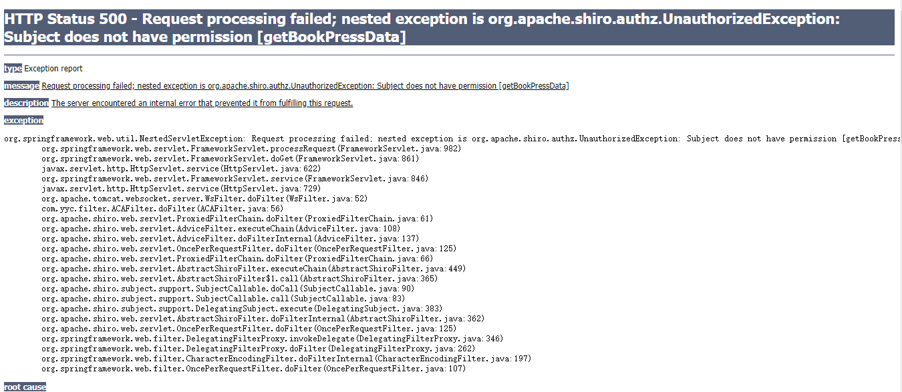
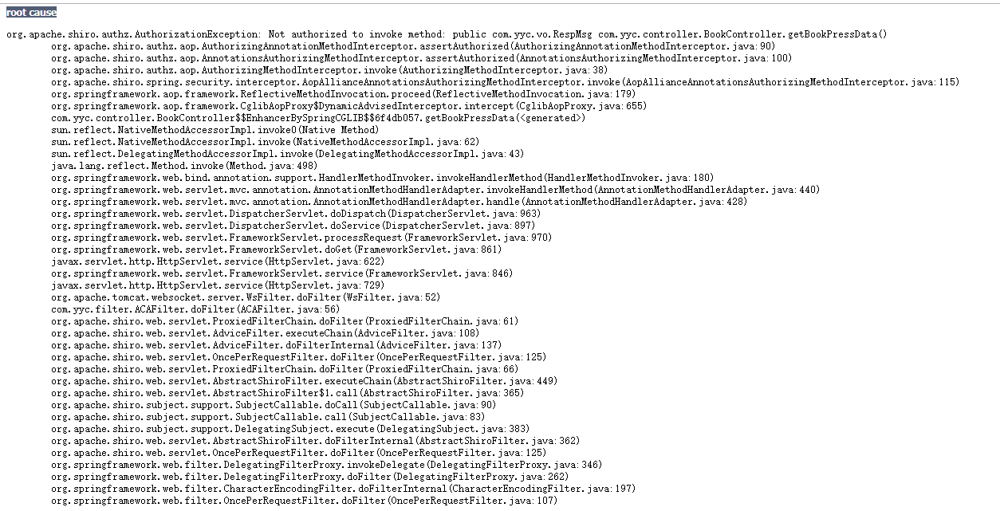

## 开发环境

- IntelliJ IDEA 2019.3 ×64
- Spring 4.3.3
- Shiro  1.3.2

## 问题重现

在Shiro的权限认证后，如果没有权限，系统会跳转到指定的页面，这就需要如下配置：

```xml
<!-- 权限认证失败，则跳转到指定页面 -->
<property name="unauthorizedUrl" value="/unauthorized"/>
```

<!--more-->

这一般用在非前后端分离的应用中，如果系统采用前后端分离架构则需要后台直接返回JSON格式的数据。在Shiro中，通常采用自定义过滤器（Filter）重写`AuthorizationFilter`类中的`isAccessAllowed`和`onAccessDenied`方法来实现。目的是过滤器拦截到没有权限访问目标资源时，直接返回“无权限”等JSON数据。

自定义过滤器：

```java
import java.io.IOException;
import javax.servlet.ServletRequest;
import javax.servlet.ServletResponse;
import javax.servlet.http.HttpServletResponse;
import com.yyc.shiro.RespShiroResult;
import com.yyc.shiro.ShiroResultEnum;
import org.apache.shiro.subject.Subject;
import org.apache.shiro.web.filter.authz.AuthorizationFilter;
import com.alibaba.fastjson.JSONObject;

/**
 * @ClassName:  ShiroPermsFilter
 * @Description:TODO(ShiroPermsFilter是权限认证)
 * @author: yinyicao
 *
 * @Copyright: 2020 www.yinyicao.work. All rights reserved.
 *
 */

public class ShiroPermsFilter extends AuthorizationFilter{
    @Override
    public boolean isAccessAllowed(ServletRequest request, ServletResponse response, Object mappedValue) throws IOException {
        Subject subject = getSubject(request, response);
        String[] perms = (String[]) mappedValue;
        boolean isPermitted = true;
        if (perms != null && perms.length > 0) {
            if (perms.length == 1) {
                if (!subject.isPermitted(perms[0])) {
                    isPermitted = false;
                }
            } else {
                if (!subject.isPermittedAll(perms)) {
                    isPermitted = false;
                }
            }
        }
        return isPermitted;
    }

    /**
     * shiro认证perms资源失败后回调方法
     * @param servletRequest
     * @param servletResponse
     * @return
     * @throws IOException
     */
    @Override
    protected boolean onAccessDenied(ServletRequest servletRequest, ServletResponse servletResponse) throws IOException {
    	System.err.println("-----------------ShiroPermsFilter---onAccessDenied-------------------");
        HttpServletResponse httpServletResponse = (HttpServletResponse) servletResponse;
        httpServletResponse.setCharacterEncoding("UTF-8");
        httpServletResponse.setContentType("application/json");
        RespShiroResult resultData = new RespShiroResult(ShiroResultEnum.UNAUTHORIZED);
        httpServletResponse.getWriter().write(JSONObject.toJSON(resultData).toString());
        return false;
    }


}
```

接着，在shiro的配置文件xml中配置和使用过滤器：

```xml
    <!-- Shiro过滤器 核心-->
    <bean id="shiroFilter" class="org.apache.shiro.spring.web.ShiroFilterFactoryBean">
        <!-- Shiro的核心安全接口,这个属性是必须的 -->
        <property name="securityManager" ref="securityManager"/>

        <property name="filters">
            <map>
                <entry key="authc" value-ref="shiroLoginFilter" />
                <entry key="perms" value-ref="shiroPermsFilter" />
            </map>
        </property>

        <!-- 身份认证失败，则跳转到登录页面的配置 -->
<!--        <property name="loginUrl" value="/nologin"/>-->
        <!-- 权限认证失败，则跳转到指定页面 -->
<!--        <property name="unauthorizedUrl" value="/unauthorized"/>-->

        <!-- Shiro连接约束配置,即过滤链的定义 -->
        <property name="filterChainDefinitions">
            <value>
                /logout=logout
                <!--anon 表示匿名访问，不需要认证以及授权-->
                /main/login=anon
                <!--authc表示需要认证 没有进行身份认证是不能进行访问的,这里使用的是自定义过滤器-->
                /** =authc,perms
            </value>
        </property>

    </bean>
```

同时还需要在`web.xml`中监听`shiroFilter`：

```xml
<!--shiro过滤器-->
    <filter>
        <filter-name>shiroFilter</filter-name>
        <filter-class>org.springframework.web.filter.DelegatingFilterProxy</filter-class>
        <init-param>
            <!-- 该值缺省为false,表示生命周期由SpringApplicationContext管理,设置为true则表示由ServletContainer管理 -->
            <param-name>targetFilterLifecycle</param-name>
            <param-value>true</param-value>
        </init-param>
    </filter>
    <filter-mapping>
        <filter-name>shiroFilter</filter-name>
        <url-pattern>/*</url-pattern>
    </filter-mapping>
```

**问题来了：**访问的目标资源没有权限时，不执行自定义的权限过滤器，系统无法返回JSON数据，而是直接发生`UnauthorizedException`与`UnauthenticatedException`异常。具体的异常信息见文末附1。

## 解决问题

> 在折腾半天后，无论怎样也不能完成过滤器的回调，只能通过全局异常拦截的方式改正。
>
> 参考： https://blog.csdn.net/joe_storm/article/details/80375089 

### 初步

在SpringMVC中处理异常的方式是在`springmvc.xml`中配置`org.springframework.web.servlet.handler.SimpleMappingExceptionResolver`

如下：

```xml
<bean class="org.springframework.web.servlet.handler.SimpleMappingExceptionResolver">
    <property name="exceptionMappings">
        <props>
            <!-- 错误异常转发jsp页面 -->
            <prop key="org.apache.shiro.authz.UnauthorizedException">/unauthorized.jsp</prop>
            <prop key="org.apache.shiro.authz.UnauthenticatedException">/unauthenticated.jsp</prop>
        </props>
    </property>
</bean>
```

但是这种方式还是进行页面的跳转，不能直接返回数据。这时需要重写` SimpleMappingExceptionResolver `，主要是覆盖`doResolveException`方法。

### 最终

自定义异常处理，重写` SimpleMappingExceptionResolver `，覆盖`doResolveException`方法。如下：

```java
import com.alibaba.fastjson.JSONObject;
import com.yyc.shiro.RespShiroResult;
import com.yyc.shiro.ShiroResultEnum;
import org.apache.shiro.authz.AuthorizationException;
import org.apache.shiro.authz.UnauthorizedException;
import org.springframework.web.servlet.ModelAndView;
import org.springframework.web.servlet.handler.SimpleMappingExceptionResolver;
import javax.servlet.http.HttpServletRequest;
import javax.servlet.http.HttpServletResponse;
import java.io.IOException;

/**
 * 自定义异常捕获，主要捕获没有权限异常
 */
public class NoPermissionException extends SimpleMappingExceptionResolver {

    @Override
    protected ModelAndView doResolveException(HttpServletRequest request, HttpServletResponse response, Object handler, Exception ex) {
        if (ex instanceof  AuthorizationException || ex instanceof UnauthorizedException){
            response.setCharacterEncoding("UTF-8");
            response.setContentType("application/json");
            RespShiroResult resultData = new RespShiroResult(ShiroResultEnum.UNAUTHORIZED);
            try {
                response.getWriter().write(JSONObject.toJSON(resultData).toString());
            } catch (IOException e) {
                e.printStackTrace();
            }
        }else { // 其他异常打印
            ex.printStackTrace();
        }
        return null;
    }
}
```

然后在Spring配置文件中定义这个bean。

```xml
    <!--重写了SimpleMappingExceptionResolver中的doResolveException方法处理异常-->
    <bean class="com.yyc.exception.NoPermissionException">

    </bean>
```

这时候访问该用户没有权限访问的资源则会返回JSON数据了。

```json
{
    "id": 1,
    "desc": "对不起，您无权限进行当前操作",
    "status": 401
}
```

------

## 附1

`UnauthorizedException`与`UnauthenticatedException`异常





```json
HTTP Status 500 - Request processing failed; nested exception is org.apache.shiro.authz.UnauthorizedException: Subject does not have permission [getBookPressData]
type Exception report

message Request processing failed; nested exception is org.apache.shiro.authz.UnauthorizedException: Subject does not have permission [getBookPressData]

description The server encountered an internal error that prevented it from fulfilling this request.

exception

org.springframework.web.util.NestedServletException: Request processing failed; nested exception is org.apache.shiro.authz.UnauthorizedException: Subject does not have permission [getBookPressData]
	org.springframework.web.servlet.FrameworkServlet.processRequest(FrameworkServlet.java:982)
	org.springframework.web.servlet.FrameworkServlet.doGet(FrameworkServlet.java:861)
	javax.servlet.http.HttpServlet.service(HttpServlet.java:622)
	org.springframework.web.servlet.FrameworkServlet.service(FrameworkServlet.java:846)
	javax.servlet.http.HttpServlet.service(HttpServlet.java:729)
	org.apache.tomcat.websocket.server.WsFilter.doFilter(WsFilter.java:52)
	com.yyc.filter.ACAFilter.doFilter(ACAFilter.java:56)
	org.apache.shiro.web.servlet.ProxiedFilterChain.doFilter(ProxiedFilterChain.java:61)
	org.apache.shiro.web.servlet.AdviceFilter.executeChain(AdviceFilter.java:108)
	org.apache.shiro.web.servlet.AdviceFilter.doFilterInternal(AdviceFilter.java:137)
	org.apache.shiro.web.servlet.OncePerRequestFilter.doFilter(OncePerRequestFilter.java:125)
	org.apache.shiro.web.servlet.ProxiedFilterChain.doFilter(ProxiedFilterChain.java:66)
	org.apache.shiro.web.servlet.AbstractShiroFilter.executeChain(AbstractShiroFilter.java:449)
	org.apache.shiro.web.servlet.AbstractShiroFilter$1.call(AbstractShiroFilter.java:365)
	org.apache.shiro.subject.support.SubjectCallable.doCall(SubjectCallable.java:90)
	org.apache.shiro.subject.support.SubjectCallable.call(SubjectCallable.java:83)
	org.apache.shiro.subject.support.DelegatingSubject.execute(DelegatingSubject.java:383)
	org.apache.shiro.web.servlet.AbstractShiroFilter.doFilterInternal(AbstractShiroFilter.java:362)
	org.apache.shiro.web.servlet.OncePerRequestFilter.doFilter(OncePerRequestFilter.java:125)
	org.springframework.web.filter.DelegatingFilterProxy.invokeDelegate(DelegatingFilterProxy.java:346)
	org.springframework.web.filter.DelegatingFilterProxy.doFilter(DelegatingFilterProxy.java:262)
	org.springframework.web.filter.CharacterEncodingFilter.doFilterInternal(CharacterEncodingFilter.java:197)
	org.springframework.web.filter.OncePerRequestFilter.doFilter(OncePerRequestFilter.java:107)
root cause

org.apache.shiro.authz.UnauthorizedException: Subject does not have permission [getBookPressData]
	org.apache.shiro.authz.ModularRealmAuthorizer.checkPermission(ModularRealmAuthorizer.java:323)
	org.apache.shiro.mgt.AuthorizingSecurityManager.checkPermission(AuthorizingSecurityManager.java:137)
	org.apache.shiro.subject.support.DelegatingSubject.checkPermission(DelegatingSubject.java:205)
	org.apache.shiro.authz.aop.PermissionAnnotationHandler.assertAuthorized(PermissionAnnotationHandler.java:74)
	org.apache.shiro.authz.aop.AuthorizingAnnotationMethodInterceptor.assertAuthorized(AuthorizingAnnotationMethodInterceptor.java:84)
	org.apache.shiro.authz.aop.AnnotationsAuthorizingMethodInterceptor.assertAuthorized(AnnotationsAuthorizingMethodInterceptor.java:100)
	org.apache.shiro.authz.aop.AuthorizingMethodInterceptor.invoke(AuthorizingMethodInterceptor.java:38)
	org.apache.shiro.spring.security.interceptor.AopAllianceAnnotationsAuthorizingMethodInterceptor.invoke(AopAllianceAnnotationsAuthorizingMethodInterceptor.java:115)
	org.springframework.aop.framework.ReflectiveMethodInvocation.proceed(ReflectiveMethodInvocation.java:179)
	org.springframework.aop.framework.CglibAopProxy$DynamicAdvisedInterceptor.intercept(CglibAopProxy.java:655)
	com.yyc.controller.BookController$$EnhancerBySpringCGLIB$$6f4db057.getBookPressData(<generated>)
	sun.reflect.NativeMethodAccessorImpl.invoke0(Native Method)
	sun.reflect.NativeMethodAccessorImpl.invoke(NativeMethodAccessorImpl.java:62)
	sun.reflect.DelegatingMethodAccessorImpl.invoke(DelegatingMethodAccessorImpl.java:43)
	java.lang.reflect.Method.invoke(Method.java:498)
	org.springframework.web.bind.annotation.support.HandlerMethodInvoker.invokeHandlerMethod(HandlerMethodInvoker.java:180)
	org.springframework.web.servlet.mvc.annotation.AnnotationMethodHandlerAdapter.invokeHandlerMethod(AnnotationMethodHandlerAdapter.java:440)
	org.springframework.web.servlet.mvc.annotation.AnnotationMethodHandlerAdapter.handle(AnnotationMethodHandlerAdapter.java:428)
	org.springframework.web.servlet.DispatcherServlet.doDispatch(DispatcherServlet.java:963)
	org.springframework.web.servlet.DispatcherServlet.doService(DispatcherServlet.java:897)
	org.springframework.web.servlet.FrameworkServlet.processRequest(FrameworkServlet.java:970)
	org.springframework.web.servlet.FrameworkServlet.doGet(FrameworkServlet.java:861)
	javax.servlet.http.HttpServlet.service(HttpServlet.java:622)
	org.springframework.web.servlet.FrameworkServlet.service(FrameworkServlet.java:846)
	javax.servlet.http.HttpServlet.service(HttpServlet.java:729)
	org.apache.tomcat.websocket.server.WsFilter.doFilter(WsFilter.java:52)
	com.yyc.filter.ACAFilter.doFilter(ACAFilter.java:56)
	org.apache.shiro.web.servlet.ProxiedFilterChain.doFilter(ProxiedFilterChain.java:61)
	org.apache.shiro.web.servlet.AdviceFilter.executeChain(AdviceFilter.java:108)
	org.apache.shiro.web.servlet.AdviceFilter.doFilterInternal(AdviceFilter.java:137)
	org.apache.shiro.web.servlet.OncePerRequestFilter.doFilter(OncePerRequestFilter.java:125)
	org.apache.shiro.web.servlet.ProxiedFilterChain.doFilter(ProxiedFilterChain.java:66)
	org.apache.shiro.web.servlet.AbstractShiroFilter.executeChain(AbstractShiroFilter.java:449)
	org.apache.shiro.web.servlet.AbstractShiroFilter$1.call(AbstractShiroFilter.java:365)
	org.apache.shiro.subject.support.SubjectCallable.doCall(SubjectCallable.java:90)
	org.apache.shiro.subject.support.SubjectCallable.call(SubjectCallable.java:83)
	org.apache.shiro.subject.support.DelegatingSubject.execute(DelegatingSubject.java:383)
	org.apache.shiro.web.servlet.AbstractShiroFilter.doFilterInternal(AbstractShiroFilter.java:362)
	org.apache.shiro.web.servlet.OncePerRequestFilter.doFilter(OncePerRequestFilter.java:125)
	org.springframework.web.filter.DelegatingFilterProxy.invokeDelegate(DelegatingFilterProxy.java:346)
	org.springframework.web.filter.DelegatingFilterProxy.doFilter(DelegatingFilterProxy.java:262)
	org.springframework.web.filter.CharacterEncodingFilter.doFilterInternal(CharacterEncodingFilter.java:197)
	org.springframework.web.filter.OncePerRequestFilter.doFilter(OncePerRequestFilter.java:107)
root cause

org.apache.shiro.authz.AuthorizationException: Not authorized to invoke method: public com.yyc.vo.RespMsg com.yyc.controller.BookController.getBookPressData()
	org.apache.shiro.authz.aop.AuthorizingAnnotationMethodInterceptor.assertAuthorized(AuthorizingAnnotationMethodInterceptor.java:90)
	org.apache.shiro.authz.aop.AnnotationsAuthorizingMethodInterceptor.assertAuthorized(AnnotationsAuthorizingMethodInterceptor.java:100)
	org.apache.shiro.authz.aop.AuthorizingMethodInterceptor.invoke(AuthorizingMethodInterceptor.java:38)
	org.apache.shiro.spring.security.interceptor.AopAllianceAnnotationsAuthorizingMethodInterceptor.invoke(AopAllianceAnnotationsAuthorizingMethodInterceptor.java:115)
	org.springframework.aop.framework.ReflectiveMethodInvocation.proceed(ReflectiveMethodInvocation.java:179)
	org.springframework.aop.framework.CglibAopProxy$DynamicAdvisedInterceptor.intercept(CglibAopProxy.java:655)
	com.yyc.controller.BookController$$EnhancerBySpringCGLIB$$6f4db057.getBookPressData(<generated>)
	sun.reflect.NativeMethodAccessorImpl.invoke0(Native Method)
	sun.reflect.NativeMethodAccessorImpl.invoke(NativeMethodAccessorImpl.java:62)
	sun.reflect.DelegatingMethodAccessorImpl.invoke(DelegatingMethodAccessorImpl.java:43)
	java.lang.reflect.Method.invoke(Method.java:498)
	org.springframework.web.bind.annotation.support.HandlerMethodInvoker.invokeHandlerMethod(HandlerMethodInvoker.java:180)
	org.springframework.web.servlet.mvc.annotation.AnnotationMethodHandlerAdapter.invokeHandlerMethod(AnnotationMethodHandlerAdapter.java:440)
	org.springframework.web.servlet.mvc.annotation.AnnotationMethodHandlerAdapter.handle(AnnotationMethodHandlerAdapter.java:428)
	org.springframework.web.servlet.DispatcherServlet.doDispatch(DispatcherServlet.java:963)
	org.springframework.web.servlet.DispatcherServlet.doService(DispatcherServlet.java:897)
	org.springframework.web.servlet.FrameworkServlet.processRequest(FrameworkServlet.java:970)
	org.springframework.web.servlet.FrameworkServlet.doGet(FrameworkServlet.java:861)
	javax.servlet.http.HttpServlet.service(HttpServlet.java:622)
	org.springframework.web.servlet.FrameworkServlet.service(FrameworkServlet.java:846)
	javax.servlet.http.HttpServlet.service(HttpServlet.java:729)
	org.apache.tomcat.websocket.server.WsFilter.doFilter(WsFilter.java:52)
	com.yyc.filter.ACAFilter.doFilter(ACAFilter.java:56)
	org.apache.shiro.web.servlet.ProxiedFilterChain.doFilter(ProxiedFilterChain.java:61)
	org.apache.shiro.web.servlet.AdviceFilter.executeChain(AdviceFilter.java:108)
	org.apache.shiro.web.servlet.AdviceFilter.doFilterInternal(AdviceFilter.java:137)
	org.apache.shiro.web.servlet.OncePerRequestFilter.doFilter(OncePerRequestFilter.java:125)
	org.apache.shiro.web.servlet.ProxiedFilterChain.doFilter(ProxiedFilterChain.java:66)
	org.apache.shiro.web.servlet.AbstractShiroFilter.executeChain(AbstractShiroFilter.java:449)
	org.apache.shiro.web.servlet.AbstractShiroFilter$1.call(AbstractShiroFilter.java:365)
	org.apache.shiro.subject.support.SubjectCallable.doCall(SubjectCallable.java:90)
	org.apache.shiro.subject.support.SubjectCallable.call(SubjectCallable.java:83)
	org.apache.shiro.subject.support.DelegatingSubject.execute(DelegatingSubject.java:383)
	org.apache.shiro.web.servlet.AbstractShiroFilter.doFilterInternal(AbstractShiroFilter.java:362)
	org.apache.shiro.web.servlet.OncePerRequestFilter.doFilter(OncePerRequestFilter.java:125)
	org.springframework.web.filter.DelegatingFilterProxy.invokeDelegate(DelegatingFilterProxy.java:346)
	org.springframework.web.filter.DelegatingFilterProxy.doFilter(DelegatingFilterProxy.java:262)
	org.springframework.web.filter.CharacterEncodingFilter.doFilterInternal(CharacterEncodingFilter.java:197)
	org.springframework.web.filter.OncePerRequestFilter.doFilter(OncePerRequestFilter.java:107)
note The full stack trace of the root cause is available in the Apache Tomcat/8.0.37 logs.

Apache Tomcat/8.0.37
```

