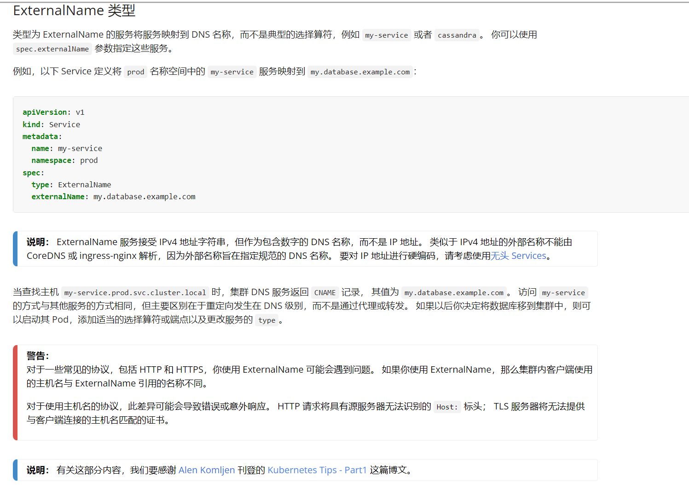
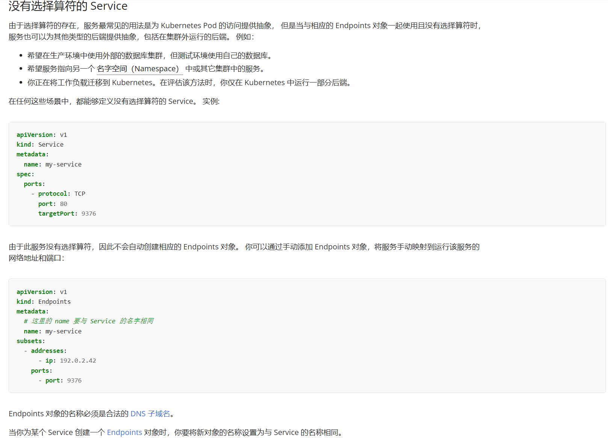

我们都知道在k8s中，NameSpace是资源隔离的，那如何在命名空间A中调用B中的服务呢？

先说答案：第一种方式：在NameSpace A中创建无Selecter选择运算符的Service，然后手动创建EndPoints指向NameSpace B中的Service IP。或者第二种方式使用ExternalName 类型的Service

其实原理很简单，和我们创建平时创建普通Service一样：创建Service时一般会使用selecter选择Pod，会创建一个与Serivce同名EndPoints去调用Pod，使用`kubectl get endpoints -n ns xxx -o yaml`可以看到在EndPoints中指定了Pod Ip和端口。

我们这里就是将自动创建EndPoints的过程变为手动，EndPoints指向Pod Ip变为指向Service IP。

遇到一个实际需求案例：

Ingress 创建了域名web.app.x指向NameSpace A中的Service A，同时NameSpace B中有Service B，现在的需求是我要相同域名不同前缀访问两个ServiceA和B，即web.app.x/app访问Service A，web.app.x/web访问Service B。如下图

```
                                   |-----NameSpace A------|
       ---------web.app.x/app→→→   |     Service A        | 
       ↑                           |----------------------|
Ingress             
       ↓                           |-----NameSpace B------|
       ---------web.app.x/web→→→   |     Service B        |
                                   |----------------------|
```

如果ServiceA和ServiceB同时在一个NameSpace中这很容易实现，只需要创建一个Ingress分别指定前缀url指向两个Service就OK。

这种情况，很容易想到的就是分别在两个NameSpace中创建一个Ingress，域名都写web.app.x同时分别指定前缀url，其实这是不行的，实际操作下来发现第二个是不生效的，访问404。

## ExternalName 类型的Service

网络上搜了一番，都是在说使用[ExternalName 类型](https://kubernetes.io/zh-cn/docs/concepts/services-networking/service/#externalname)的Service，官方文档说明如下：



在官方文档的说明和警告中可以发现可能有一些限制，在实际使用中我也发现了。

在之前的实际需求案例中，需要在NameSpace A中创建一个ExternalName 类型的Service指向NameSpace A，当我像网上一样创建如下Service是访问不到的。

```yaml
kind: Service
apiVersion: v1
metadata:
  name: test-service-1
  namespace: namespace-a
spec:
  type: ExternalName
  externalName: test-service-2.namespace-b.svc.cluster.local # 需要改为test-service-2的IP
  ports:
  - port: 8080
```

似乎是无法解析`test-service-2.namespace-b.svc.cluster.local`这个service的IP，指定test-service-2的ip就可以访问`externalName: 	10.43.6.139`

## 没有选择算符的 Service

在官方文档中[没有选择算符的 Service](https://kubernetes.io/zh-cn/docs/concepts/services-networking/service/#services-without-selectors)说明很详细。官网截图如下：



创建没有选择算符的Service，由于此服务没有选择算符，因此不会自动创建相应的 Endpoints 对象。 需要通过手动添加 Endpoints 对象，将服务手动映射到运行该服务的网络地址和端口。

```yaml
apiVersion: v1
kind: Service
metadata:
  name: test-service-1
  namespace: namespace-a
spec:
  ports:
    - protocol: TCP
      port: 8080
      targetPort: 8080
	  
---
apiVersion: v1
kind: Endpoints
metadata:
  name: test-service-1   # 这里的 name 要与 Service 的名字相同
  namespace: namespace-a
subsets:
  - addresses:
      - ip: 10.43.6.139
    ports:
      - port: 8080
```


最后，根据实际需求，只需要在namespace-a中创建Ingress即可。

```yaml
apiVersion: extensions/v1beta1
kind: Ingress
metadata:
  name: test
  namespace: namespace-a
spec:
  rules:
  - host: web.app.x
    http:
      paths:
      - backend:
          serviceName: tt2 # namespace-a中的一般Service
          servicePort: 8080
        path: /app
      - backend:
          serviceName: test-service-1 # namespace-a中without-selectors的Service或者ExternalName类型的Service:指向namespace-b的Service
          servicePort: 8080
        path: /web
```


## *参考*

[ExternalName 类型 服务（Service） | Kubernetes](https://kubernetes.io/zh-cn/docs/concepts/services-networking/service/#externalname)

[没有选择算符的 Service 服务（Service） | Kubernetes](https://kubernetes.io/zh-cn/docs/concepts/services-networking/service/#services-without-selectors)

[Kubernetes Tips - Part 1 (akomljen.com)](https://akomljen.com/kubernetes-tips-part-1/)

[ingress跨namespace访问service服务_ouyanglk的博客-CSDN博客_ingress 跨命名空间](https://blog.csdn.net/u012190809/article/details/109716144)

[Kubernetes 外部服务入口规则（ExternalName 类型） | (1r1g.com)](https://qa.1r1g.com/sf/ask/4322620711/)

[k8s - Service ExternalName_牛牛Blog的博客-CSDN博客_externalname](https://blog.csdn.net/yujia_666/article/details/114104791)
