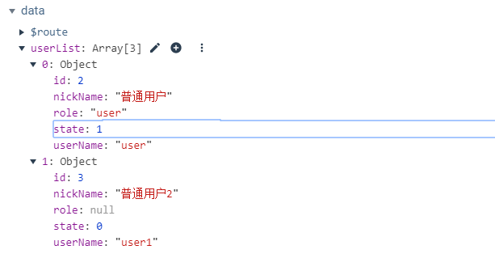
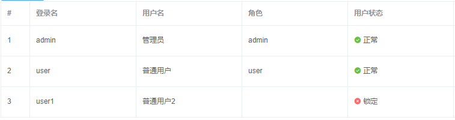

## 最终显示效果

## 实现效果

需求简介：根据用户状态值（0或1），显示不同颜色的原点表示任务状态，并将状态值显示为中文。如图：<!--more-->

服务器返回数据



页面显示效果



## 实现步骤

### 单元格图标颜色

需要使用slot-scope获取到单元格数据，使其根据数据动态设置Class值。

```vue
<el-table-column
  prop="state"
  label="用户状态">
  <template slot-scope="scope">
    <i :class="addclassStatus(scope.row.state)"></i>
    {{scope.row.state | formatSatate}}
  </template>
</el-table-column>
```

`addclassStatus`方法：根据值设置不同的Class值

```javascript
addclassStatus(i){
  switch (i) {
    case 1: return 'el-icon-success green';
    case 0: return 'el-icon-error red';
  }
}
```

这时对Class设置样式，就可以实现不同的颜色显示效果了。

```css
<style scoped>
  .green{
    color: #67C23A;//绿色
  }
  .red{
    color:#F56C6C;//红色
  }
</style>
```

### 将状态值转换为文字显示

使用过滤器将用户状态值显示为中文，Vue过滤器使用参考官方：https://cn.vuejs.org/v2/guide/filters.html

过滤器使用要点：管道符（|）前面是过滤器方法的参数，后面是过滤器方法名。

```javascript
filters:{
  formatSatate(val){
    switch (val) {
      case 0 :return '锁定';
      case 1 :return '正常';
      default:return val;
    }
  }
}
```

