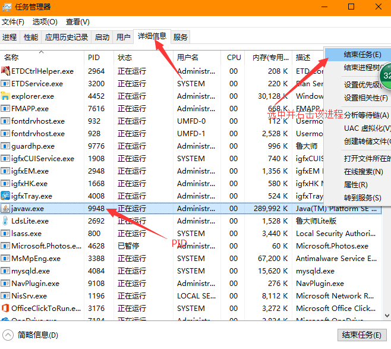
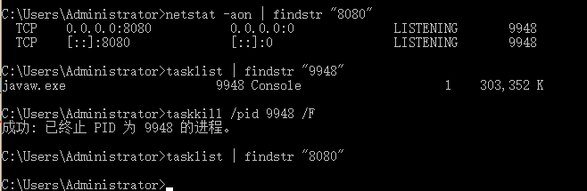

### 前言

在开发中难免会遇到windows的端口被占用，现在我们来查看端口的占用和结束占用端口的进程。

需要先按键`win+r` 输入`cmd`进入命令提示符；

### 根据端口号查进程PID

比如我们需要查看8080端口的占用情况，输入`netstat -aon | findstr "8080"`，可以看出当前8080端口被进程号(PID)为9948的程序占用。输入命令时**注意空格**。

```powershell
C:\Users\Administrator>netstat -aon | findstr "8080"
　Proto   Local Address         Foreign Address        State           PID
　====    ============          ==============        ==========     ======
  TCP    0.0.0.0:8080           0.0.0.0:0              LISTENING       9948
  TCP    [::]:8080              [::]:0                 LISTENING       9948
```

### [可选]根据PID查询具体的进程任务

输入`tasklist | findstr "9948"`，来查看进程PID是9948的程序占用情况。如下所示，可以看出PID为9948的进程是javaw.exe。如果你很熟悉此进程，并确定可以终止，那么就直接进入下一步使用`taskkill /pid 9948 /F `命令把PID为9948的进程终止而无需每次都执行`tasklist`命令。

```powershell
C:\Users\Administrator>tasklist | findstr "12012"
  图像名                       PID   会话名                   会话     内存使用
=======================      ====== ======                ========  ========
 javaw.exe                    9948  Console                  1      329,652 K
```

### 根据PID结束进程

#### 通过命令结束

通过输入`taskkill /pid 9948 /F `命令，来结束PID为9948的进程。

```powershell
C:\Users\Administrator>taskkill /pid 9948 /F
成功: 已终止 PID 为 9948 的进程。
```

#### 通过任务管理器结束

这一步同样可以在任务管理器中执行，右击windows任务栏，选择任务管理器（快捷键：`Ctrl+Shift+Esc`）选择详细信息找到PID为9948的条目，如下图所示。`javaw.exe`就是任务管理器中的映像名称，选中它并点击”结束进程”即可。



### 完整命令截图



> 该篇文章转载自本人的博客园（不再更新）。

