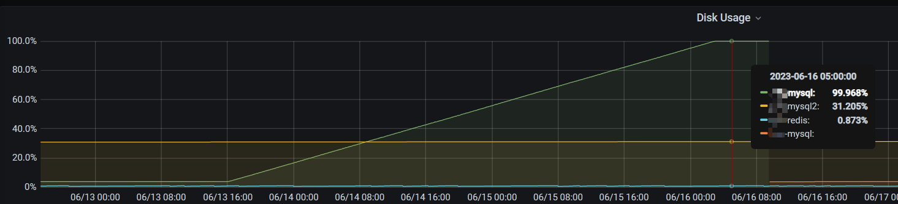

## 前言

由于项目中使用了多级目录结构，数据库的存储使用id,parentId进行存储，有个需求就是通过id查询最顶层目录的id（最顶层目录id的parentId=0），想尝试使用存储过程来解决这个问题。因为存储过程使用到了临时表导致存储空间被占满。

<!-- more -->

## 现象与起因



根据监控查看到mysql存储空间被占满，但是使用SQL查询数据库表文件却只是占用了几个G。

```sql
SELECT
	table_schema AS '数据库',
	sum( table_rows ) AS '记录数',
	sum(
	TRUNCATE ( data_length / 1024 / 1024, 2 )) AS '数据容量(MB)',
	sum(
	TRUNCATE ( index_length / 1024 / 1024, 2 )) AS '索引容量(MB)' 
FROM
	information_schema.TABLES 
GROUP BY
	table_schema 
ORDER BY
	sum( data_length ) DESC,
	sum( index_length ) DESC;
```

到mysql数据库存储目录下使用`du sh * `发现有一个ibtmp1文件很大，占用了分区所有空闲空间。

网上查了一下其中有一条原因可能是使用了大量的临时表造成的，回想起前几天执行了一个存储过程。

```mysql
DELIMITER //
CREATE PROCEDURE get_top_folder_id(IN p_folder_id BIGINT, OUT p_top_folder_id BIGINT)
BEGIN
    DECLARE v_parent_id BIGINT;
    SET p_top_folder_id = p_folder_id;
    SET v_parent_id = (SELECT parent_id FROM test_issue_folder WHERE folder_id = p_folder_id);
    WHILE v_parent_id != 0 DO
            SET p_top_folder_id = v_parent_id;
            SET v_parent_id = (SELECT parent_id FROM test_issue_folder WHERE folder_id = v_parent_id);
        END WHILE;
END//
DELIMITER ;


CALL get_top_folder_id(:folder_id, @top_folder_id);
SELECT 184611653340499968 as folderId,@top_folder_id;
```

这个存储过程本身没有问题，只是`184611653340499968`这个folderId的parent_id是其本身，查询时造成了死循环，导致创建了大量的临时表。

## 如何处理

1）首先备份数据库，如果Mysql服务还能正常使用，可以用日常的备份机制做一次全备；如果Mysql服务已经异常了，可以考虑物理备份。

2）为了避免以后再次出现ibtmp1文件暴涨，限制其大小，需在mysql配置文件加入：

```bash
$ vim /etc/my.cnf
[mysqld]
innodb_temp_data_file_path = ibtmp1:12M:autoextend:max:5G
```

3）与业务各方沟通好，重启Mysql实例（重启后ibtmp1文件会自动清理）。

4）重启后，验证配置是否生效：

```mysql
mysql> show variables like 'innodb_temp_data_file_path';
+----------------------------+------------------------------+
| Variable_name              | Value                        |
+----------------------------+------------------------------+
| innodb_temp_data_file_path | ibtmp1:12M:autoextend:max:5G |
+----------------------------+------------------------------+
1 row in set (0.01 sec)
```


## 总结

1. 尽量避免使用数据库的存储过程，可迁移性是个问题，另一个就是如果存储过程使用到临时表就很有可能出现本文的问题。
2. 今后无论是代码还是SQL中，遇到递归/循环问题一定加上一个深度控制。比如在我的场景下加上循环10次还没找到顶级目录就退出循环。

**可能导致ibtmp1文件会暴涨的情况: **

1. 用到临时表，当EXPLAIN 查看执行计划结果的 Extra 列中，如果包含 Using Temporary就表示会用到临时表。

2. GROUP BY无索引字段或GROUP BY + ORDER BY的子句字段不一样时。

3. order by与distinct共用，其中distinct与order by里的字段不一致（主键字段除外）。

4. insert into table1 select xxx from table2语句。

## *参考*

1. [mysql语句查看数据库表所占容量空间大小_mysql查询表占用空间大小_l386913的博客-CSDN博客](https://blog.csdn.net/jialiu111111/article/details/129361106)
1. [Mysql里的ibtmp1文件太大，导致磁盘空间被占满_mysql临时文件太大_求知若渴，虚心若愚。的博客-CSDN博客](https://blog.csdn.net/qq_33283901/article/details/129123666)