**层次分析法**(Analytic Hierarchy Process,AHP)

是一种定性和定量相结合的、系统的、层次化的分析方法。这种方法的特点就是在对复杂决策问题的本质、影响因素及其内在关系等进行深入研究的基础上，利用较少的定量信息使决策的思维过程数学化，从而为多目标、多准则或无结构特性的复杂决策问题提供简便的决策方法。**是对难以完全定量的复杂系统做出决策的模型和方法。** 

层次分析法的原理，层次分析法根据问题的性质和要达到的总目标，将问题分解为不同的组成因素，并按照因素间的相互关联影响以及隶属关系将因素按不同的层次聚集组合，形成一个多层次的分析结构模型，从而最终使问题归结为最低层(供决策的方案、措施等)相对于最高层(总目标)的**相对重要权值**的确定或相对优劣次序的排定。

层次分析法的步骤，运用层次分析法构造系统模型时，大体可以分为以下四个步骤：

## 1. 建立阶梯层次结构模型

> 深入分析实际问题，将有关因素自上而下分层（目标—准则或指标一方案或对象），上层受下层影响，而层内各因素基本上相对独立。 按他们之间的相互关系分成最高层、中间层和最低层，绘制层次结构图。 

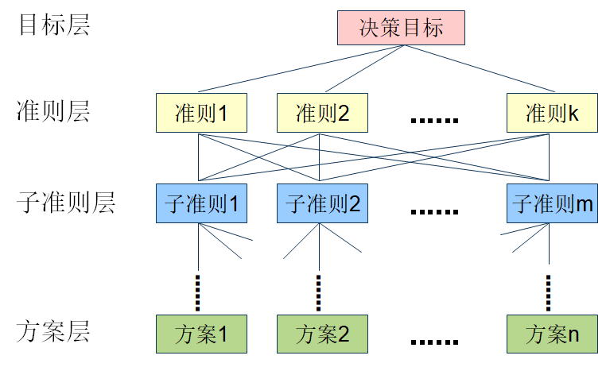

## 2. 构造各层次中的所有判断矩阵

> 用成对比较法和1~9尺度，构造各层对上一层每一因素的成对比较阵。

在确定各层次各因素之间的权重时，如果只是定性的结果(就是我认为因素$A_1$占80%，$A_2$占10%等等)，则常常不容易被别人接受，因此Santy等人提出：一致矩阵法，即：

1. 不把所有因素放在一起比较，而是两两比较；
2. 对此时采用相对尺度，以尽可能减少性质不同的诸因素相互比较的困难，以提高准去性；

成对比较矩阵是表示**本层所有因素针对上一层某一个*因素(准则或目标)*的相对重要性**的比较。成对比较矩阵的元素$a_{ij}$表示的是第$i$个因素相对于第$j$个因素的比较结果，这个值使用的是Santy的1-9标度方法给出。 

| 标度    | 含义                                                         |
| ------- | ------------------------------------------------------------ |
| 1       | 表示两个因素相比，具有同样重要性                             |
| 3       | 表示两个因素相比，一个因素比另一个因素稍微重要               |
| 5       | 表示两个因素相比，一个因素比另一个因素明显重要               |
| 7       | 表示两个因素相比，一个因素比另一个因素强烈重要               |
| 9       | 表示两个因素相比，一个因素比另一个因素极端重要               |
| 2,4,6,8 | 上述两相邻判断的中值                                         |
| 倒数    | 因素$i$于$j$比较的判断$a_{ij}$，则因素$j$与$i$比较的判断$a_{ji}=1/a_{ij}$ |

例如矩阵A：$a_{23}=5$ 就表示$A_2$因素比$A_3$因素对于目标层（Z）来说**明显重要**。
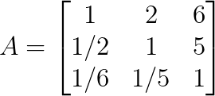

| Z     | $A_1$ | $A_2$ | $A_3$ |
| ----- | ----- | ----- | ----- |
| $A_1$ | 1     | 2     | 6     |
| $A_2$ | 1/2   | 1     | 5     |
| $A_3$ | 1/6   | 1/5   | 1     |

那两两进行比较以后，怎么才能知道，下层各因素对上层某因素的影响程度的排序结果呢？ **层次单排序**

## 3. 层次单排序及其一致性检验

就以上面的矩阵$A$来说， 因为这里$a_{23}=5$ 但是根据计算$a{23}=a{21} \cdot a{13}=1/2 \cdot 6 = 3$。在构造成对矩阵的时候，很容易出现这种状况。那如果$a{23}=a{21} \cdot a{13}$ 则称成对矩阵为一致阵 。

这里的成对比较矩阵有两种可能，一致阵或者不是一致阵：

1. 如果成对比较矩阵是一致阵，则我们自然会取对应于最大特征根$n$ 的归一化特征向量 $\{ \omega_1,\omega_2,\omega_3,...,\omega_n\}$  ，且$\sum_{i=1}^n \omega_i = 1$，$\omega_i$表示下层第 $i$个因素对上层某个因素影响程度的权值。
2. 若成对比较矩阵不是一致阵，Saaty等人建议用其最大特征根对应的归一化特征向量作为权向量 $W$ ，则$AW=\lambda W$   $W=\{ \omega_1,\omega_2,\omega_3,...,\omega_n\}$这样确定权向量的方法称为特征根法；

对应于判断矩阵最大特征根$\lambda max$的特征向量，经归一化（使向量中各元素之和为1）后记为$W$。$W$的元素为同一层次元素对于上一层因素某因素相对重要性的排序权值，这一过程称为层次单排序。那能否确认层次单排序，需要进行一致性检验，所谓一致性检验是指对成对比较矩阵确定不一致的允许范围。 

定义一致性指标$CI=\frac {\lambda-n}{n-1}$,

- $CI=0$,有完全的一致性；
- $CI$接近于0，有满意的一致性；
- $CI$越大，不一致越严重。

为了衡量$CI$的大小，引入随机一致性指标$RI$，n表示矩阵阶数。

| n    | 1    | 2    | 3    | 4    | 5    | 6    | 7    | 8    | 9    | 10   | 11   |
| ---- | ---- | ---- | ---- | ---- | ---- | ---- | ---- | ---- | ---- | ---- | ---- |
| RI   | 0    | 0    | 0.58 | 0.90 | 1.12 | 1.24 | 1.32 | 1.41 | 1.45 | 1.49 | 1.51 |

定义一致性比率：$CR=\frac{CI}{RI}$，一般认为一致性比率$CR<0.1$时，认为$A$的不一致程度在容许范围之内，有满意的一致性，通过一致性检验。可用其归一化特征向量作为权向量，否则要重新构造成对比较矩阵$A$，对$a_{ij}$加以调整。

### 1).第一步：计算W

**由上可知**，要进行一次性校验，需要先算出$\lambda$的值，而需要$\lambda$则需要先算出$W$。计算$W$这里给出两种比较简单的计算方法。

**第一种：**

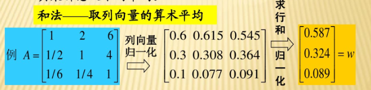

1. 先对矩阵列向量归一化；

&emsp;&emsp;将矩阵的每一列分别加起来，再用原来的数($a_{ij}$) 除以它所在列的和。如：$1  \div (1+1/2+1/6) = 0.6$ 

2. 再求行和归一化；

&emsp;&emsp;每一行分别相加，再除以每一行的个数（即每一行的平均数）。如：$(0.6+0.615+0.545) \div 3=0.587$

​	即得到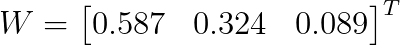。

**第二种：**

还是以上面这个矩阵为例。
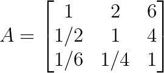

1. 分别求出$M_1 = 1  \times 2  \times  6 = 12$，$M_2 = 2$，$M_3 = 0.042$；

2. 计算$M_i$的n次方根：

   $\overline{W_1} =  \sqrt[3]{M_1} = 2.289$，$\overline{W_2} = 1.260$，$\overline{W_3} = 0.347$；

3. 再归一化：

   $\displaystyle \sum_{i=1}^3 \overline{W_i} = 2.289+1.260+0.347 = 3.896$

   $W_1 =  \frac{\overline{W_1} }{\displaystyle \sum_{i=1}^3 \overline{W_i}} = \frac{2.289}{3.896} = 0.588$  ，$W_2 =  0.323$，$W_3 =  0.$089

得出：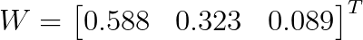

*注：以上两种方法由于手动计算，略有偏差*。

### 2).第二步：计算λ的值

公式：$\lambda_{max} = \displaystyle \sum_{i=1}^n \frac{(AW)_i}{nW_i}$，$AW$表示矩阵的乘法。

矩阵乘法公式（某一个值$a_{ij}$ ）：$(AW)_{ij}= \displaystyle \sum_{k=1}^p a_{ik}b_{kj}=a_{i1}b_{1j}+a_{i2}b_{2j}+...+a_{ip}b_{pj}$ 

所以，$\lambda_{max} = \displaystyle \sum_{i=1}^n \frac{(AW)_i}{nW_i} = \frac{1.769}{3  \times  0.587}+\frac{0.974}{3  \times  0.324}+\frac{0.268}{3  \times  0.089}= 3.009$

### 3).第三步：计算CI和RI

$CI=\frac {\lambda-n}{n-1} = \frac{3.009-3}{3-1} = 0.0045$

可直接查表得出$RI = 0.58$

### 4).第四步：计算CR得出结论

$CR=\frac{CI}{RI} = \frac{0.0045}{0.58}=0.0078 < 0.1$ ,通过一致性检验。

**以上四步，第一步求出的$W$ 对后面有用，而其它三步就只是为了进行一致性检验。**

**至此，只是完成了第二层对第一层（目标层）的层次单排序和一致性检验，我们还需要进行第三层对第二层的层次单排序和一致性检验，如果有更多层需要完成更多，直到最后一层（方案层）对上一次进行层次单排序和一致性检验。后面会有一个例子进行讲解。**

## 4. 层次总排序及其一致性检验

- 计算某一层次所有因素对于最高层（总目标）相对重要性的权值，称为层次总排序。
- 这一过程是从最高层次到最低层次依次进行的。

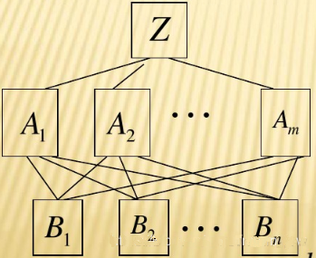

A层$m$个因素$A_{1},A_{2},···,A_m$,对总目标Z的排序为$a_{1},a_{2},···,a_{m}$。

B层$n$个因素对上层A中因素为$A_{j}$ 的层次单排序为$b_{1j},b_{2j},···,b_{nj}(j=1,2,3,···,m)$。
B层的层次总排序(即B层第$i$个因素对总目标的权值为：$\displaystyle \sum_{j=1}^{m}a_{j}b_{ij}$)为：
$B_{1}:a_{1}b_{11}+a_{2}b_{12}+···+a_{m}b_{1m}$,

$B_{2}:a_{1}b_{21}+a_{2}b_{22}+···+a_{m}b_{2m}$,
......
$B_{n}:a_{1}b_{n1}+a_{2}b_{n2}+···+a_{m}b_{nm}$,

层次总排序的一致性比率为:$CR=\frac{a_{1}CI_{1}+a_{2}CI_{2}+···+a_{m}CI_{m}}{a_{1}RI_{1}+a_{2}RI_{2}+···+a_{m}RI_{m}}$,当$CR<0.1$时，认为层次总排序通过一致性检验。

## 举例

&emsp;&emsp;某厂有一笔企业留成利润要决定如何使用，根据各方意见提出的决策方案有：发奖金；扩建集体福利设施；办技校；建图书馆；购买新设备。在决策时要考虑调动职工劳动积极性、提高职工技术文化水平、改善职工物质文化生活三方面，据此构造各因素之间相互联结的层次结构模型如下图所示。

**1.建立阶梯层次结构模型**

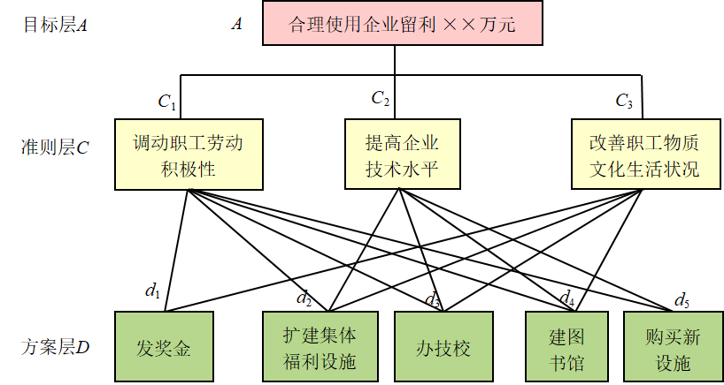

**2. 计算单一准则下元素的相对重要性**

i. 第二层相对于第一层的判断矩阵

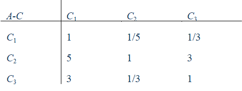

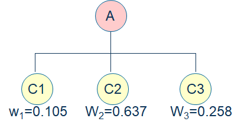

通过计算得判断矩阵的特征向量和特征值分别为： 

$W=(0.105,0.637,0.258)$ ，$λmax=3.308$

对判断矩阵进行一致性检验，即计算CI和CR

$CI=0.019$，$CR=0.033<0.1$

说明判断矩阵的一致性可以接受。

ii. 第三层元素相对于第二层元素判断矩阵

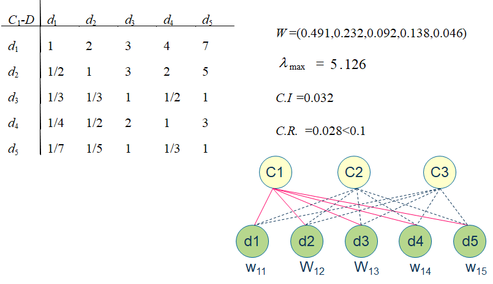

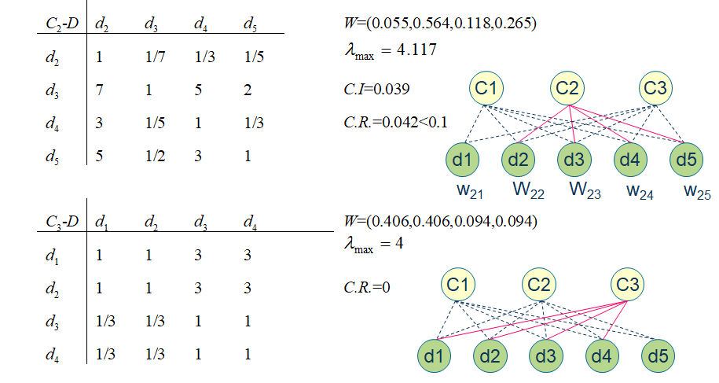

**3.各个元素的权重**

第二层对第一层各个元素的权重**乘**以第三层各个元素对第二层的权重得到的值**累加**等于第三层（方案）的总权重值。如：$0.105*0.491+0.637*0+0.258*0.406=0.157$

**4.结论**

发奖金，福利设施，办技校，建图书馆，新设备对应的权重：

$W=(0.157, 0.164, 0.393, 0.113, 0.172)$

$CI=0.028$

$RI=0.923$ （这里不知道怎么来的，查表的话应该是1.12？待讨论）

$CR=0.03<0.10$

计算结果表明，对于合理使用企业留成利润来说，**办技校**（权重值最大）是首选的方案。  

*参考：*

[1].<https://www.bilibili.com/video/BV1KE411q7Wh> 

[2]. <https://zhuanlan.zhihu.com/p/38207837>

[3].<https://blog.csdn.net/mmm_jsw/article/details/84863416>

[4].AHP(层次分析法)方法、步骤PPT,<a :href="$withBase('/file/AHP(层次分析法)方法、步骤.zip')" download="AHP(层次分析法)方法、步骤.zip">点击下载</a>