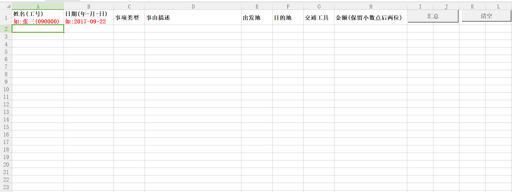
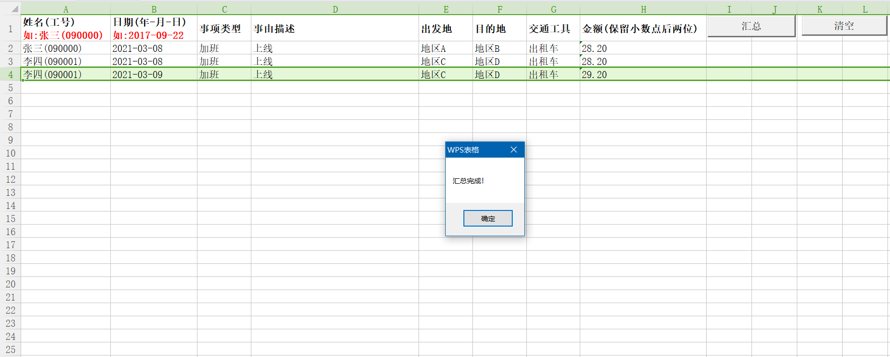

## 效果展示

**点击按钮前：**



**点击按钮后：**



## **主要脚本内容**

```vbscript
Private Sub CommandButton1_Click()
  Dim mypath As String
  Dim myExtension As String
  Dim myFiles As String
  Dim thisWb As Worksheet
  Dim wb As Workbook
  Dim I&, Rm&
  
  '设置一些属性
  Application.ScreenUpdating = False
  Application.EnableEvents = False
  Application.Calculation = xlCalculationManual
  
  Set thisWb = ThisWorkbook.Worksheets(1) '当前工作簿
  
  mypath = ThisWorkbook.Path & "\data\" '指定文件夹路径
 
  myExtension = "*.xls"  '指定过滤的文件后缀
  
  myFiles = Dir(mypath & myExtension)  '所有指定后缀的文件

  '循环处理每一个文件
  Do While myFiles <> ""
  
     Set wb = Application.Workbooks.Open(Filename:=mypath & myFiles) '打开
     
    '确保工作簿被打开，在处理下一个文件时
     DoEvents
     
     
     Rm = Cells.Rows.Count  '当前活动工作表的行数
     With wb.Worksheets(1)
         For I = 2 To .Range("A" & Rm).End(3).Row  '←为1也表示xlToLeft，→为2也表示xlToRight，↑为3也表示xlUp，↓为4也表示xlDown
              .Rows(I).Copy thisWb.Range("A" & Rm).End(3).Offset(1)
         Next
            
     End With
  
     wb.Close 'SaveChanges:=True '保存工作簿
     '确保工作簿被关闭，在处理下一个文件时
     DoEvents
     '接着处理下一个
     myFiles = Dir
    
  Loop
  
  '恢复设置
  Application.EnableEvents = True
  Application.Calculation = xlCalculationAutomatic
  Application.ScreenUpdating = True
  
  MsgBox ("汇总完成！")
End Sub
```

*参考：*

[1].案例文档,<a :href="$withBase('/file/vba-collect-files.zip')" download="vba-collect-files.zip">点击下载</a>

