> 该文章为博主原创，最初发表在[我的博客园](https://www.cnblogs.com/hyyq/p/5933214.html)。

## Tomcat安装和启动

### **一、下载Tomcat**  

地址栏输入官网地址：http://tomcat.apache.org/，然后进入他的主页，在主页左侧可以找到Download，这里可以看到很多版本，我这里选择Tomcat8这个版本（因为我的MyEclipse是2014版，它支持配置的最高版本Tomcat是8），点击进去，这里我选择64-bit Windows zip这个版本，点击它就可以下载了。

### **二、安装Tomcat**

怎么安装呢，其实解压就算是安装好了（听说分什么解压版和安装版，我这里就不说了，可能是上面下载的版本问题，但是我下载的这个也可以当作安装版呀），只是还需要相关配置才能正常工作哦，如图，下载的包是1，解压后是2.

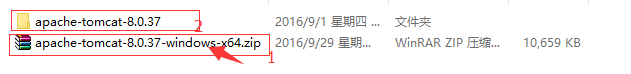

然后，需要检查你的JAVA_HOME变量配好了没（很重要，看了后面其实也不用配，如果是新手，还是配上吧），当然path,classpath也需要正确配置，网上有很多关于配置JDK环境变量的文章，我这里就不一一解说了，举个例子，JAVA_HOME正确的是这样，如图，

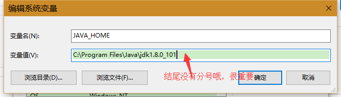


 注：变量名为大写，JAVA_HOME（中间有下划线），变量值为你的jdk存放路径（末尾不能有分号）

然后打开刚刚解压的Tomcat8文件夹，打开bin目录，然后可以看到很多，批处理文件，点击startup.bat运行，

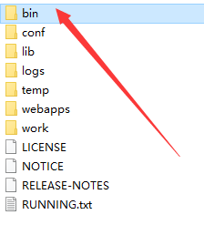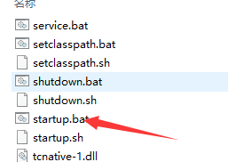

如果点击过后等待若秒后，出现下面图中样子，并没有任何报错输出，并且你也可以在电脑服务中（win+r
输入services.msc）找到一个服务名为Apache Tomcat 8.0 Tomcat8的服务已经启动了，说明你已经启动成功了！

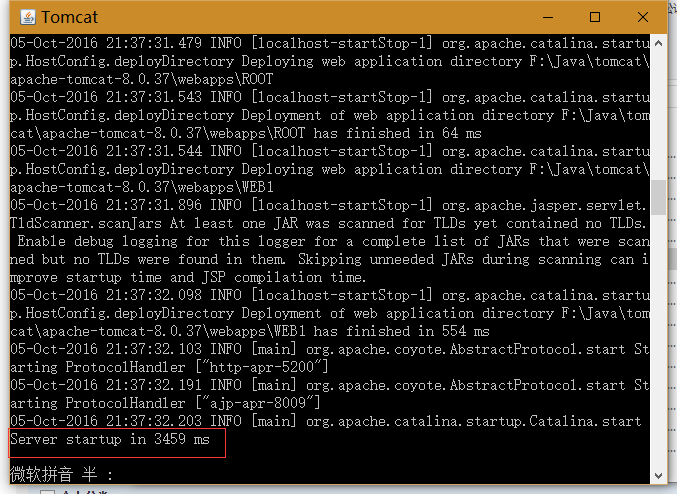

### **三、测试启动** 

这时，保持上面窗口没有关闭（如果你想关闭它，不要直接点击右上角的小叉，同样在bin目录下有一个shutdown.bat点击它可以关闭tomcat服务器），你可以在浏览器地址栏输入http://localhost:8080/检查是否真的启动成功，如果出现下面图中样式，则启动成功，你可以不用再往下看了。

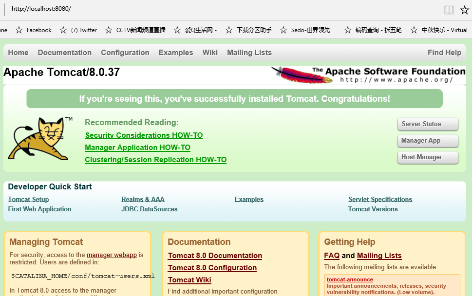


## 错误排查

很多时候并不是这样一帆风顺，下面列出几个常见的错误，也是我遇到的。比如：

### 错误一:启动失败

**点击startup.bat后，屏幕闪一下就没了，并没有启动成功！**

查看错误：首先应该想到的是，你的JAVA_HOME环境变量没有配好（路径后面一定要没有分号，因为Tomcat需要获取这个值），如果是配好了，那就右击startup.bat选择编辑，在最后一行输入pause,目的是让当前窗口暂停，不让他消失，如图：

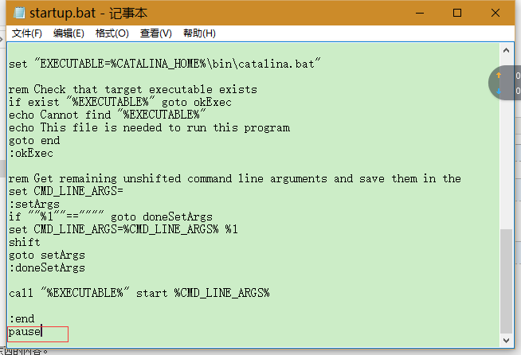

然后再启动它，如果配置正确的话应该是可以看到这些值的，如图：

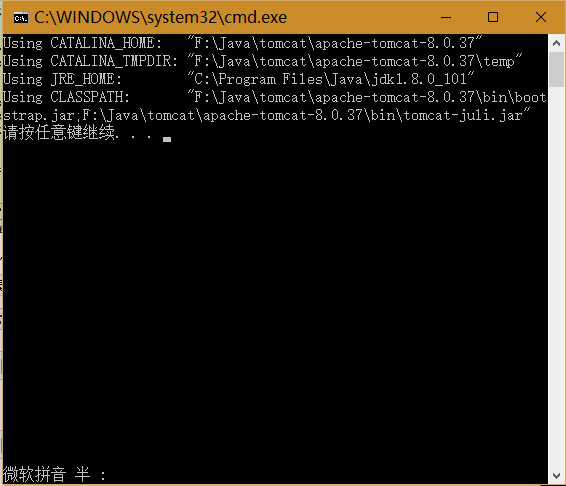  

解决方法一：在tomcat的bin目录下的startup.bat中`set JAVA_HOME=""`或`set JRE_HOME="...\jre",以及CATALINA_BASE或CATALINA_HOME`然后测试http://localhost:8080

```bash
rem ---------------------------------------------------------------------------
rem Start script for the CATALINA Server
rem ---------------------------------------------------------------------------
 
setlocal
 
rem ---------当前bat文件目录的上级--------
set CATALINA_HOME=%~dp0.. 
rem -----------setclasspath.bat中要用到JAVA_HOME----------
set JAVA_HOME=C:\Program Files\Java\jdk1.7.0_15
```

解决方法二：去配置这些环境变量，名字是前面大写的部分（如：CATALINA_HOME），值就是后面的了。其实，我配置的是下面的几个：

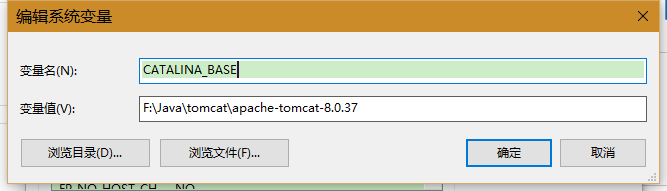

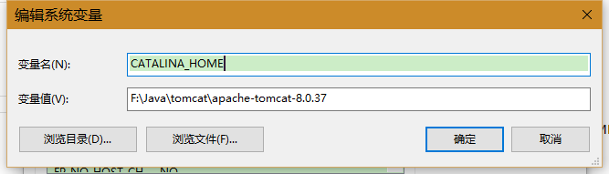

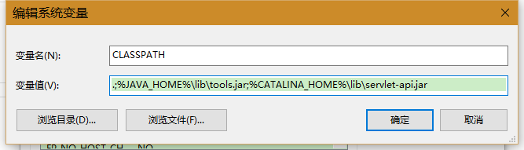

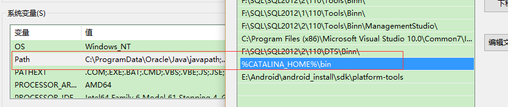

解决方法三：如果，上面两种方法都试过了，并且配置了各种路径正确，还不行，那么只有试试这种方法了：

首先先上面说到的环境变量保证配好，然后，你点击bin目录下的这个选项（如图），是不是弹出一个框说是没有安装。

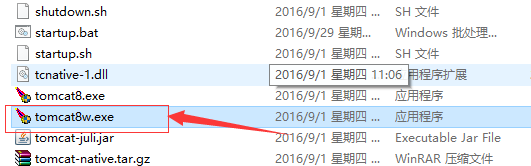

如果上面说的环境变量（特别是path和CATALINA_HOME）配置好了，那么现在按win+R或者直接打开运行，输入cmd，回车（如图）：

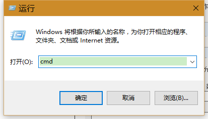

然后输入service install Tomcat8
回车，会提示你安装成功（如图，由于我已经安装过，说以会说是失败），如果提示说："......"不是内部命令或外部命令，那就是你环境变量没配好。


如果某一天你想卸载它，命令是：service uninstall Tomcat8（卸载Tomcat8）。


现在你再点击bin目录下的tomcat8w.exe就会出现一个对话框了，里面的一些路径需要和你配置的环境变量和tomcat安装目录一致（默认会自动配置，但有可能不对），如图：

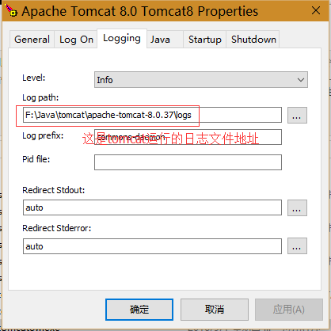

日志文件可以帮助你找到关于tomcat启动、运行中出现的错误或信息。

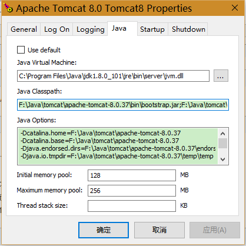

这些都对了，你可以启动tomcat服务器了，点击start启动，关闭点stop如图：

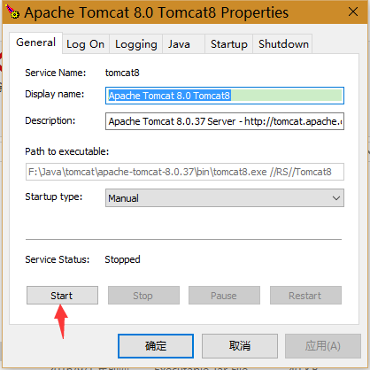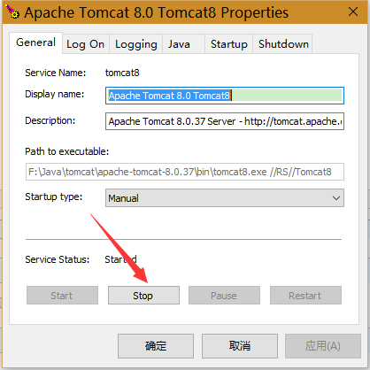

### 错误二:端口占用

**8080端口被占用**

因为Tomcat服务器默认使用你电脑里的8080端口，如果这个端口被其它程序所占用，
就启动不了了，这时需要去修改它的默认端口，怎么修改呢？打开tomcat安装目录，找到conf目录下的
server.xml文件，右键编辑，找到如图所示地方，修改8080为其它，我这里修改为5200.

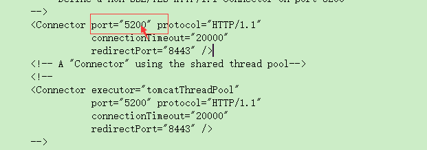

重新启动tomcat服务，现在在浏览器中输入http://localhost:5200/（注：5200就是上面你改过的端口号），出现如图页面，就成功了。

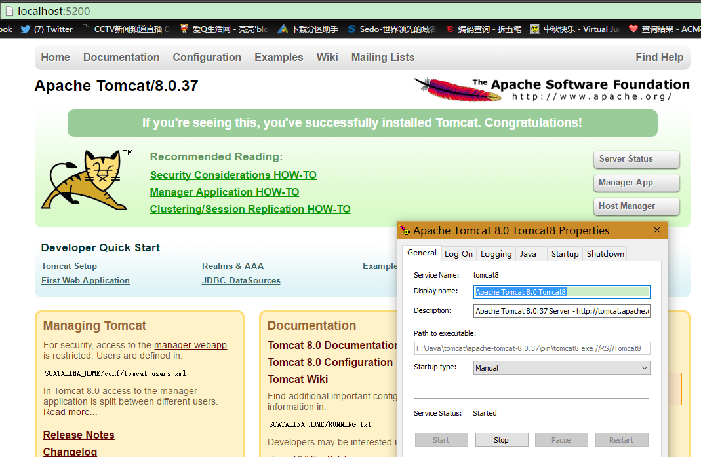


如果在安装过程中，还有其它错误，你可以查看，上文提到的日志文件，里面或许可以找到你需要的。

### 错误三:Manager无法进入

**Tomcat进入Server Status 、Manager App、Host Manager报401或403错误**

某些情况下可能会用到 **Server Status、 Manager App、 Host Manager**这三个工具，在tomcat启动主页的靠右边点可以看到这三个选项。一般来说安装完成tomcat，测试成功能进入tomcat主页面，但点击Server Status或Manager App、Host Manager都会先让你输入账号密码，然后出现错误，如下图：

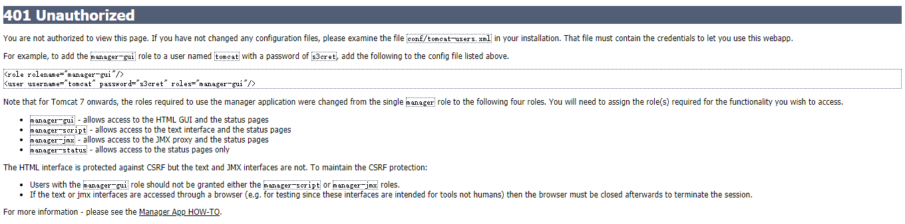

这个时候我们可以通过错误提示进行配置。错误中说你需要设置一个角色和用户名以及密码。那我们就去配置，打开conf目录下的tomcat-users.xml文件，拉到最后，配置好相应的角色和用户名及密码，对应角色拥有的权限在上面图中的错误页面可以看到。配置如下图：

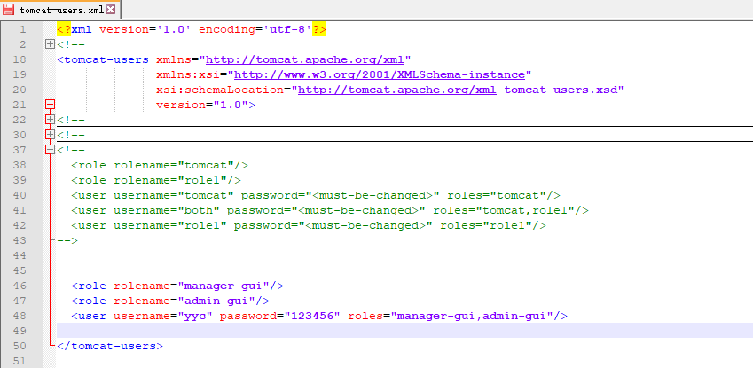

`<role />标签`：

- `manager-gui` \- allows access to the HTML GUI and the status pages用于可以进入tomcat的Server Status或Manager App，

- `admin-gui` \- allows access to the HTML GUI可以进入Host Manager，

`<user/>标签`：配置用户名、密码以及该用户拥有的角色。配置完成后保存并重启tomcat，发现可以通过用户名和密码进入Server Status或Manager App、Host Manager这三个页面了。

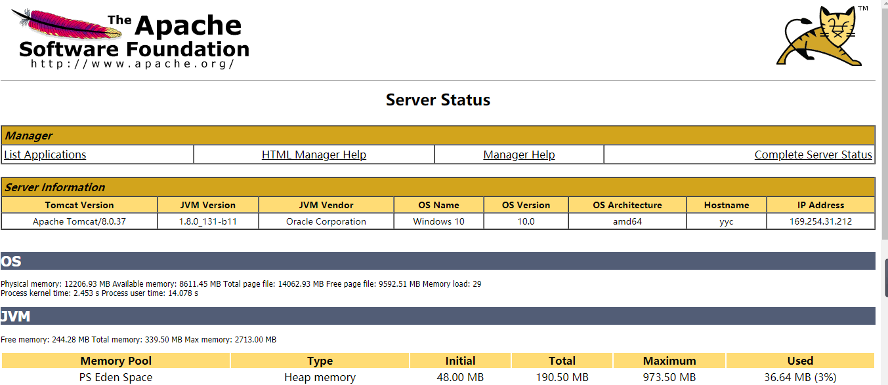


本文如有错误，希望您能帮我指出。如有任何问题请直接在网站右上方留言板给我留言。谢谢。

该文章为博主原创，最初发表在[我的博客园](https://www.cnblogs.com/hyyq/p/5933214.html)。

